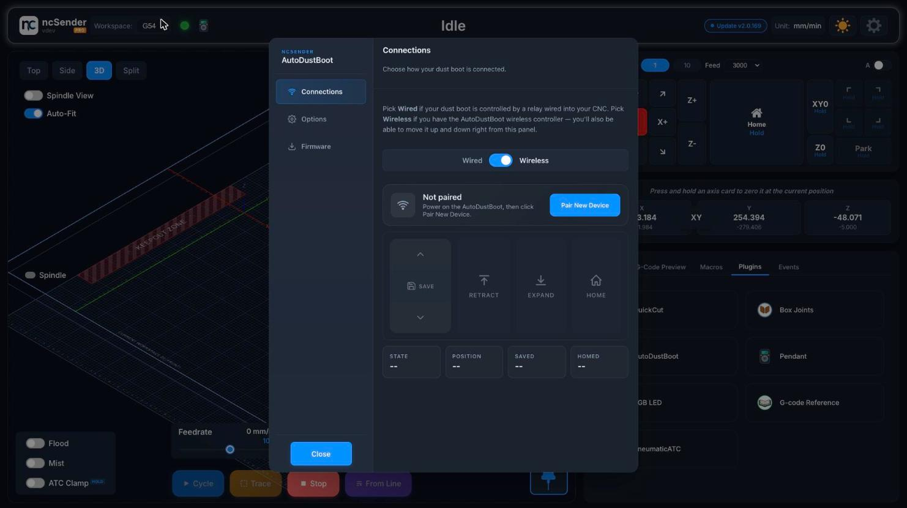
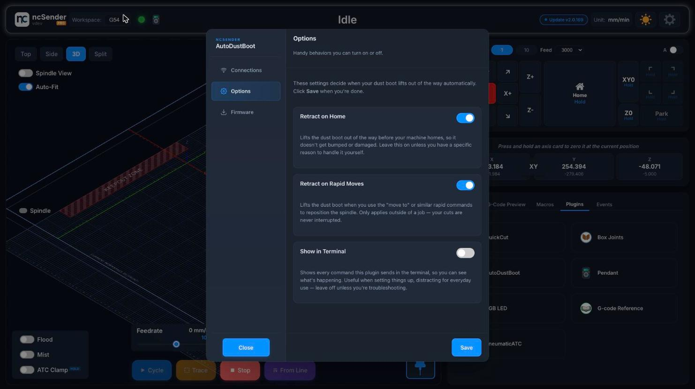

# AutoDustBoot

The AutoDustBoot is a stepper-driven dust boot with its own onboard
controller. The controller does the retract / expand mechanically —
there's no pneumatic cylinder and no spring — and exposes two control
paths so the boot works with a lot of different CNC setups.

## V1 vs V2

**AutoDustBoot V1** is TTL-only: the controller listens for a
level-triggered input on a single wire — high retracts, low expands
(or vice-versa depending on how you wire it). Anything that can drive
a 3.3 V or 5 V logic output can drive it. That's how the original
AutoDustBoot integrates with Masso, Buildbotics, grblHAL, and every
other controller that has a spare TTL-level aux output.

**AutoDustBoot V2** Soon keeps
the TTL input for backward compatibility — so it drops straight into
a V1 setup — and adds a **wireless link** to ncSender through the
[Wireless USB &rarr;](wireless-usb.md). On the wireless link the
controller reports state, position, saved position, and homed status,
and accepts direct retract / expand / home / save commands. That's
the "better communication" a V2 buys you on grblHAL + ncSender.

You can run a V2 as:

| Setup | What it uses | Works on |
|---|---|---|
| **TTL (V1-compatible)** | The TTL aux input | Any CNC controller with a spare 3.3–5 V logic output (Masso, Buildbotics, grblHAL, …) |
| **Wireless + ncSender plugin** | The [Wireless USB &rarr;](wireless-usb.md) | ncSender only |

If you're running ncSender on grblHAL, wireless is what you want. If
you're on another controller, keep it wired to a TTL aux and drive it
from your G-code.

<!-- TODO: screenshot — AutoDustBoot V2 controller hardware close-up -->

## TTL setup

### What you need

- **Any 3.3 V or 5 V TTL aux output on your CNC controller.** Common
  choices on a grblHAL / FluidNC board are the **Flood** (`M8`) or
  **Mist** (`M7`) pins, since they're already broken out and driven
  by standard G-code. Any `M64 P<n>` / `M65 P<n>` aux pin works
  equally well.
- **Wire from that pin to the AutoDustBoot's control input.** Signal
  and ground.

The AutoDustBoot only cares about the logic level; it doesn't care
which pin drives it or which controller you're on.

### Operating it

Once wired, retract / expand is a simple G-code toggle:

| Action | With M7 / M8 | With M64 aux pin |
|---|---|---|
| Retract (pin high) | `M8` | `M64 P0` |
| Expand (pin low) | `M9` | `M65 P0` |

### From ncSender, no plugin

If ncSender is running the machine but you don't install the plugin,
you drive the boot yourself:

1. **From the terminal** — type `M8` (retract) and `M9` (expand)
   whenever you want.
2. **From your G-code / CAM post-processor** — most of the workflow
   lives here. Add the retract before `M6` / `$H`, the expand after
   the first XY move at the next cut location, etc. Vectric,
   Fusion 360, and every other CAM has a post-processor you can
   customize to add the commands.

!!! warning "You're on the hook for correctness"
    Without the plugin, ncSender doesn't know the AutoDustBoot exists
    — every retract / expand has to come from you or from your
    G-code. If your program has an `M6` without a preceding retract,
    the boot will run right into your spindle carriage.

### From other controllers (Masso, Buildbotics, …)

Wire it the same way — pick a TTL-level aux output and drive it with
whatever your controller uses to toggle that pin (usually `M8` /
`M9`, or your controller's macro / event system). The
AutoDustBoot behaves identically; it's just a logic input.

## Wireless setup (V2 only)

The V2 controller talks to ncSender over the
[Wireless USB &rarr;](wireless-usb.md). Getting connected:

1. Plug the Wireless USB into the computer running ncSender.
2. Power up the AutoDustBoot V2 controller.
3. Open the **AutoDustBoot** plugin (Plugins panel), Connections tab.
4. Flip the toggle to **Wireless**, then click **Pair New Device**.
   Follow the shared pairing flow — see
   [Wireless USB &rarr;](wireless-usb.md) for details.
5. Once paired the plugin shows the boot's state, position, saved
   position, and homed flag; you can drive the boot up and down
   manually from the Connections tab.

Wireless setup **requires the plugin** — there's no equivalent to
"type M8 from the terminal" for the wireless controller because it
doesn't sit on an aux pin.

## The plugin

Install the **AutoDustBoot** plugin from ncSender's plugin catalog,
then open it from the **Plugins** panel.

### Connections

Pick which control path you're using and (for Wireless) pair the
controller.

- **Wired / Wireless toggle** — set to match how the AutoDustBoot is
  attached. *Wired* means the boot is driven by an aux pin on your
  controller; *Wireless* means the V2 controller is paired to a
  Wireless USB.
- **Pair New Device** (Wireless only) — power on the AutoDustBoot,
  then click. See [Wireless USB &rarr;](wireless-usb.md) for the
  shared pairing flow.
- **Direct control** (Wireless only, once paired) — **Retract**,
  **Expand**, **Home**, and **Save** actions plus a read-out of the
  current state, position, saved position, and homed flag. Handy for
  testing the boot outside a job.

### Options

The three toggles decide when the plugin injects retract / expand
commands into your G-code stream.

- **Retract on Home** *(on by default)* — lifts the boot before any
  `$H`. Homing rapids across the whole work area; without this the
  boot drags across the workpiece.
- **Retract on Rapid Moves** *(on by default)* — lifts the boot when
  a `G0` "move to" command runs from the console or a macro. G0 moves
  *inside* a running program are left alone (the program's own logic
  handles positioning).
- **Show in Terminal** *(off by default)* — echoes every injected
  command in the console. Leave off for a quiet console; turn on when
  troubleshooting.

Click **Save** after changing anything.

### Firmware

Check for and flash new AutoDustBoot firmware over the wireless
link. Progress is shown in the plugin. Only applies to V2 wireless
controllers; V1 (TTL-only) and wired-mode V2 setups don't have
firmware you update from here.

## What the plugin does that a wired setup doesn't

Everything the plugin buys you is automation on top of the physical
mechanism. Skip the plugin and you handle these yourself in G-code.

**Tool change (`M6` / `$TLS`).** The plugin retracts the boot before
the tool change, then re-expands it right before the first XY move
that follows — which is when the machine has finished positioning
for the next cut. If your G-code already contains an expand at that
spot, the plugin comments it out so the boot doesn't double-pulse.

**Homing (`$H`).** With *Retract on Home* enabled, the retract runs
before the `$H`.

**Manual rapid (`G0`).** With *Retract on Rapid Moves* enabled, a
`G0` typed into the console (or fired from a macro) triggers a
retract first. G0s inside a running program don't trigger this —
that's on the program.

## Troubleshooting

- **Wired: boot doesn't respond.** Verify the aux pin is wired to
  the AutoDustBoot's input and the polarity is right — bench-test by
  typing the matching command in the console (e.g. `M8` if you're on
  Flood, or `M64 P0` if you're on an aux pin) and watching the
  stepper move.
- **Wireless: boot doesn't retract on tool change.** Confirm the
  AutoDustBoot shows as *Connected* in the
  [Wireless USB dialog &rarr;](wireless-usb.md). If it's disconnected,
  power-cycle the controller; if it stays disconnected, re-pair it.
- **Unexpected retract mid-job.** *Retract on Rapid Moves* only
  fires for console / macro G0s, but a macro that fires a G0 during
  a job window will trip it. Turn the option off if that's causing
  trouble.
- **Boot travels the wrong distance.** Boot travel is set on the
  controller itself (Save button in the plugin's Connections tab, or
  the equivalent gesture on V1). If the retract doesn't clear your
  workpiece, re-home the boot and re-save.
