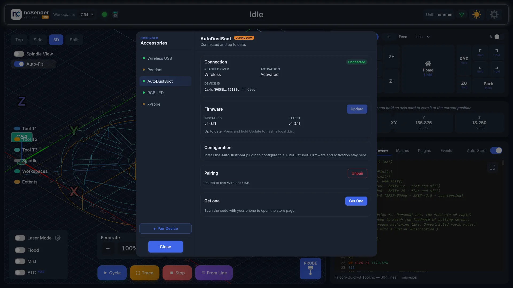
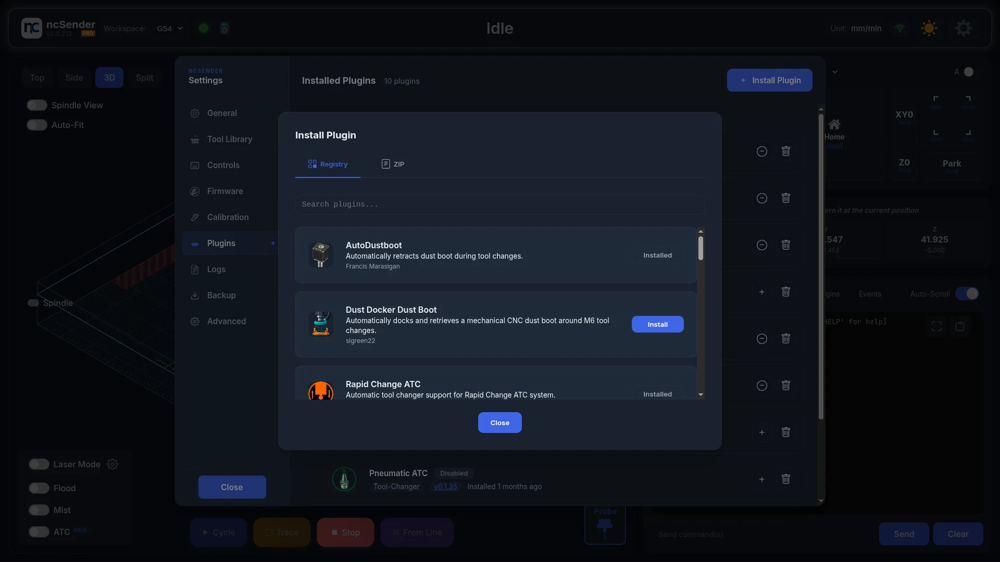
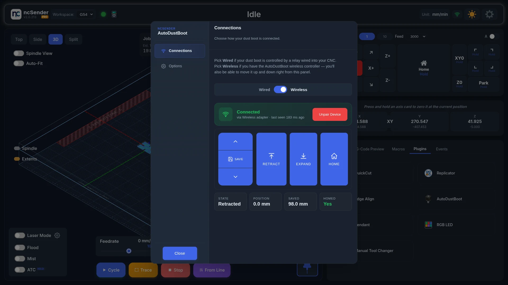
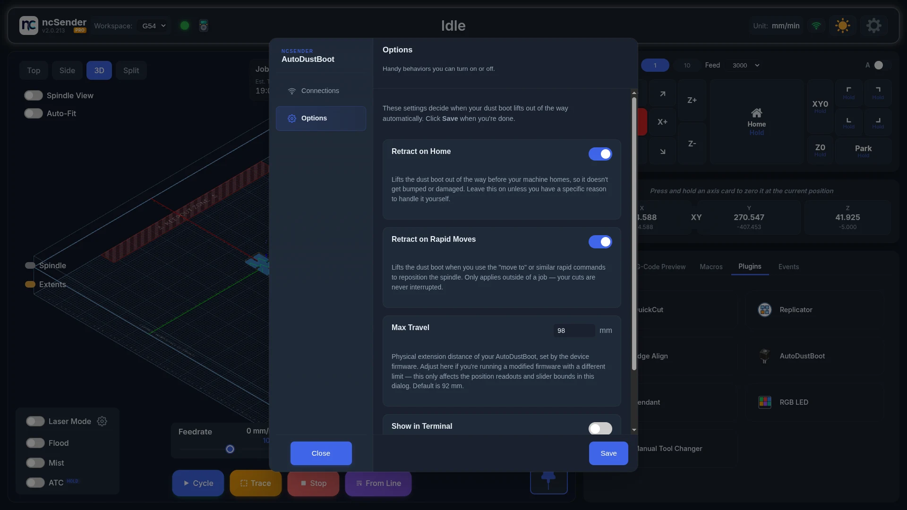

# AutoDustBoot

The AutoDustBoot is a motor-driven dust boot with its own controller. It
retracts and expands the boot for you, and can be driven in two ways, so it
works with many CNC setups.

## V1 vs V2

**AutoDustBoot V1** is TTL-only. The controller watches a single input wire
from your CNC controller to retract or expand. Anything with a 3.3 V or 5 V
logic output can drive it, including Masso, Buildbotics and grblHAL.

**AutoDustBoot V2** Soon keeps the TTL input,
so it drops straight into a V1 setup. It also adds a **wireless link** to
ncSender through the [Wireless USB &rarr;](wireless-usb.md). Wirelessly, it
reports its state, position, saved position and whether it is homed, and
accepts retract, expand, home and save commands.

You can run a V2 as:

| Setup | What it uses | Works on |
|---|---|---|
| **TTL (V1-compatible)** | The TTL aux input | Any CNC controller with a spare 3.3–5 V logic output (Masso, Buildbotics, grblHAL, …) |
| **Wireless + ncSender plugin** | The [Wireless USB &rarr;](wireless-usb.md) | ncSender only |

If you run ncSender on grblHAL, use wireless. On another controller, wire it
to a TTL aux output and drive it from your G-code.

<!-- TODO: screenshot — AutoDustBoot V2 controller hardware close-up -->

## TTL setup

### What you need

- **A 3.3 V or 5 V aux output on your CNC controller.** The **Flood** (`M8`)
  or **Mist** (`M7`) pins are common choices. Any `M64 P<n>` / `M65 P<n>` aux
  pin works too.
- **A wire from that pin to the AutoDustBoot's control input**, plus ground.

### Operating it

Once wired, retract and expand with G-code:

| Action | With M7 / M8 | With M64 aux pin |
|---|---|---|
| Retract (pin high) | `M8` | `M64 P0` |
| Expand (pin low) | `M9` | `M65 P0` |

### From ncSender, no plugin

Without the plugin, you drive the boot yourself:

1. **From the console** — type `M8` to retract and `M9` to expand.
2. **From your G-code** — add a retract before each `M6` and `$H`, and an
   expand after the first move at the next cut. Most CAM programs let you add
   these in the post-processor.

!!! warning "You're responsible for every retract"
    Without the plugin, ncSender doesn't know the AutoDustBoot exists. If your
    program has an `M6` with no retract before it, the boot will hit the
    spindle carriage.

### From other controllers (Masso, Buildbotics, …)

Wire it the same way, and toggle the pin with whatever your controller uses
(usually `M8` / `M9`, or its macros).

## Wireless setup (V2 only)

1. Plug the Wireless USB into the computer running ncSender.
2. Power on the AutoDustBoot V2.
3. In ncSender, open **Accessories** (the pendant icon in the toolbar) and
   click **Pair Device**. You have **60 seconds**.
4. On the AutoDustBoot, start pairing mode.
   <!-- OWNER: confirm the AutoDustBoot pairing gesture. This page used to say "hold Retract ▲ + Extend ▼ together for about 3 seconds until it starts scanning"; wireless-usb.md said "hold the pair button for 3 seconds (LED blinks)". -->
5. Select **AutoDustBoot** in Accessories. It shows **Connected**.
6. If it shows **!**, click **Activate**. See
   [Wireless USB &rarr;](wireless-usb.md#activating).
7. Install the plugin (see [The plugin](#the-plugin)), open **Connections**,
   and choose **Wireless**.

Wireless use **needs the plugin**. The wireless controller isn't on an aux
pin, so typing `M8` does nothing.

## Physical buttons

The V2 controller has three buttons on top: **Retract (▲)**, **Mode (●)** in
the middle, and **Extend (▼)**.

| Gesture | What it does |
|---|---|
| **Retract ▲** tap | Move the boot up one small step. |
| **Retract ▲** hold | Retract until you let go. |
| **Extend ▼** tap | Move the boot down one small step. |
| **Extend ▼** hold | Extend until you let go. |
| **Mode ●** double-press | **Save the current position as the expand position.** |
| **Mode ●** long-press | Restart the controller. It homes on startup. |
| Hold **Retract ▲** while powering on | **Skip homing on startup.** Use this when homing would crash the boot into the work. |

<!-- OWNER: confirm the pairing-mode gesture and add it back to this table. -->

The plugin's Connections tab has the same actions: Retract, Expand, Home and
Save.

## The plugin

Install it from **Settings → Plugins → Install Plugin**, and choose
**AutoDustboot**. Then open **AutoDustBoot** from the Tools menu.

The plugin changes how the boot behaves. Firmware updates and activation are
in **Accessories**.

### Connections

Choose **Wired** or **Wireless**.

**Wired.** For a boot driven by an aux pin on your CNC controller. Edit the
G-code the plugin sends to raise and lower the boot. You can add `G4` pauses to
let the boot finish moving before the machine continues.

<!-- CAPTURE NEEDED: assets/images/accessories/autodustboot-connections-wired.webp (AutoDustBoot Connections tab — Wired) -->

- **Retract Sequence** — sent before homing, tool changes and (if turned on)
  console rapids. The default is `M8` · `G4 P0.1` · `M9` · `G4 P1`.
- **Expand Sequence** — sent when the boot should come back down, right
  before the next cut. The default is `M8`.

**Wireless.** For the V2 wireless controller only.

- **Pair New Device** — opens the same 60-second pairing window as **Pair
  Device** in Accessories. **Unpair Device** removes the pairing.
- **Retract**, **Expand** and **Home** move the boot. Hold the up or down
  arrow to jog it, and click **Save** to store the current position as the
  expand position.
- **State**, **Position**, **Saved** and **Homed** show the boot's live
  status.

<!-- CAPTURE NEEDED: assets/images/accessories/autodustboot-retract-expand.webp (Retract and expand from the plugin) -->

### Options

Choose when the plugin retracts the boot.

- **Retract on Home** *(on by default)* — retracts before homing, so the boot
  doesn't drag across the work.
- **Retract on Rapid Moves** *(on by default)* — retracts before a `G0` sent
  from the console or a macro. `G0` moves inside a running program are left
  alone.
- **Show in Terminal** *(off by default)* — shows the plugin's commands in the
  console. Turn it on when troubleshooting.

Click **Save** after changing anything.

## Firmware updates

Firmware updates apply to the V2 only.

1. Open **Accessories** and select **AutoDustBoot**.
2. Click **Update to v…** in the Firmware card.
3. Keep the AutoDustBoot powered and connected until it finishes.

With a USB cable plugged in, the update goes over the cable, which is much
faster. Otherwise it goes wirelessly. If an update is interrupted, the current
firmware keeps working. Just start again.

## What the plugin does for you

**Tool change (`M6` / `$TLS`).** Retracts the boot before the tool change, and
expands it again right before the first move of the next cut. If your G-code
already expands the boot at that point, the plugin skips its own so the boot
doesn't move twice.

**Homing (`$H`).** With *Retract on Home* on, retracts before homing.

**Console rapids (`G0`).** With *Retract on Rapid Moves* on, retracts before a
`G0` sent from the console or a macro.

## Troubleshooting

- **Wired: boot doesn't respond.** Check the wiring and polarity. Type the
  matching command in the console (e.g. `M8` for Flood, or `M64 P0` for an aux
  pin) and watch the boot move.
- **Wireless: boot doesn't retract on tool change.** Open **Accessories** and
  select **AutoDustBoot**. If it isn't **Connected**, power-cycle the
  controller. If it still doesn't connect, pair it again.
- **Unexpected retract during a job.** A macro that sends a `G0` during a job
  triggers *Retract on Rapid Moves*. Turn the option off if that's a problem.
- **Boot doesn't clear the work.** Move the boot to the height you want and
  save it again, with **Save** in the plugin or a double-press of **Mode ●**
  on the controller.
