# ncWirelessIO

ncWirelessIO gives ncSender **four inputs**, **four switched outputs** and a
**machine-status LED strip port**, linked wirelessly through the
[Wireless USB &rarr;](wireless-usb.md). Mount it at the tool changer and wire
the sensors and the air solenoid there, instead of running cables back to the
control box. Your controller's own inputs and outputs stay free.

It is built for ncSender's [Pneumatic ATC &rarr;](../plugins/pneumatic-atc.md)
plugin: a drawbar sensor, a tool sensor and the clamp solenoid. The two spare
inputs and three spare outputs are yours for anything else.

!!! note "Coming soon"
    ncWirelessIO is in development. Pneumatic ATC support for it arrives with
    the plugin's ncWirelessIO profile.

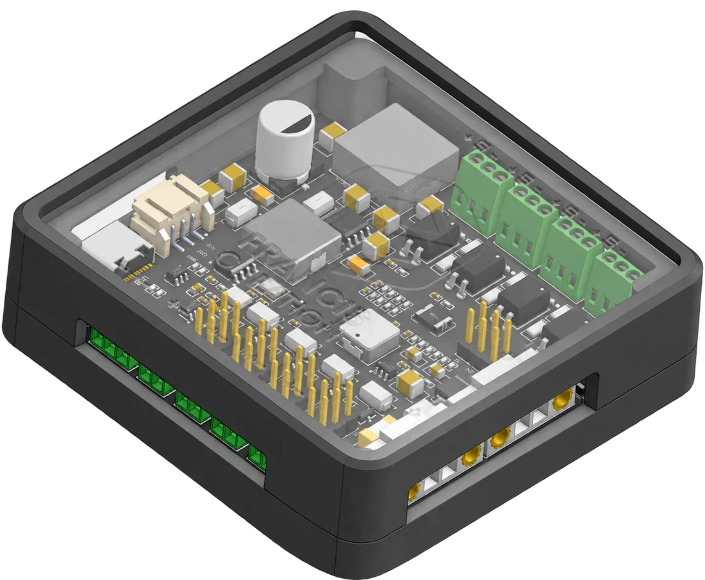

## Hardware

- **4 inputs**, optically isolated, for 3.3–24 V signals. NPN sensors, PNP
  sensors and plain switches all work.
- **4 switched outputs**, each set to **5, 12 or 24 V** with its own jumper.
  Short-circuit and over-temperature protected.
- **LED strip port** for a **12 V WS2811** strip. It shows machine state the
  same way the [RGB LED &rarr;](smart-rgb-led.md) does.
- **24–48 V DC** supply, reverse-polarity protected.
- **USB-C** for set-up and fast firmware updates.
- Pairs with the [Wireless USB &rarr;](wireless-usb.md), the same one the
  pendant, AutoDustBoot and RGB LED use.

!!! warning "Wireless USB is required"
    ncWirelessIO only talks to ncSender through the
    [Wireless USB &rarr;](wireless-usb.md).

## What's on the board

Everything is printed on the board. The numbers below match the picture.

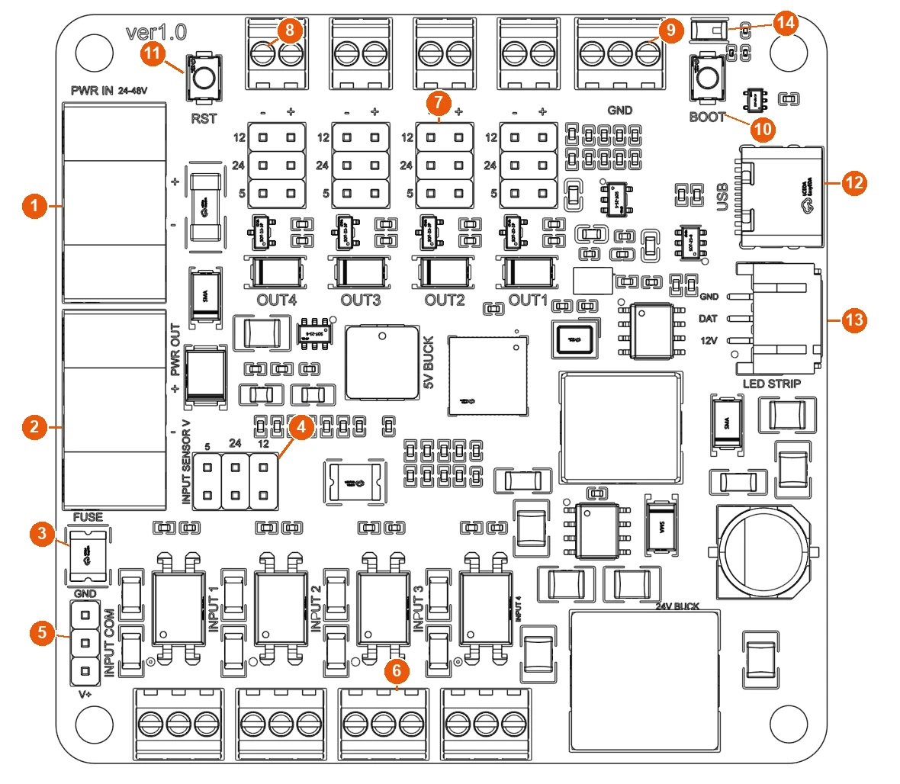

| # | Label on the board | What it is |
|---|---|---|
| 1 | **PWR IN** `+` `−` | Power in, 24–48 V DC |
| 2 | **PWR OUT** `+` `−` | The same supply passed on to another device (optional) |
| 3 | **FUSE** | Resettable fuse for the sensor supply |
| 4 | **INPUT SENSOR V** `5` `24` `12` | Jumper: the voltage on every input's `V` screw |
| 5 | **INPUT COM** `GND` … `V+` | Jumper: PNP or NPN sensors |
| 6 | **INPUT 1** … **INPUT 4** (left to right) | Input terminals. **INPUT PINS: G S V** is printed beside them |
| 7 | Output jumpers, rows `12` `24` `5` | One per output, above its terminal: that output's voltage |
| 8 | Output terminals `−` `+` | One per output. From the left: **OUT4**, **OUT3**, **OUT2**, **OUT1** (printed below the jumpers) |
| 9 | **GND** | Three spare ground screws |
| 10 | **BOOT** | Pairing button |
| 11 | **USB** | USB-C |
| 12 | **LED STRIP** `GND` `DAT` `12V` | Plug for the LED strip |
| 13 | Status light | Shows machine state and pairing (see [Status light](#status-light)) |

The underside repeats the terminal names (**INPUT 1** … and `V S G`, mirrored), so
you can check your wiring with the board turned over.

## Power

Connect a **24–48 V DC** supply to **PWR IN**: `+` to the supply's positive,
`−` to its negative.

<figure class="wio-fig" markdown>
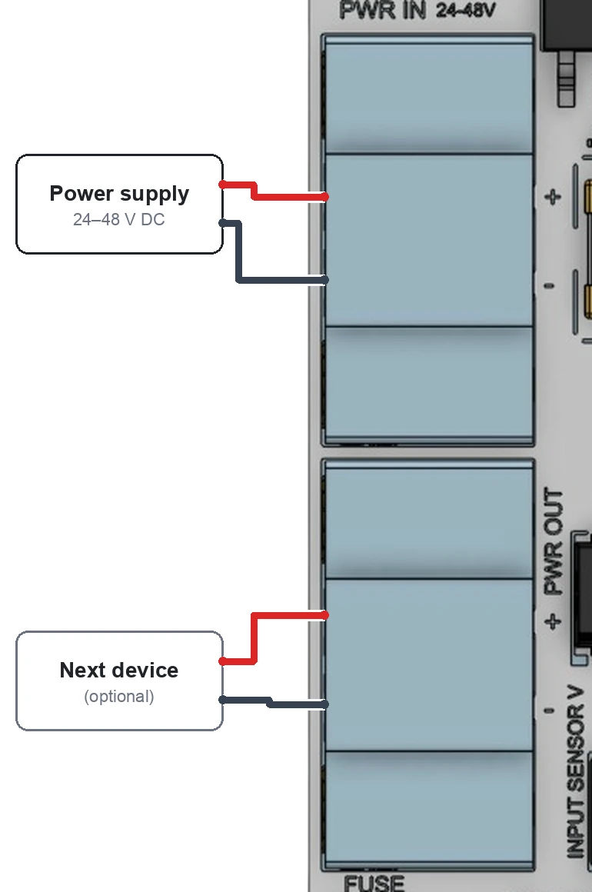
<figcaption>PWR IN from the supply (red +, black −). PWR OUT can feed another device.</figcaption>
</figure>

- Wired backwards, the board stays off and nothing is damaged. Swap the wires.
- **PWR OUT** passes your supply straight on, exactly as it is wired, so you
  can power another accessory (an RGB LED or AutoDustBoot controller) without
  a second run back to the supply. It is not fused or protected by
  ncWirelessIO, so check the polarity before you connect the next device.
- With a **24 V** supply, outputs set to `24` get slightly less than 24 V. Use
  a 36 V or 48 V supply if a 24 V load needs a full 24 V.
- USB-C alone powers the brain of the board, enough to set it up and update it.
  Inputs, outputs and the LED strip need **PWR IN**.

## Inputs

Each input has a 3-screw terminal:

<figure class="wio-fig" markdown>
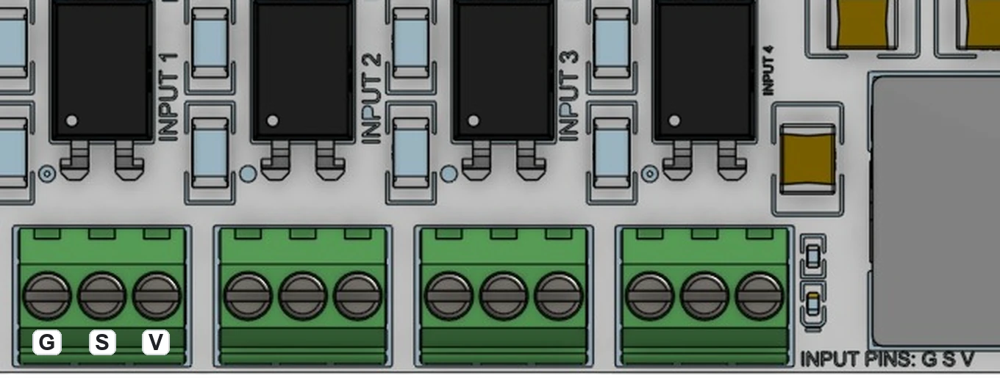
<figcaption>INPUT 1 to INPUT 4, left to right. Every terminal is G, S, V.</figcaption>
</figure>

| Screw | Name | Wire it to |
|---|---|---|
| `G` | Ground | The sensor's ground or `0 V` wire |
| `S` | Signal | The sensor's output wire, or one side of a switch |
| `V` | Sensor supply | The sensor's power wire, or the other side of a switch |

Each input has a **blue light** near its terminal. It is on while the input
is active, so you can check a sensor without opening ncSender.

### Sensor supply jumper (INPUT SENSOR V)

The `V` screw on all four inputs carries the same voltage. Choose it with the
**INPUT SENSOR V** jumper (**4** in the picture). Its columns are printed `5`,
`24` and `12`:

<figure class="wio-fig" markdown>
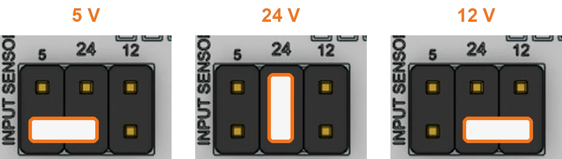
<figcaption>INPUT SENSOR V: where the shunt goes for 5, 24 and 12 V.</figcaption>
</figure>

| Voltage | Shunt position |
|---|---|
| **5 V** | Bottom row, left pair (under `5` and `24`) |
| **24 V** | Middle column, top to bottom (under `24`) |
| **12 V** | Bottom row, right pair (under `24` and `12`) |

Pick the voltage your sensors are rated for. Most inductive proximity sensors
take 12–24 V. The sensor supply is protected by a resettable fuse (**FUSE**). It
cuts out on a short and comes back once the short is removed.

### NPN or PNP (INPUT COM)

The **INPUT COM** jumper (**5** in the picture) sets the sensor type for all
four inputs. Its three pins run top to bottom: `GND`, COM, `V+`.

<figure class="wio-fig" markdown>
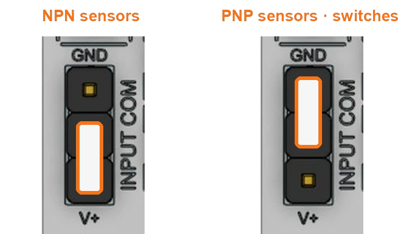
<figcaption>INPUT COM: one setting for all four inputs.</figcaption>
</figure>

| Shunt position | Use it for |
|---|---|
| **Bottom two pins** (COM and **V+**) | **NPN** sensors (they switch their output to ground) |
| **Top two pins** (COM and **GND**) | **PNP** sensors (they switch their output to the supply), and plain switches |

Mixing types? Use the setting that suits most of them. A plain switch works on
either setting if you wire it between `S` and the right screw: `S`–`V` with
**COM** on **GND**, or `S`–`G` with **COM** on **V+**.

### Sample wiring

=== "NPN sensor"

    <figure class="wio-fig" markdown>
    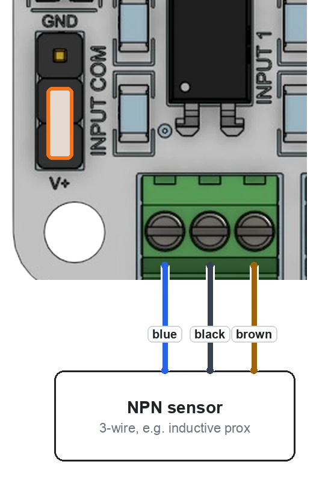
    </figure>

    - **INPUT COM** on the bottom two pins (**V+** side).
    - **INPUT SENSOR V** on the sensor's voltage.
    - Brown to `V`, black to `S`, blue to `G` (standard sensor colours; check
      your sensor's label).

=== "PNP sensor"

    <figure class="wio-fig" markdown>
    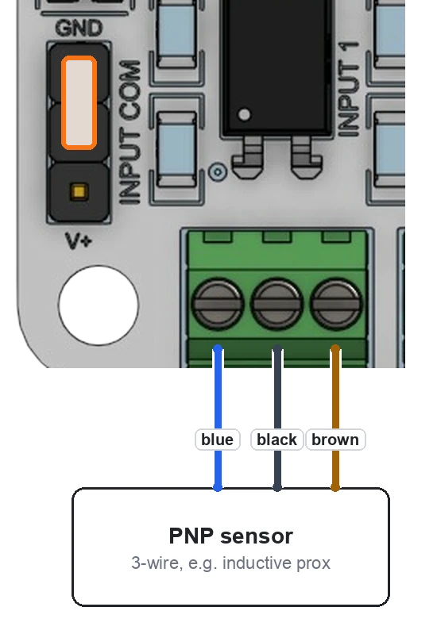
    </figure>

    - **INPUT COM** on the top two pins (**GND** side).
    - **INPUT SENSOR V** on the sensor's voltage.
    - Brown to `V`, black to `S`, blue to `G`.

=== "Switch"

    <figure class="wio-fig" markdown>
    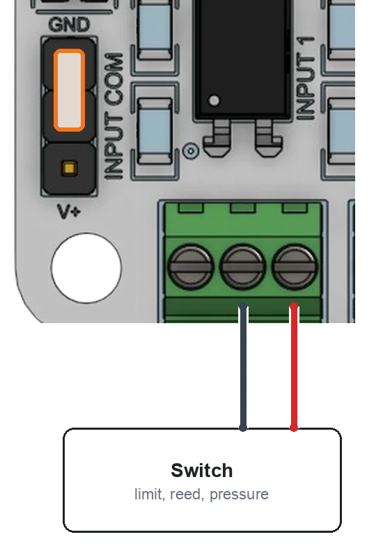
    </figure>

    For limit switches, reed switches, pressure switches and similar dry
    contacts.

    - **INPUT COM** on the top two pins (**GND** side).
    - One switch wire to `V`, the other to `S`. `G` stays empty.
    - Any **INPUT SENSOR V** setting works. `5` is gentlest on the contacts.

## Outputs

Each output has a 2-screw terminal and its own voltage jumper.

<figure class="wio-fig" markdown>
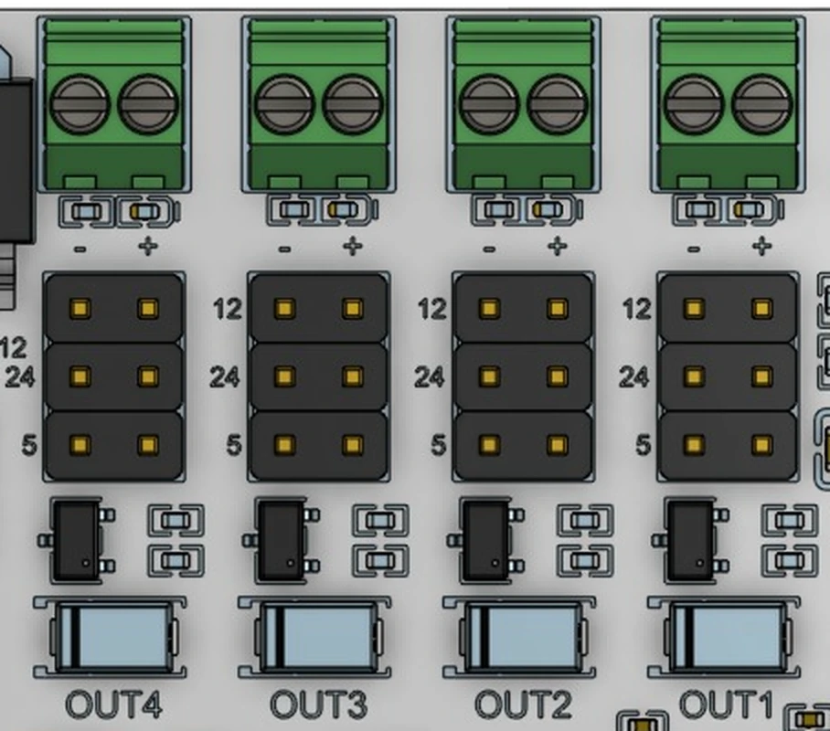
<figcaption>OUT4 to OUT1, left to right. Each output: terminal − +, its jumper below.</figcaption>
</figure>

| Screw | What it does |
|---|---|
| `−` (left) | Connected to ground while the output is on |
| `+` (right) | The voltage set by that output's jumper. Always on |

Connect the load between `−` and `+`. When ncSender turns the output on, the
load runs. Each output has a **blue light**, between its jumper and its terminal, that is on while the output is on.

### Output voltage jumpers (OUT1 … OUT4)

Each output has its own jumper, directly above its terminal (**7** in the
picture). Its rows are printed `12`, `24` and `5` from the top:

<figure class="wio-fig" markdown>
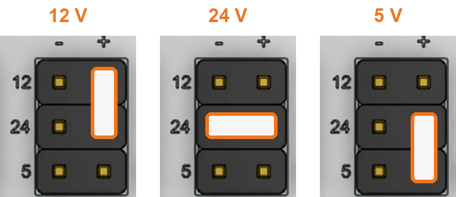
<figcaption>An output jumper (OUT1 shown): where the shunt goes for 12, 24 and 5 V.</figcaption>
</figure>

| Voltage | Shunt position |
|---|---|
| **12 V** | Right column, top pair (`12` and `24` rows) |
| **24 V** | Across the middle row (`24`) |
| **5 V** | Right column, bottom pair (`24` and `5` rows) |

Each output can use a different voltage. From the left, the terminals are
**OUT4**, **OUT3**, **OUT2**, **OUT1**.

!!! warning "Set the jumper before you connect the load"
    A 12 V solenoid on an output set to `24` runs hot and can burn out.

### Sample wiring: air solenoid

<figure class="wio-fig" markdown>
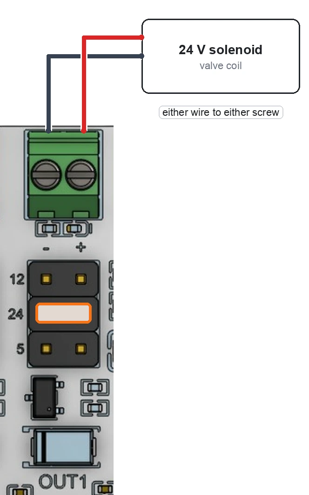
<figcaption>A 24 V solenoid valve on OUT1, jumper across the middle row.</figcaption>
</figure>

1. Set the **OUT1** jumper to `24`, across the middle row (or to your valve's voltage).
2. Connect the valve's two wires to OUT1 `−` and `+`. Either way round.
   OUT1 is the rightmost output terminal.
3. Turn OUT1 on from ncSender to check the valve clicks.

Solenoids, relays and other coils are safe to connect directly. The board
already has the protection diode a coil needs.

### What an output can drive

- Up to about **0.8 A** per output.
- Solenoid valves, relay coils, small fans, pumps, indicator lamps.
- If an output is shorted it switches off and recovers on its own once the
  short is removed.
- Bigger loads (spindle contactors, vacuum motors): drive a relay or contactor
  from the output, not the load itself.

### Fail-safe

An output can be set to **switch off on its own if the link to ncSender is
lost**, for example if the PC sleeps or the Wireless USB is unplugged. Use it
for anything that should not stay on unattended.

## LED strip

Plug a **12 V WS2811** strip into **LED STRIP**:

<figure class="wio-fig" markdown>
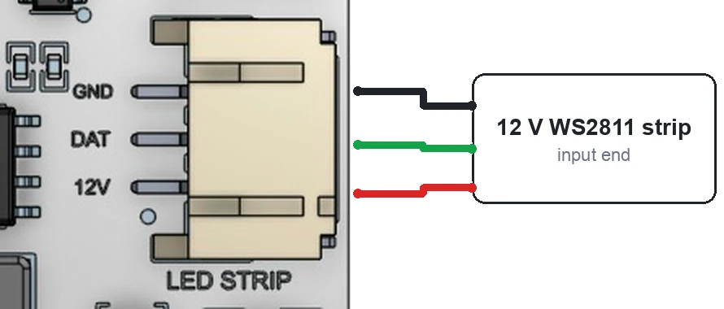
<figcaption>Connect the strip's input end (the end its arrows point away from).</figcaption>
</figure>

The strip works exactly like the [RGB LED &rarr;](smart-rgb-led.md): white at
idle, green while running, red on an alarm, a light show when a job finishes,
and so on. Set it up with the **RGB LED** plugin, the same way. The strip's
power comes from the board through a resettable fuse.

No strip? The **status light** on the board shows the same colours.

## Input and output mapping

| On the board | In ncSender | Light on the board |
|---|---|---|
| INPUT 1 | Input 1 | Blue, near INPUT 1 |
| INPUT 2 | Input 2 | Blue, near INPUT 2 |
| INPUT 3 | Input 3 | Blue, near INPUT 3 |
| INPUT 4 | Input 4 | Blue, near INPUT 4 |
| OUT1 (rightmost) | Output 1 | Blue, near OUT1 |
| OUT2 | Output 2 | Blue, near OUT2 |
| OUT3 | Output 3 | Blue, near OUT3 |
| OUT4 (leftmost) | Output 4 | Blue, near OUT4 |

For a pneumatic tool changer:

| Device | Connect to | Settings |
|---|---|---|
| Drawbar sensor | **INPUT 1** | **INPUT COM** to match the sensor (NPN or PNP) |
| Tool sensor | **INPUT 2** | Same |
| Clamp / unclamp solenoid | **OUT1** | **OUT1** jumper on the valve's voltage |
| Air pressure switch (optional) | **INPUT 3** | Wire as a switch |
| Taper blow valve (optional) | **OUT2** | **OUT2** jumper on the valve's voltage |

## Status light

The status light on the board shows the same thing the LED strip does.

| Status light | Meaning |
|---|---|
| Yellow, breathing | Not paired yet, or pairing |
| Amber, blinking | Needs activating (see [Activating &rarr;](wireless-usb.md#activating)) |
| White | Idle, or connected but ncSender is not sending a machine state |
| Green | Running or jogging |
| Amber | Hold |
| Red | Alarm |
| Orange | Door open |
| Teal | Probing |
| Blue | Homing |
| Magenta | Tool change |
| Changing colours, then green breathing | A job just finished |
| Blue, pulsing | Firmware update in progress. Don't power off |

## Getting connected

1. Plug the Wireless USB into the computer running ncSender.
2. Power ncWirelessIO from **PWR IN**.
3. In ncSender, open **Accessories** (the pendant icon in the toolbar) and
   click **Pair Device**. You have **60 seconds**.
4. On the board, hold **BOOT** for **3 seconds**. The status light breathes
   yellow while it looks for the Wireless USB.
    - If **BOOT** is hard to reach, switch the power off and on **three times
      quickly** instead.
5. Select **ncWirelessIO** in Accessories. It shows **Connected**.
6. If it shows **!**, click **Activate**. See
   [Wireless USB &rarr;](wireless-usb.md#activating).

## Firmware updates

1. Open **Accessories** and select **ncWirelessIO**.
2. Click **Update to v…** in the Firmware card.
3. Keep the board powered until it finishes. The status light pulses blue.

With the board plugged into the ncSender computer by USB-C, the update goes
over the cable and takes about 20 seconds. Without the cable it goes wirelessly
and takes over a minute. If an update is interrupted, the current
firmware keeps working. Just start again.

## Troubleshooting

- **An input never turns on.** Check its blue light while you trigger the
  sensor. If the light stays off: check the **INPUT COM** jumper matches the
  sensor (NPN or PNP), check **INPUT SENSOR V** is on the sensor's voltage, and
  check `G`, `S`, `V` are not swapped.
- **An input is always on.** The **INPUT COM** jumper is probably on the wrong
  side for the sensor type.
- **All sensors stopped at once.** The sensor supply fuse has tripped, usually
  a shorted sensor cable. Fix the short; it recovers by itself.
- **An output's light comes on but the load doesn't run.** Check the output's
  jumper is fitted, and that **PWR IN** has power. USB-C alone does not power
  the outputs.
- **A load runs weakly.** Check the output's jumper voltage, and with a 24 V
  supply see [Power](#power).
- **Status light blinks amber.** The board needs activating. See
  [Activating &rarr;](wireless-usb.md#activating).
- **Status light breathes yellow.** It is not paired. See
  [Getting connected](#getting-connected).

## Specifications

| | |
|---|---|
| Supply | 24–48 V DC, reverse-polarity protected |
| Inputs | 4, optically isolated, 3.3–24 V, NPN, PNP or switch |
| Sensor supply | 5, 12 or 24 V by jumper, resettable fuse |
| Outputs | 4 switched, 5, 12 or 24 V per output by jumper, about 0.8 A each, short-circuit protected |
| LED strip | 12 V WS2811, fused |
| Connection | Wireless, through the ncSender Wireless USB |
| USB | USB-C, for set-up and updates |
| Size | 70 × 68 mm |
