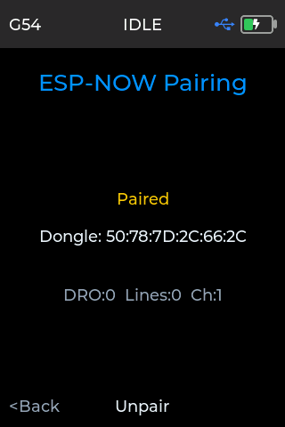
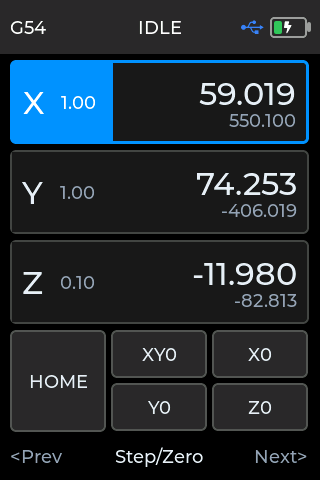
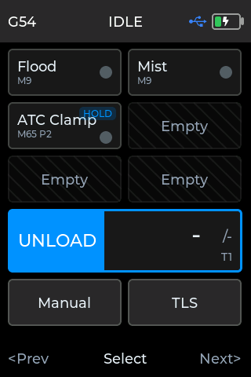
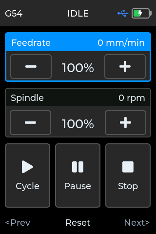
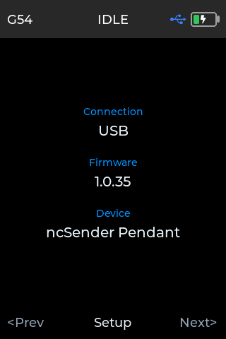
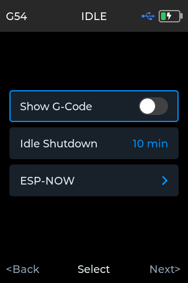

# Pendant

The ncSender Wireless Pendant is a handheld controller for your CNC machine. It
gives you a live position readout and hands-on control of jogging, zeroing,
homing, probing, tool changes, aux outputs and running jobs, right at the
machine.

It connects to ncSender wirelessly through a small Wireless USB, so you can
walk around the machine while you work.

!!! info "Minimum versions"
    - **Wireless firmware updates** — Wireless USB **v0.3.5** or newer.
      See [Wireless USB &rarr;](wireless-usb.md#wireless-usb-older-than-v035).
    - **Running the pendant alongside other wireless accessories:**
        - **ncSender** — v2.0.63 or newer
        - **ncSender Pro** — v2.0.117 or newer
        - **Pendant firmware** — v1.0.16 or newer
        - **Wireless USB firmware** — v0.3.0 or newer
    - **Tool picker with Manual, live tool changer updates and the TLS
      reminder** — pendant firmware **v1.0.37**, ncSender **v2.0.148** or
      ncSender Pro **v2.0.220** or newer.

## Hardware

- **Pendant** — a battery-powered handheld with a touch display, a jog knob,
  three soft buttons and a power button.
- **Wireless USB** — a small USB stick that plugs into the computer running
  ncSender and links to the pendant wirelessly.

## Getting connected

1. Plug the Wireless USB into the computer running ncSender.
2. Power on the pendant (hold the power button).
3. Once paired, the pendant reconnects on its own and its status bar shows
   the connection icon.

Once connected, the pendant follows your machine live, and every button you
press acts on the machine right away.

### First-time pairing

1. In ncSender, open **Accessories** (the pendant icon in the toolbar).
2. Click **Pair Device**. You have **60 seconds**.
3. On the pendant, go to **Setup → ESP-NOW** and press **Scan**.
4. Select **Pendant** in Accessories. It shows **Connected**.

**Pair Device** needs an activated Wireless USB. See
[Wireless USB &rarr;](wireless-usb.md#activating).

<!-- CAPTURE NEEDED: assets/images/accessories/pendant-pairing-flow.webp (Pairing the pendant) -->

## Activating the pendant

A pendant that isn't activated shows **Activation Required**.

1. Connect the pendant to the computer with its USB cable.
2. In ncSender, open **Accessories** and select **Pendant**.
3. Click **Activate**. If the pendant has been activated before, that is all.
   If it is new to the store, enter the **Installation ID** that came with it.

## Re-pairing the pendant

Pairing is remembered, so you shouldn't normally need to do it again. Re-pair
when:

- **You swapped in a different Wireless USB**, or moved the pendant to another
  machine.
- **The pendant no longer connects** after a Wireless USB update.
- **The connection has become unstable** and reconnecting doesn't help.

**Steps:**

1. **Unpair in ncSender.** Open **Accessories**, select **Pendant**, click
   **Unpair** in the Pairing card, and confirm.
2. **Unpair on the pendant.** Go to **Setup → ESP-NOW** and choose **Unpair**
   if the pendant still shows itself as paired.
3. **Click Pair Device** in Accessories. You have 60 seconds.
4. **Scan on the pendant.** Go to **Setup → ESP-NOW → Scan**.
5. **Check it.** The connection icon on the pendant lights up, and **Pendant**
   shows **Connected** in Accessories.

!!! tip "If the pendant doesn't find the Wireless USB"
    - Press **Scan** as soon as you click **Pair Device**. If the countdown
      runs out, click **Pair Device** again.
    - Make sure the pendant is on **v1.0.16 or newer** when the Wireless USB
      is on **v0.3.x**.
    - If it still won't pair, update the Wireless USB (see
      [Wireless USB &rarr;](wireless-usb.md#updating-firmware)) and try again.

## Screens

Hold **Prev** or **Next** for half a second to move between screens: **Jog**,
**Aux & Tool Change**, **Probe**, **Job** and **Info**. Open **Setup** from the
Info screen.

!!! info "Hold to activate"
    Anything that moves the machine, changes a tool or ends a job needs a
    **1-second hold** on the touch screen, so a stray touch can't set it off.
    While you hold, a white fill sweeps across the control. Lift your finger
    before the fill completes, or slide it off, to cancel.

    A tap on the screen only selects the control. Once it's selected, press
    **Exec** (the middle soft button) to run it straight away.

### Jog

The home screen: your live readout and jogging controls.

**Status bar (top)** shows the active workspace (e.g. `G54`), the machine
status (`IDLE`, `RUN`, `HOLD`, `ALARM`, …), the connection icon and the
battery level.

**Position readout** lists each axis (X, Y, Z) with its work position in large
type and the machine position in smaller type underneath. The highlighted axis
is the one the jog knob moves. The small number next to each axis label is the
current jog step.

**Turn the jog knob** to move the selected axis. Turning faster moves faster.
Z jog is limited to what your machine can stop cleanly, so fast turns don't
overshoot.

**Changing the step size.** Use **Prev / Next** to pick an axis, then press
**Step/Zero** to cycle its step: `0.01`, `0.1`, `1.0`. X and Y share a step;
Z has its own.

**Zeroing an axis.** Hold the axis card on the screen for 1 second, or hold
**Step/Zero** with the axis selected. The fill sweeps across the position side
of the card.

**Buttons:**

- **HOME** — run the homing cycle.
- **XY0 / X0 / Y0 / Z0** — move to zero on those axes. The machine lifts to
  safe Z first.

Hold a button on the screen for 1 second to run it.

**Footer.** Three soft buttons below the screen: **Prev**, the middle button
and **Next**.

- **Prev / Next** — move between the axes and buttons.
- **Step/Zero** (axis selected) — press to cycle the step, hold to zero the
  axis.
- **Exec** (button selected) — run the button.
- **Hold Prev / Next** — change screen.

### Aux & Tool Change

Aux switches, the tool changer slot picker and tool-change actions in one
place.

**Aux switches (top).** Up to six switches, each with its name and an ON/OFF
dot. Empty spaces show *Empty*.

If you haven't set up any aux outputs, the first two are **Flood** and
**Mist**. Add or change them in ncSender under **Settings → Advanced →
Auxiliary I/O**. Changes reach the pendant right away.

Hold a switch on the screen for 1 second to turn it on or off. Switches set to
hold-to-activate show a **HOLD** badge after their command, and need a hold on
**Exec** too.

**Tool picker (middle).** The right side shows the chosen tool (e.g.
**SLOT 1**) with your total slots underneath (**Total: 6**). The left side
shows **LOAD** or **UNLOAD** with the tool in the spindle underneath (e.g.
**Current: T1**).

Turn the jog knob to pick a tool. After the last slot the picker offers:

- **Manual** — change to a tool by hand, when your tool changer allows it.
- **Probe** — load the probe, when the probe tool is turned on in your tool
  changer.

Hold the picker on the screen for 1 second, or press **Exec**, to load the
chosen tool. If the chosen tool is already in the spindle, the same action
unloads it.

The slots, Manual, Probe and TLS come from your tool-change plugin (Pneumatic
ATC, Rapid Change ATC or Manual Tool Changer). The pendant updates as soon as
you enable, disable or change the plugin. With no tool changer set up, the
picker is hatched out and can't be selected.

**TLS (bottom).** Measure the tool length. Hold for 1 second, or press
**Exec**. When a tool is loaded but its length hasn't been measured, **TLS**
glows red, the same as in ncSender, to remind you to measure it. TLS is hatched
out when your tool changer has no tool length setter.

**Footer.** **Prev / Next** move between items. **Exec** runs the chosen item.
Hold **Prev** or **Next** to change screen.

### Probe

Jog to the touch-off point and start a probe without walking back to ncSender.

<!-- CAPTURE NEEDED: assets/images/accessories/pendant-probe-screen.webp (Pendant probe screen) -->

1. Pick the axis and step at the top, and turn the jog knob to move the
   machine into place.
2. Choose the **probe type**: **3D Probe**, **Std Block**, **AutoZero** or
   **TLS**.
3. Choose the **mode**: **Z**, **XYZ**, **XY**, **X**, **Y**, **Center-In** or
   **Center-Out**.
4. Pick where the probe sits on the work: a corner, an edge or the centre.
   For **Center-In** and **Center-Out**, turn the jog knob to set the
   diameter instead.
5. Hold **Start Probe** for 1 second.

While probing, the button changes to **Stop Probe**. Hold it for 1 second to
stop.

<!-- CAPTURE NEEDED: assets/images/accessories/pendant-probe-running.webp (Pendant probing) -->

If **Start Probe** is unavailable, the line under it tells you why. For
example, the machine is busy, the pendant isn't connected, or you need to
touch the probe once to test it. The **PROBE** and **TLS** dots light up when
the probe is triggered.

Plunge, offsets, feeds and the 3D probe's ball diameter come from your probe
settings in ncSender.

**Footer.** **Prev / Next** move between rows. **Select** changes the chosen
row. Long-press **Select** to start the probe.

### Job

When you start a program, the pendant switches to the Job screen. You can also
reach it any time from the screen cycle.

**Feedrate and Spindle.** Each card's title bar shows the live feed rate
(mm/min or in/min) and spindle speed. Use the card to change its override
while the program runs:

- Tap **−** or **+** to change the override by 10 %. Hold the button to keep
  changing it.
- Tap the percentage to reset it to 100 %. It turns blue when it isn't at 100 %.
- Or pick the card with **Prev / Next** and turn the jog knob. **Reset** sets
  it back to 100 %.

Overrides go from 10 % to 200 %. Lowering the feed override also slows rapid
moves (see [Overrides](../features/visualizer.md#overrides)).

**Program buttons.** They use the same colours as in ncSender:

- **Cycle** (blue) — start or resume the program. Hold for 1 second.
- **Pause** (amber) — pause the program. A single tap pauses straight away.
- **Stop** (red) — stop the program. Hold for 1 second.

!!! question "Why does Pause work on a tap, but Stop needs a hold?"
    A paused program simply carries on when you resume it, so an accidental
    tap on **Pause** costs nothing, and you can pause the moment you need to.
    A stopped program can't be resumed; it has to be started again. The
    1-second hold on **Stop** makes sure it only happens when you mean it.

    Stop on the pendant isn't an emergency stop. Use your machine's E-stop for
    emergencies. If you want to stop right away from the pendant, select
    **Stop** and press **Exec**.

A button that can't be used right now is shown faded and can't be selected:
**Cycle** while the program is running, and **Pause** when nothing is running
or the program is already paused.

With a button selected, press **Exec** to run it straight away. With a card
selected, the middle button is **Reset**.

When the job finishes or you stop it, the pendant stays on the Job screen.

### Info

Shows the pendant's connection type, firmware version and device name. Press
**Setup** here to open the Setup screen.

### Setup

The pendant's own preferences.

- **Show G-Code** — when on, commands from the pendant show in ncSender's
  console.
- **Idle Shutdown** — how long the pendant waits with no activity before it
  turns itself off. Choose from **5 to 30 minutes**. Turn the jog knob or tap
  the row to change it.
- **ESP-NOW** — pair or unpair with a Wireless USB.

!!! note "Idle shutdown only runs on battery"
    While the pendant is plugged into USB, it stays on. Any touch, button or
    knob movement restarts the timer.

### Alarm prompt

When the machine goes into alarm, the pendant shows **ALARM** with the alarm
number and its description. Press **Unlock** to clear it. The prompt closes by
itself when the alarm is cleared anywhere, including from ncSender.

<!-- CAPTURE NEEDED: assets/images/accessories/pendant-alarm-prompt.webp (Pendant alarm prompt) -->

## Managing the pendant from ncSender

Open **Accessories** (the pendant icon in the toolbar) and select **Pendant**.

Here you can:

- See whether the pendant is connected, and whether over **USB** or
  **Wireless**.
- **Copy** its Device ID for support.
- Activate it.
- Update its firmware.
- Unpair it.

### Updating pendant firmware

1. Open **Accessories** and select **Pendant**.
2. Click **Update to v…** in the Firmware card.
3. Keep the pendant powered and connected until it finishes.

- With the USB cable plugged in, the update goes over the cable. Otherwise it
  goes wirelessly through the Wireless USB.
- ncSender picks the right firmware for your pendant, and handles older
  pendants on the cable automatically.
- If an update is interrupted, the current firmware keeps working. Just start
  again.

## Wireless USB

Pendant traffic runs through the [Wireless USB &rarr;](wireless-usb.md), the
same stick the AutoDustBoot and RGB LED use. Updating the Wireless USB doesn't
require updating the pendant.
