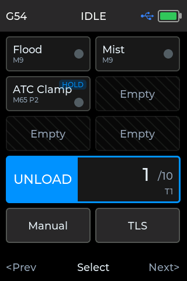
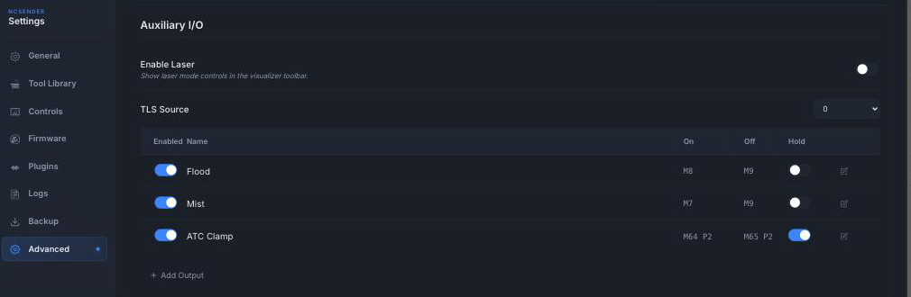

# Pendant

The ncSender Wireless Pendant is a handheld controller for your CNC machine. It
gives you a live position readout and hands-on control of jogging, zeroing,
homing, tool changes, aux outputs, and running jobs — right at the machine,
without reaching for the keyboard.

It connects to ncSender wirelessly through a small Wireless USB, so you can
walk around the machine while you work.

!!! info "Minimum versions"
    - **Wireless multi-device support** (running the pendant alongside other
      wireless accessories on the same Wireless USB):
        - **ncSender** — v2.0.63 or newer
        - **ncSender Pro** — v2.0.117 or newer
        - **Pendant firmware** — v1.0.16 or newer
        - **Wireless USB firmware** — v0.3.0 or newer
    - **Reliable direct-USB firmware update** (per-chunk CRC + retry, catches
      the byte-drop failures older USB drivers occasionally introduced):
        - **ncSender** — v2.0.106 or newer
        - **ncSender Pro** — v2.0.168 or newer
        - **Pendant firmware** — v1.0.20 or newer

    See [Wireless USB &rarr;](wireless-usb.md) for how to flash a Wireless
    USB update. If you're on older versions and only use the pendant on its
    own, no updates are needed.

## Hardware

- **Pendant** — a battery-powered handheld with a touch display, a jog knob
  (rotary encoder), three soft buttons, and a power button.
- **Wireless USB** — a small USB stick that plugs into the computer running
  ncSender and links to the pendant wirelessly.

## Getting connected

1. Plug the Wireless USB into the computer running ncSender.
2. Power on the pendant (hold the power button).
3. The pendant and Wireless USB pair automatically and the status bar shows
   the connection icon.

Once connected, the pendant mirrors your machine state in real time and any
button you press acts on the machine immediately.

!!! tip "First-time pairing"
    If the pendant and Wireless USB have never been paired, open the **Setup**
    screen on the pendant and choose **ESP-NOW → Scan** to pair them. After
    the first pairing the connection is remembered and reconnects on its own.

{ .center }

The pairing screen shows whether the pendant is currently paired. Press
**Scan** to search for a Wireless USB; press **&lt;Back** to return to Setup.

## Re-pairing the pendant

The first pairing is automatic and sticks — you shouldn't normally have to do
it again. A few situations do call for a re-pair:

- **You flashed a major Wireless USB firmware update** (e.g. `v0.2.x → v0.3.x`).
  Major-version firmware resets the Wireless USB's paired-device list.
- **You swapped in a different Wireless USB.**
- **You want to move the pendant to a different Wireless USB / different machine.**
- **The pairing has become unstable** and reconnects don't recover.

**Steps:**

1. **Clear the old pairing on the ncSender side.** Click the pendant icon in
   the ncSender toolbar to open the **Wireless USB** dialog. Under **Devices**,
   click **Unpair** next to the pendant row and confirm.
2. **Clear the old pairing on the pendant.** On the pendant, go to
   **Setup → ESP-NOW** and choose **Unpair** if the pendant still shows
   itself as paired.
3. **Open a new pairing window on ncSender.** Back in the Wireless USB dialog,
   click **+ Pair New Device**. A 30-second countdown starts — the Wireless
   USB is now listening for a new device to pair.
4. **Scan on the pendant.** While the ncSender window is still open, go to
   **Setup → ESP-NOW → Scan** on the pendant. The pendant finds the Wireless
   USB and completes the pairing.
5. **Verify.** The connection icon in the pendant's status bar should light up
   within a few seconds, and the pendant row in the ncSender Wireless USB
   dialog shows as **Connected**.

!!! tip "If the pendant doesn't find the Wireless USB"
    - The 30-second window closes fast — start **Scan** on the pendant as soon
      as you click **+ Pair New Device** in ncSender.
    - If the two firmwares are on mismatched major versions, pairing can
      silently fail. Make sure the pendant is on **v1.0.16 or newer** when the
      Wireless USB is on **v0.3.x**.
    - If it still won't pair, flash the latest Wireless USB firmware (see
      [Wireless USB &rarr;](wireless-usb.md)) and try again.

## Screens

The pendant has five screens you'll cycle through with the footer soft
buttons: **Jog**, **Aux & Tool Change**, **Job** (auto-swapped in while a
program runs), **Info**, and **Setup**.

### Jog

The home screen — your live readout and jogging controls.

{ .center }

**Status bar (top)** shows, left to right: the active workspace (e.g. `G54`),
the machine status (`IDLE`, `RUN`, `HOLD`, `ALARM`, …), the connection icon,
and the battery level.

**Position readout** lists each axis (X, Y, Z) with its work position in large
type and the machine position in smaller type underneath. The highlighted axis
is the one the jog knob will move; the small number next to each axis label
(e.g. `1.00`) is the current jog step size.

**Turn the jog knob** to move the selected axis. The step size sets how far
each click travels; turning faster moves faster. Z jog is speed-limited to
what your machine can accelerate and decelerate cleanly, so fast rotations
stay smooth and stop without overshooting the end of travel.

**Changing the step size.** Use the footer **Prev / Next** buttons to focus
the axis you want, then press **Select** (middle) to cycle its step size.
Available steps are `0.01`, `0.1`, and `1.0` — the current value shows next
to the axis label (e.g. `X 0.10`). X and Y share the same step; Z has its
own so you can jog Z fine while still moving XY in millimetres.

**Buttons:**

- **HOME** — run the homing cycle.
- **XY0 / X0 / Y0 / Z0** — zero the work position for those axes at the current
  location.

**Footer.** Three soft buttons below the screen: **Prev / Select / Next**.

- **Prev / Next** — cycle focus through axes and action buttons (Home,
  XY0, X0, Y0, Z0).
- **Select** (labelled **Step / Zero** on this screen) — its action
  depends on what's focused: on an axis it cycles the step size, on an
  action button (Home / X0 / Y0 / Z0 / XY0) it fires that action.
- **Long-press Prev / Next** — switch between screens.

### Aux & Tool Change

The Aux & Tool Change screen groups everything you tend to reach for mid-job
into one place: aux switches (coolant, air, laser, whatever you've wired
up), the ATC slot picker, and manual tool-change actions.

{ .center }

**Aux grid (top).** A fixed 2 × 3 grid of aux buttons — always six cells so
the layout doesn't shuffle when you add or remove outputs. Each configured
aux shows its name, its `M`-command hint (e.g. `M8`, `M64 P0`), and an
ON/OFF dot on the right; unconfigured cells show as *Empty* placeholders.

If you haven't defined any custom aux outputs, the pendant seeds the first
two cells with **Flood** (`M8`) and **Mist** (`M7`) so coolant is always
one tap away. Add or edit them in ncSender under **Settings → Advanced →
Auxiliary I/O**; changes push to the pendant right away.

**Slot picker (middle).** Shows the target slot on the left (`1 /6` — the
current pick over your total slots) and the action on the right (`LOAD` or
`UNLOAD`, with the loaded tool number `T3` underneath). Rotate the jog knob
to change the slot; long-press **Select** to load or unload.

The total slot count comes from whichever tool-change plugin you have set
up — Pneumatic ATC, Rapid Change ATC, or Manual Tool Changer. Save the
plugin's config and the pendant picks up the count automatically. With no
tool-change plugin configured, the picker shows `-/-`.

**Actions (bottom).**

- **Manual** — send an `M6` (routed through whichever tool-change plugin is
  configured). Long-press to fire.
- **TLS** — run the tool-length probe (`$TLS`). Long-press to fire.

Both require a **long-press** to fire, so a stray tap on the touchscreen
mid-job can't accidentally launch a probe cycle or start a tool change.

**Footer.** Use **Prev** and **Next** to move the focus around the screen
(the current selection is highlighted). **Select** activates the focused
item — short-press for aux switches, long-press for items that need a hold
to fire. Long-press **Prev** or **Next** to switch between screens.

### Job

When you start a program, the pendant automatically switches to the Job
screen so the controls you need while cutting are front and centre.

{ .center }

- **Feedrate / Spindle** (top) — the live feed rate and spindle speed the
  machine is actually running.
- **Feed Override / Spindle Override** — turn the jog knob to trim feed rate
  or spindle speed on the fly. Select which slider to adjust with the footer
  buttons; each shows the current override percentage.
- **Cycle** — start / resume the program.
- **Pause** — feed-hold the running program.
- **Stop** — stop the program.

When the job finishes or you stop it, the pendant returns to the Jog screen
automatically.

### Info

The Info screen shows the pendant's current connection type, firmware
version, and device name. It's the quickest way to check which firmware
you're running — useful before and after a firmware update. Press **Setup**
here to open the Setup screen.

{ .center }

!!! note ""
    Firmware version shown in the screenshot is a development build — the
    number on your pendant reflects the release you've actually installed.

### Setup

The Setup screen holds the pendant's own preferences.

{ .center }

- **Show G-Code** — when on, jog and command output from the pendant is
  echoed in ncSender's console. Off keeps the console quiet.
- **Idle Shutdown** — how long the pendant waits, with no activity, before
  it powers itself off to save battery. Choose from **5 to 30 minutes**.
  Turn the jog knob (or tap the row) to change the value.
- **ESP-NOW** — pair or unpair with a Wireless USB.

!!! note "Idle shutdown only runs on battery"
    While the pendant is plugged into USB (or charging), it stays on
    indefinitely. The idle timer only starts once it's running on battery,
    and any touch, button, or knob movement resets it.

## Managing the pendant from ncSender

Two ncSender surfaces work with the pendant. They cover different things:

| Surface | What it does |
|---|---|
| **Wireless USB** dialog (built-in) | Pair / unpair the pendant with the Wireless USB. Also handles Wireless USB activation and shows every device currently paired (pendant, AutoDustBoot, Smart RGB LED, …). |
| **Pendant** plugin | Activate the pendant itself, check the pendant's firmware version, and flash pendant firmware updates over the air. |

Click the **pendant icon** in the ncSender toolbar (next to the connection
status) to open the **Wireless USB** dialog. Everything to do with which
devices are paired to your Wireless USB lives here — including the pendant.

For pendant **activation and firmware updates**, install the **Pendant**
plugin from ncSender's plugin catalog. The plugin adds a **Pendant** entry
to the tools menu; open it to see the current connection, activate the
pendant, or check for and flash firmware updates.

!!! info "Why is pendant firmware a plugin?"
    Previously the pendant had its own built-in dialog in ncSender. Splitting
    it into a plugin (like AutoDustBoot) lets pendant firmware ship on its own
    release cadence — you get new firmware and activation features without
    waiting for a full ncSender release, and users who don't own a pendant
    don't have unused UI in their toolbar.

### Pendant firmware updates

The Pendant plugin can flash pendant firmware two ways:

- **Wireless (via the Wireless USB / dongle)** — the default. Works whenever
  the pendant is paired and communicating. Slower than USB (small ESP-NOW
  frames, per-chunk ACKs) but very robust — the underlying transport already
  retries dropped chunks.
- **Direct USB** — plug the pendant into the computer with a USB-C cable and
  the plugin uses that link instead. Faster (a full 1 MB firmware finishes
  in ~10 seconds) and does not need the Wireless USB to be paired.

!!! success "Reliable USB flashing (v2.0.106 / v2.0.168 / firmware v1.0.20)"
    Older versions of the USB flash path could fail with a vague *End failed*
    message when the operating-system USB driver dropped a byte mid-transfer.
    On the current versions, the host and pendant negotiate a chunked
    protocol with **per-chunk CRC-32** and **retry**, plus **whole-image
    MD5** verification at the end. Any dropped chunk gets resent
    automatically — if the flash succeeds you know the image on flash matches
    the file byte-for-byte.

## Wireless USB

Pendant traffic runs over the [Wireless USB &rarr;](wireless-usb.md), the
same accessory the AutoDustBoot and Smart RGB LED use. Pairing, unpairing,
and firmware flashing for the Wireless USB are on that page — the pendant
never needs to be re-flashed when the Wireless USB is updated.
