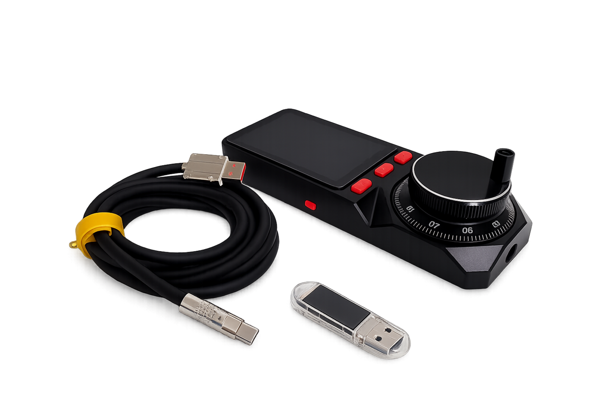
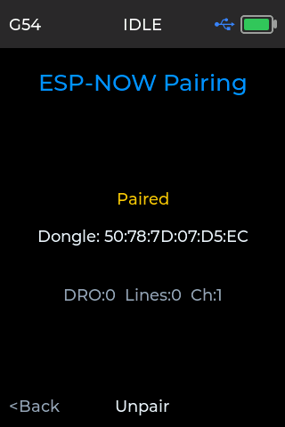
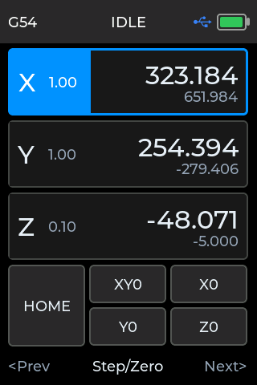
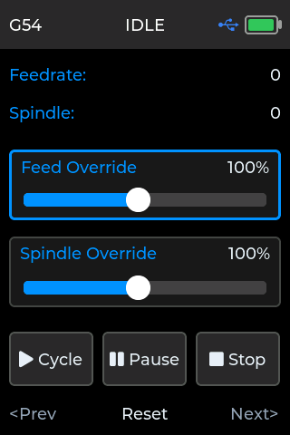
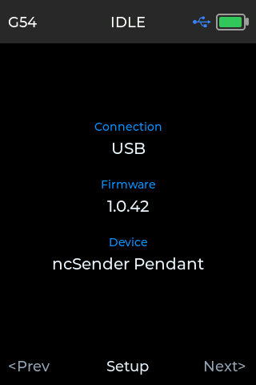
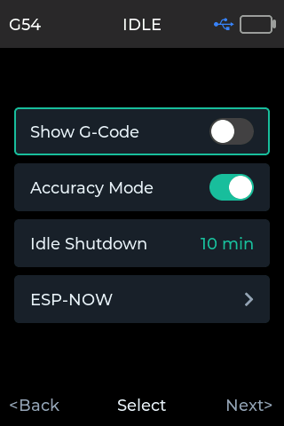
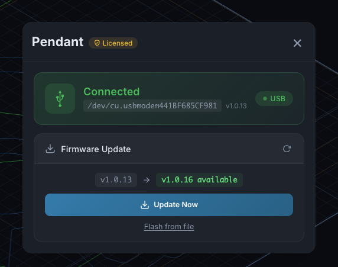

# Pendant

The ncSender Wireless Pendant is a handheld controller for your CNC machine. It
gives you a live position readout and hands-on control of jogging, zeroing,
homing, and running jobs — right at the machine, without reaching for the
keyboard.

It connects to ncSender wirelessly through a small Wireless USB, so you can
walk around the machine while you work.

!!! info "Minimum versions for wireless multi-device support"
    Running the pendant alongside other wireless accessories on the same
    Wireless USB requires:

    - **ncSender** — v2.0.63 or newer
    - **ncSender Pro** — v2.0.117 or newer
    - **Pendant firmware** — v1.0.16 or newer (any recent build is fine)
    - **Wireless USB firmware** — v0.2.2 or newer

    See [Wireless USB](#wireless-usb) below for how to flash a Wireless USB
    update. If you're on older versions and only use the pendant on its own,
    no updates are needed.

## Hardware

- **Pendant** — a battery-powered handheld with a touch display, a jog knob
  (rotary encoder), three soft buttons, and a power button.
- **Wireless USB** — a small USB stick that plugs into the computer running
  ncSender and links to the pendant wirelessly.

## Getting connected

1. Plug the Wireless USB into the computer running ncSender.
2. Power on the pendant (hold the power button).
3. The pendant and Wireless USB pair automatically and the status bar shows
   the connection icon.

Once connected, the pendant mirrors your machine state in real time and any
button you press acts on the machine immediately.

!!! tip "First-time pairing"
    If the pendant and Wireless USB have never been paired, open the **Setup**
    screen on the pendant and choose **Wireless → Scan** to pair them. After
    the first pairing the connection is remembered and reconnects on its own.

The pairing screen shows whether the pendant is currently paired. Press
**Scan** to search for a Wireless USB; press **&lt;Back** to return to Setup.

## Re-pairing the pendant

The first pairing is automatic and sticks — you shouldn't normally have to do
it again. A few situations do call for a re-pair:

- **You flashed a major Wireless USB firmware update** (e.g. `v0.1.x → v0.2.x`).
  Major-version firmware resets the Wireless USB's paired-device list.
- **You swapped in a different Wireless USB.**
- **You want to move the pendant to a different Wireless USB / different machine.**
- **The pairing has become unstable** and reconnects don't recover.

**Steps:**

1. **Clear the old pairing on the ncSender side.** Click the pendant icon in
   the ncSender toolbar to open the **Wireless USB** dialog. Under **Devices**,
   click **Unpair** next to the pendant row and confirm.
2. **Clear the old pairing on the pendant.** On the pendant, go to
   **Setup → Wireless** and choose **Unpair** if the pendant still shows
   itself as paired.
3. **Open a new pairing window on ncSender.** Back in the Wireless USB dialog,
   click **+ Pair New Device**. A 30-second countdown starts — the Wireless
   USB is now listening for a new device to pair.
4. **Scan on the pendant.** While the ncSender window is still open, go to
   **Setup → Wireless → Scan** on the pendant. The pendant finds the Wireless
   USB and completes the pairing.
5. **Verify.** The connection icon in the pendant's status bar should light up
   within a few seconds, and the pendant row in the ncSender Wireless USB
   dialog shows as **Connected**.

!!! tip "If the pendant doesn't find the Wireless USB"
    - The 30-second window closes fast — start **Scan** on the pendant as soon
      as you click **+ Pair New Device** in ncSender.
    - If the two firmwares are on mismatched major versions, pairing can
      silently fail. Make sure the pendant is on **v1.0.16 or newer** when the
      Wireless USB is on **v0.2.x**.
    - If it still won't pair, flash the latest Wireless USB firmware (see
      [Wireless USB](#wireless-usb)) and try again.

## The Jog screen

This is the pendant's home screen — your live readout and jogging controls.

**Status bar (top)** shows, left to right: the active workspace (e.g. `G54`),
the machine status (`IDLE`, `RUN`, `HOLD`, `ALARM`, …), the connection icon,
and the battery level.

**Position readout** lists each axis (X, Y, Z) with its work position in large
type and the machine position in smaller type underneath. The highlighted axis
is the one the jog knob will move; the small number next to each axis label
(e.g. `1.00`) is the current jog step size.

**Turn the jog knob** to move the selected axis. The step size sets how far each
click travels; turning faster moves faster.

**Buttons:**

- **HOME** — run the homing cycle.
- **XY0 / X0 / Y0 / Z0** — zero the work position for those axes at the current
  location.

**Footer** — the three soft buttons below the screen. On the Jog screen they
select the axis / step and switch between screens (**Prev / Step-Zero / Next**).

## The Job screen

When you start a program, the pendant automatically switches to the Job screen
so the controls you need while cutting are front and center.

- **Feedrate / Spindle** (top) — the live feed rate and spindle speed the
  machine is actually running.
- **Feed Override / Spindle Override** — turn the jog knob to trim feed rate or
  spindle speed on the fly. Select which slider to adjust with the footer
  buttons; each shows the current override percentage.
- **Cycle** — start / resume the program.
- **Pause** — feed-hold the running program.
- **Stop** — stop the program.

When the job finishes or you stop it, the pendant returns to the Jog screen
automatically.

## The Info screen

The Info screen shows the pendant's current connection type, firmware version,
and device name. It's the quickest way to check which firmware you're running —
useful before and after a firmware update. Press **Setup** here to open the
Setup screen.

## The Setup screen

The Setup screen holds the pendant's own preferences.

- **Show G-Code** — when on, jog and command output from the pendant is echoed
  in ncSender's console. Off keeps the console quiet.
- **Accuracy Mode** — chooses how the jog knob behaves. On gives precise,
  step-locked movement; off gives quicker continuous jogging.
- **Idle Shutdown** — how long the pendant waits, with no activity, before it
  powers itself off to save battery. Choose from **5 to 30 minutes**. Turn the
  jog knob (or tap the row) to change the value.
- **Wireless** — pair or unpair with a Wireless USB.

!!! note "Idle shutdown only runs on battery"
    While the pendant is plugged into USB (or charging), it stays on
    indefinitely. The idle timer only starts once it's running on battery, and
    any touch, button, or knob movement resets it.

## Managing the pendant from ncSender

Click the **pendant icon** in the ncSender toolbar (next to the connection
status) to open the **Pendant** dialog, where you manage the connection and
firmware.

- **Connection** — shows how the pendant is connected (USB or the Wireless
  USB), the port, and its current firmware version.
- **Firmware Update** — ncSender checks for new pendant firmware and shows when
  an update is available. Press **Update Now** to flash it over the existing
  connection — no cables or tools required. **Flash from file** lets you install
  a specific firmware `.bin` instead.

## Wireless USB

The Wireless USB is a small USB-A stick that ncSender uses to talk to the
pendant (and other wireless accessories) over the air. Under normal use you
never touch it — you plug it in once and forget it.

### When to flash new firmware

- **You're enabling wireless multi-device support** — running the pendant
  alongside other accessories (AutoDustBoot, Smart RGB LED) on the same
  Wireless USB. Multi-device support requires **Wireless USB firmware v0.2.2
  or newer**; older firmware only supports a single paired pendant.
- **A newer firmware fixes an issue you're hitting** — pairing failures,
  intermittent disconnects, LCD glitches, etc.

### How to flash the Wireless USB firmware

Unlike the pendant, the Wireless USB is flashed from your browser, not from
inside ncSender. You'll need **Google Chrome or Microsoft Edge (v89+)** —
Safari and Firefox do not support the Web Serial API the flasher uses.

1. **Quit ncSender** on every computer that has this Wireless USB plugged in.
   Only one program can hold the serial port at a time — if ncSender is
   running, the flasher's **Connect** step will fail.
2. **Open the flasher** in Chrome or Edge:
   [Wireless USB Flasher &rarr;](../utility/wireless-usb-flasher.md)
3. **Pick a firmware version** from the list on the page. **v0.2.2** is the
   current multi-device release; **v0.1.0** is only for rolling back to
   the old single-pendant behavior.
4. **Put the Wireless USB into boot mode:**
    1. Press and hold the small **BOOT** button on the Wireless USB.
    2. While still holding, plug it into a USB port on your computer.
    3. Continue holding for about **1 second**, then release.
5. **Click Connect** in the flasher. A browser dialog asks which serial device
   to attach — pick the entry that just appeared (usually shows *ESP32-S3* or
   similar). If nothing appears in the list, the Wireless USB isn't in boot
   mode — unplug it and repeat step 4.
6. **Click Flash firmware.** A progress bar fills as the new firmware writes.
   It takes about 10–20 seconds. Do not unplug the Wireless USB while it's
   flashing.
7. When the progress reaches 100%, **unplug the Wireless USB and plug it back
   in**. On power-up it shows the new firmware version on its own LCD.

!!! tip "Checking the Wireless USB firmware version"
    The Wireless USB prints its firmware version on its own LCD at power-on
    (e.g. `v0.2.2`). You can also see it in ncSender's **Wireless USB**
    dialog (click the pendant icon in the toolbar).

!!! warning "Compatibility"
    A pendant and a Wireless USB running mismatched firmware major versions
    may fail to pair. If you update the Wireless USB to v0.2.x, make sure the
    pendant is on **v1.0.16 or newer** as well.

### After a major firmware update

A major-version bump on the Wireless USB (for example `v0.1.x → v0.2.x`)
wipes the stored paired-device list. Your pendant will show as *disconnected*
even though both devices power on normally. Follow the
[Re-pairing the pendant](#re-pairing-the-pendant) steps to re-establish the
link — you only have to do this once per firmware major-version change.
