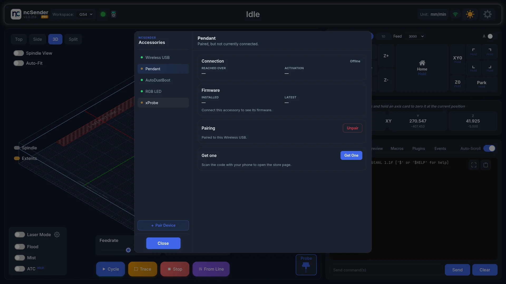

# Pendant

The ncSender Wireless Pendant is a handheld controller for your CNC machine. It
gives you a live position readout and hands-on control of jogging, zeroing,
homing, probing, tool changes, aux outputs and running jobs, right at the
machine.

It connects to ncSender wirelessly through a small Wireless USB, so you can
walk around the machine while you work.

!!! info "Minimum versions"
    - **Wireless firmware updates** — Wireless USB **v0.3.5** or newer.
      See [Wireless USB &rarr;](wireless-usb.md#wireless-usb-older-than-v035).
    - **Running the pendant alongside other wireless accessories:**
        - **ncSender** — v2.0.63 or newer
        - **ncSender Pro** — v2.0.117 or newer
        - **Pendant firmware** — v1.0.16 or newer
        - **Wireless USB firmware** — v0.3.0 or newer

## Hardware

- **Pendant** — a battery-powered handheld with a touch display, a jog knob,
  three soft buttons and a power button.
- **Wireless USB** — a small USB stick that plugs into the computer running
  ncSender and links to the pendant wirelessly.

## Getting connected

1. Plug the Wireless USB into the computer running ncSender.
2. Power on the pendant (hold the power button).
3. Once paired, the pendant reconnects on its own and its status bar shows
   the connection icon.

Once connected, the pendant follows your machine live, and every button you
press acts on the machine right away.

### First-time pairing

1. In ncSender, open **Accessories** (the pendant icon in the toolbar).
2. Click **Pair Device**. You have **60 seconds**.
3. On the pendant, go to **Setup → ESP-NOW** and press **Scan**.
4. Select **Pendant** in Accessories. It shows **Connected**.

**Pair Device** needs an activated Wireless USB. See
[Wireless USB &rarr;](wireless-usb.md#activating).

<!-- CAPTURE NEEDED: assets/images/accessories/pendant-pairing-screen.webp (Pendant wireless pairing screen) -->

<!-- CAPTURE NEEDED: assets/images/accessories/pendant-pairing-flow.webp (Pairing the pendant) -->

## Activating the pendant

A pendant that isn't activated shows **Activation Required**.

1. Connect the pendant to the computer with its USB cable.
2. In ncSender, open **Accessories** and select **Pendant**.
3. Click **Activate**. If the pendant has been activated before, that is all.
   If it is new to the store, enter the **Installation ID** that came with it.

## Re-pairing the pendant

Pairing is remembered, so you shouldn't normally need to do it again. Re-pair
when:

- **You swapped in a different Wireless USB**, or moved the pendant to another
  machine.
- **The pendant no longer connects** after a Wireless USB update.
- **The connection has become unstable** and reconnecting doesn't help.

**Steps:**

1. **Unpair in ncSender.** Open **Accessories**, select **Pendant**, click
   **Unpair** in the Pairing card, and confirm.
2. **Unpair on the pendant.** Go to **Setup → ESP-NOW** and choose **Unpair**
   if the pendant still shows itself as paired.
3. **Click Pair Device** in Accessories. You have 60 seconds.
4. **Scan on the pendant.** Go to **Setup → ESP-NOW → Scan**.
5. **Check it.** The connection icon on the pendant lights up, and **Pendant**
   shows **Connected** in Accessories.

!!! tip "If the pendant doesn't find the Wireless USB"
    - Press **Scan** as soon as you click **Pair Device**. If the countdown
      runs out, click **Pair Device** again.
    - Make sure the pendant is on **v1.0.16 or newer** when the Wireless USB
      is on **v0.3.x**.
    - If it still won't pair, update the Wireless USB (see
      [Wireless USB &rarr;](wireless-usb.md#updating-firmware)) and try again.

## Screens

Long-press **Prev** or **Next** to move between screens: **Jog**, **Aux &
Tool Change**, **Probe**, **Job** and **Info**. Open **Setup** from the Info
screen.

### Jog

The home screen: your live readout and jogging controls.

<!-- CAPTURE NEEDED: assets/images/accessories/pendant-jog-screen.webp (Pendant jog screen) -->

**Status bar (top)** shows the active workspace (e.g. `G54`), the machine
status (`IDLE`, `RUN`, `HOLD`, `ALARM`, …), the connection icon and the
battery level.

**Position readout** lists each axis (X, Y, Z) with its work position in large
type and the machine position in smaller type underneath. The highlighted axis
is the one the jog knob moves. The small number next to each axis label is the
current jog step.

**Turn the jog knob** to move the selected axis. Turning faster moves faster.
Z jog is limited to what your machine can stop cleanly, so fast turns don't
overshoot.

**Changing the step size.** Use **Prev / Next** to pick an axis, then press
**Select** to cycle its step: `0.01`, `0.1`, `1.0`. X and Y share a step; Z
has its own.

**Buttons:**

- **HOME** — run the homing cycle.
- **XY0 / X0 / Y0 / Z0** — zero those axes at the current position.

**Footer.** Three soft buttons below the screen: **Prev / Select / Next**.

- **Prev / Next** — move between the axes and buttons.
- **Select** — on an axis, cycle the step; on a button, run it.
- **Long-press Prev / Next** — change screen.

### Aux & Tool Change

Aux switches, the tool changer slot picker and tool-change actions in one
place.

<!-- CAPTURE NEEDED: assets/images/accessories/pendant-outputs-screen.webp (Pendant Aux & Tool Change screen) -->

**Aux switches (top).** Up to six switches, each with its name and an ON/OFF
dot. Empty spaces show *Empty*.

If you haven't set up any aux outputs, the first two are **Flood** and
**Mist**. Add or change them in ncSender under **Settings → Advanced →
Auxiliary I/O**. Changes reach the pendant right away.

A switch set to hold-to-activate needs a **1-second hold** to turn on.

**Slot picker (middle).** Shows the chosen slot and your total slots (e.g.
`1 /6`), with **Load** or **Unload** and the loaded tool number. Turn the jog
knob to pick a slot. After the last slot, the picker shows **Probe** if the
probe tool is turned on in the Tool Library. Long-press **Select** to load the
chosen slot or the probe, or to unload the tool in the spindle.

The slot count comes from your tool-change plugin (Pneumatic ATC, Rapid
Change ATC or Manual Tool Changer). Save the plugin's settings and the pendant
picks it up. With no tool-change plugin set up, the picker shows `-/-`.

**Actions (bottom).**

- **Manual** — change to a tool by hand. Long-press to start.
- **TLS** — measure the tool length. Long-press to start.

Both need a long-press, so a stray tap can't start a tool change or a probe.

**Footer.** **Prev / Next** move between items. **Select** runs the chosen
item: a short press for aux switches, a long press for items that need a hold.
Long-press **Prev** or **Next** to change screen.

### Probe

Jog to the touch-off point and start a probe without walking back to ncSender.

<!-- CAPTURE NEEDED: assets/images/accessories/pendant-probe-screen.webp (Pendant probe screen) -->

1. Pick the axis and step at the top, and turn the jog knob to move the
   machine into place.
2. Choose the **probe type**: **3D Probe**, **Std Block**, **AutoZero** or
   **TLS**.
3. Choose the **mode**: **Z**, **XYZ**, **XY**, **X**, **Y**, **Center-In** or
   **Center-Out**.
4. Pick where the probe sits on the work: a corner, an edge or the centre.
   For **Center-In** and **Center-Out**, turn the jog knob to set the
   diameter instead.
5. Hold **Start Probe**.

While probing, the button changes to **Stop Probe**. Hold it to stop.

<!-- CAPTURE NEEDED: assets/images/accessories/pendant-probe-running.webp (Pendant probing) -->

If **Start Probe** is unavailable, the line under it tells you why. For
example, the machine is busy, the pendant isn't connected, or you need to
touch the probe once to test it. The **PROBE** and **TLS** dots light up when
the probe is triggered.

Plunge, offsets, feeds and the 3D probe's ball diameter come from your probe
settings in ncSender.

**Footer.** **Prev / Next** move between rows. **Select** changes the chosen
row. Long-press **Select** to start the probe.

### Job

When you start a program, the pendant switches to the Job screen. You can also
reach it any time from the screen cycle.

<!-- CAPTURE NEEDED: assets/images/accessories/pendant-job-screen.webp (Pendant job screen) -->

- **Feedrate / Spindle** (top) — the live feed rate and spindle speed.
- **Feed Override / Spindle Override** — pick one with the footer buttons,
  then turn the jog knob to adjust it.
- **Cycle** — start or resume the program.
- **Pause** — pause the program.
- **Stop** — stop the program.

When the job finishes or you stop it, the pendant returns to the Jog screen.

### Info

Shows the pendant's connection type, firmware version and device name. Press
**Setup** here to open the Setup screen.

<!-- CAPTURE NEEDED: assets/images/accessories/pendant-info-screen.webp (Pendant info screen) -->

### Setup

The pendant's own preferences.

<!-- CAPTURE NEEDED: assets/images/accessories/pendant-setup-screen.webp (Pendant setup screen) -->

- **Show G-Code** — when on, commands from the pendant show in ncSender's
  console.
- **Idle Shutdown** — how long the pendant waits with no activity before it
  turns itself off. Choose from **5 to 30 minutes**. Turn the jog knob or tap
  the row to change it.
- **ESP-NOW** — pair or unpair with a Wireless USB.

!!! note "Idle shutdown only runs on battery"
    While the pendant is plugged into USB, it stays on. Any touch, button or
    knob movement restarts the timer.

### Alarm prompt

When the machine goes into alarm, the pendant shows **ALARM** with the alarm
number and its description. Press **Unlock** to clear it. The prompt closes by
itself when the alarm is cleared anywhere, including from ncSender.

<!-- CAPTURE NEEDED: assets/images/accessories/pendant-alarm-prompt.webp (Pendant alarm prompt) -->

## Managing the pendant from ncSender

Open **Accessories** (the pendant icon in the toolbar) and select **Pendant**.

Here you can:

- See whether the pendant is connected, and whether over **USB** or
  **Wireless**.
- **Copy** its Device ID for support.
- Activate it.
- Update its firmware.
- Unpair it.

### Updating pendant firmware

1. Open **Accessories** and select **Pendant**.
2. Click **Update to v…** in the Firmware card.
3. Keep the pendant powered and connected until it finishes.

- With the USB cable plugged in, the update goes over the cable. Otherwise it
  goes wirelessly through the Wireless USB.
- ncSender picks the right firmware for your pendant, and handles older
  pendants on the cable automatically.
- If an update is interrupted, the current firmware keeps working. Just start
  again.

## Wireless USB

Pendant traffic runs through the [Wireless USB &rarr;](wireless-usb.md), the
same stick the AutoDustBoot and RGB LED use. Updating the Wireless USB doesn't
require updating the pendant.
