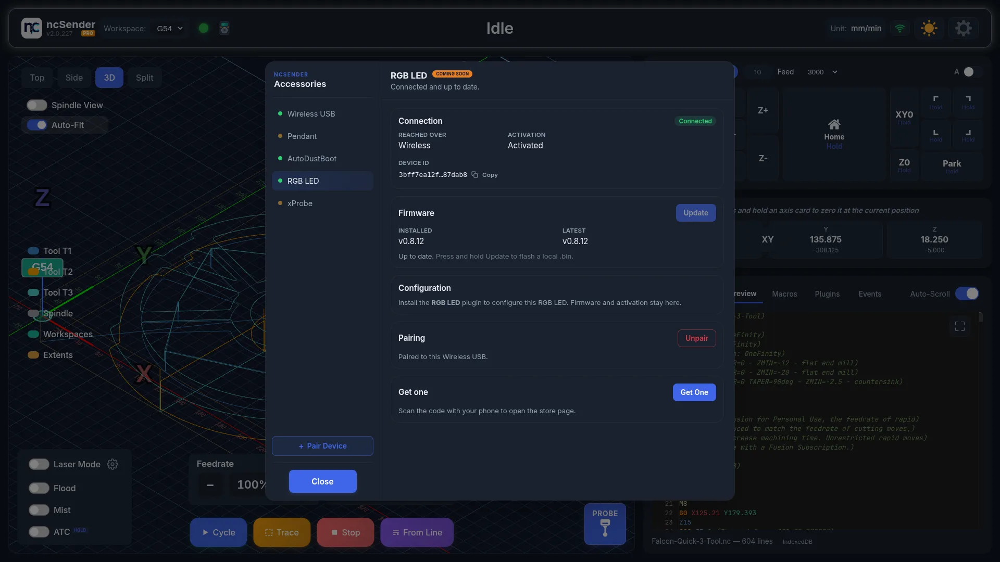
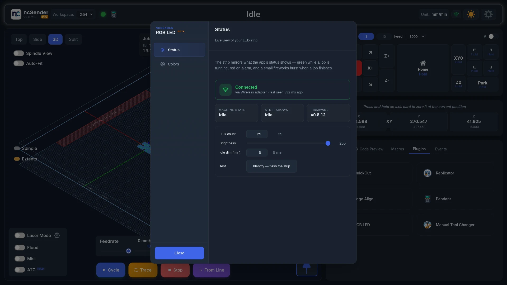
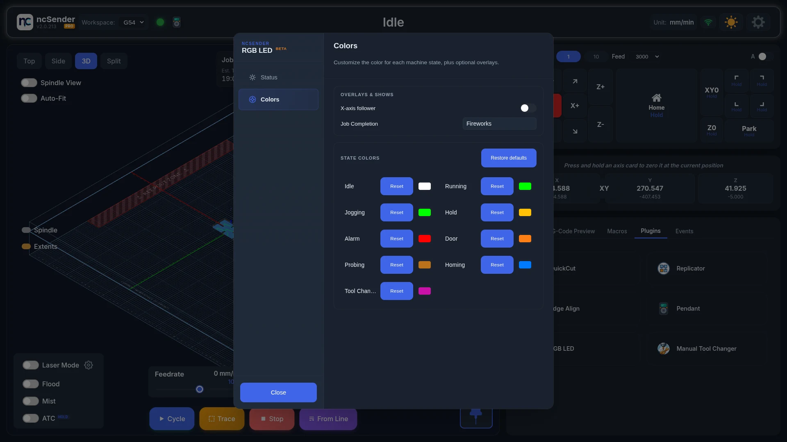

# RGB LED

The ncSender RGB LED is a wireless light strip that shows your machine state:
green while a job runs, red on an alarm, teal while probing, and a small light
show when a job finishes. Once it is paired, it works on its own. There's no
G-code to add.

<!-- TODO: screenshot — RGB LED hardware close-up -->

## Hardware

- A wireless controller driving a **WS2811 RGB** LED strip. No other strip type
  is supported.
- Its own power supply, sized to your strip length.
  <!-- OWNER: confirm the RGB LED power supply. This page said "Requires a 24 V power supply … 5 V / 12 V feeds don't drive the strip cleanly" in Hardware, but "Check the strip's own power (USB-C or 12 V)" in Troubleshooting. -->
- Pairs with the [Wireless USB &rarr;](wireless-usb.md), the same one the
  pendant and AutoDustBoot use.

!!! warning "Wireless USB is required"
    The RGB LED only talks to ncSender through the
    [Wireless USB &rarr;](wireless-usb.md). Without a paired Wireless USB,
    the strip won't show machine state.

## Getting connected

1. Plug the Wireless USB into the computer running ncSender.
2. In ncSender, open **Accessories** (the pendant icon in the toolbar) and
   click **Pair Device**. You have **60 seconds**.
3. Power on the RGB LED controller.
4. Select **RGB LED** in Accessories. It shows **Connected**.
5. If it shows **!**, click **Activate**. See
   [Wireless USB &rarr;](wireless-usb.md#activating).

## The plugin

Install it from **Settings → Plugins → Install Plugin**, and choose
**RGB LED (Beta)**. Then open **RGB LED** from the Tools menu.

The plugin changes how the strip looks. Firmware updates and activation are in
**Accessories**.

### Status

See what the strip is showing and set it up.

- **Pair New Device** — opens the same 60-second pairing window as **Pair
  Device** in Accessories.
- **Machine State / Strip Shows / Firmware** — what the machine is doing, what
  the strip is showing, and the controller's firmware version.
- **LED count** — the number of LEDs on your strip. Change it if you shorten or
  extend the strip.
- **Brightness** — overall brightness. Kept on the controller.
- **Idle dim (min)** — minutes without a state change before the strip dims.
  Any state change brings it back. Set to `0` to turn off.
- **Identify** — flashes the strip so you can tell which controller it is.

### Colors

Choose what the strip does for each machine state.

**Overlays & Shows**

- **X-axis follower** — adds a small group of lights that follows the
  spindle's X position.
- **Job Completion** — the light show played when a job finishes. **Fireworks**
  is the default. After a few seconds the strip returns to its normal colour.

**State Colors**

Pick a colour for each state: Idle, Running, Jogging, Hold, Alarm, Door,
Probing, Homing and Tool Change. Click a colour to change it. **Reset** returns
one state to its default. **Restore defaults** resets them all.

Colours are kept on the controller, so they survive restarts and go with the
strip to another machine.

<!-- CAPTURE NEEDED: assets/images/accessories/rgbled-states.webp (RGB LED showing machine states) -->

## Firmware updates

1. Open **Accessories** and select **RGB LED**.
2. Click **Update to v…** in the Firmware card.
3. Keep the controller powered and in range until it finishes.

The RGB LED always updates wirelessly. If an update is interrupted, the current
firmware keeps working. Just start again.

## Troubleshooting

- **Strip stays dark.** Check the strip has power. The controller can be
  paired and working while the strip has none. Also check that **LED count**
  on the Status tab matches your strip.
- **Wrong colours (green looks turquoise, red looks pink).** The RGB LED only
  works with **WS2811** strips. Other strip types show the wrong colours.
- **A colour change doesn't stick.** Pick the colour again.
- **Strip freezes on one colour.** Power-cycle the controller. If it keeps
  happening, open **Accessories** and check **RGB LED** shows **Connected**.
  When the link drops, the strip keeps its last colour.
