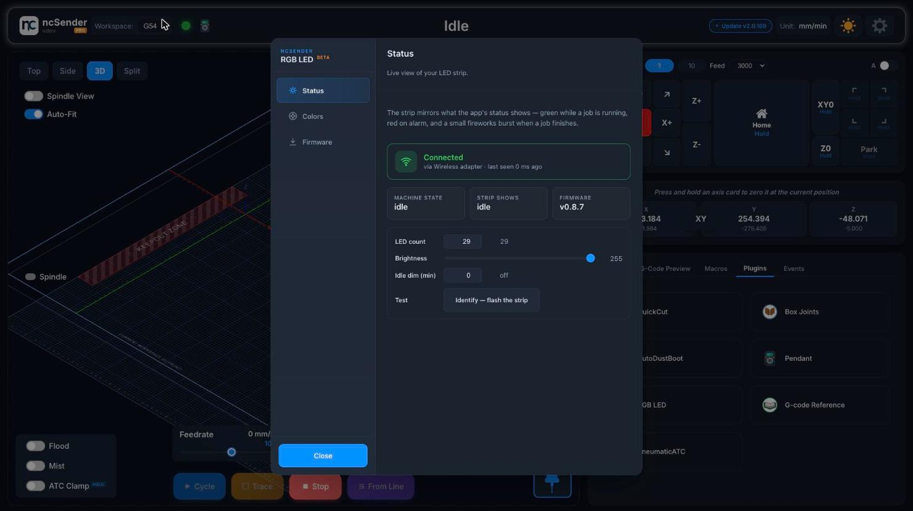
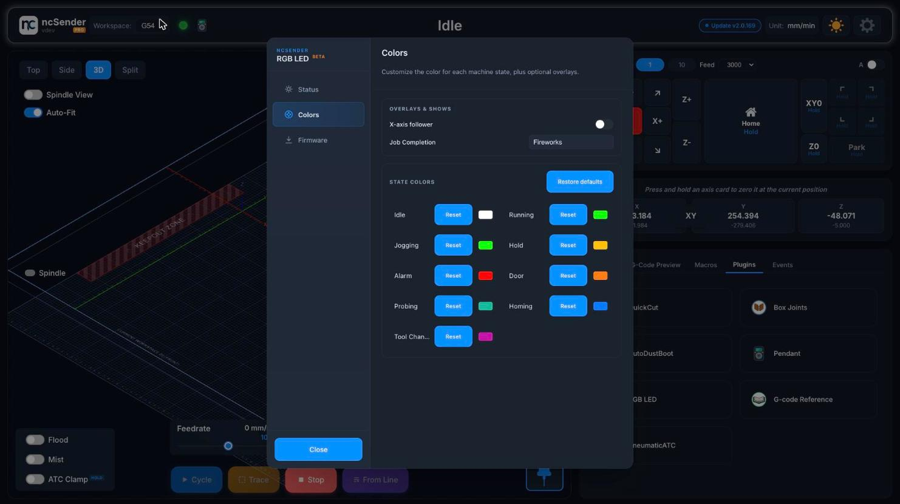
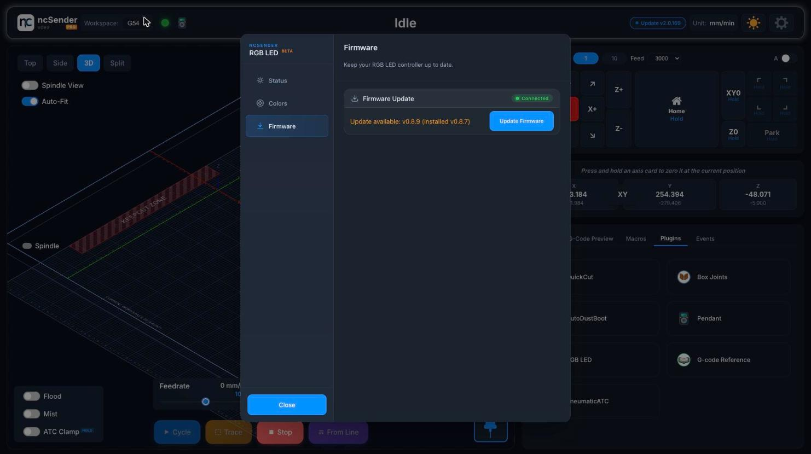

# Smart RGB LED

The ncSender Smart RGB LED is a wireless RGB / RGBW light strip that
mirrors your machine state — green while a job is running, red on an
alarm, teal while probing, a small light show when a job finishes.
Everything runs automatically once the strip is paired; there's no
G-code to add.

<!-- TODO: screenshot — Smart RGB LED hardware close-up -->

## Hardware

- Wireless controller board driving a **WS2811 RGB** LED strip. That's
  the only strip type supported right now.
- **Requires a 24 V power supply.** The board and strip are engineered
  around a 24 V rail — 5 V / 12 V feeds don't drive the strip cleanly.
  Size the supply to your strip length (LED strips pull real current).
- Pairs with the [Wireless USB &rarr;](wireless-usb.md) — the same
  Wireless USB the pendant and AutoDustBoot use.

!!! warning "Wireless USB is required"
    Unlike the pendant (which can run over its own direct USB cable)
    and the AutoDustBoot (which can run over a TTL aux pin without any
    ncSender at all), the Smart RGB LED **only** talks to ncSender
    through the [Wireless USB &rarr;](wireless-usb.md). If you don't
    have a Wireless USB paired, the plugin can't reach the controller
    and the strip won't reflect machine state.

## The plugin

Install the **RGB LED** plugin from ncSender's plugin catalog, then
open it from the **Plugins** panel. The plugin has three tabs.

### Status

Pair the strip, tune brightness / LED count / idle behaviour, and see
what the strip is showing right now.

- **Pair New Device** — pair the LED controller to your Wireless USB
  ([Wireless USB &rarr;](wireless-usb.md) has the full step-by-step).
- **Machine state / Strip shows / Firmware** — three read-only cards
  showing what the machine is doing, what the strip is rendering, and
  the firmware version on the controller. Handy for confirming the
  plugin and strip are in sync.
- **LED count** — how many pixels are on your strip. Set once to match
  the strip you wired up; the controller persists the value.
- **Brightness** — master 1 – 255 slider. Persists on the controller
  so it survives reboots and re-pairs.
- **Idle dim (min)** — after this many minutes without a machine-state
  change the strip dims to a soft baseline; any state change wakes it
  back up. Set to `0` to disable.
- **Identify** — flashes the strip six times so you can pick out which
  controller you're looking at when you have more than one.

### Colors

Fully customize what the strip does for every machine state, plus two
optional overlays.

**Overlays & Shows**

- **X-axis follower** — overlays a small cluster onto the strip that
  tracks the spindle's X position in real time. Useful as a "where's
  the tool" indicator when the strip is where you can see it but the
  spindle isn't.
- **Job Completion** — the animation the strip plays when a job
  finishes. Pick from **Fireworks** (default), or one of the other
  built-in shows in the dropdown. Each show runs a few seconds and
  then the strip returns to the hold colour.

**State Colors**

A per-state colour picker for every machine state: Idle, Running,
Jogging, Hold, Alarm, Door, Probing, Homing, Tool Change. Click the
colour chip to open a picker; **Reset** returns that single state to
its factory colour. **Restore defaults** at the top of the card
resets everything at once.

Overrides live on the *controller*, so they survive reboots and follow
the strip if you move it to a different machine.

### Firmware

Check for and flash new controller firmware over the wireless link.

Waits for the strip to report its version, then offers an update when
a newer release is available. Uses the same chunked, verified
transport the pendant's wireless OTA uses, so dropped ESP-NOW frames
retry automatically.

## How the colours work

ncSender sends the **state name** to the controller (idle, running,
alarm, probing, homing, tool-changing, complete, …). The controller
looks up the colour + animation for that name and drives the strip
accordingly. That means:

- Colours you pick under **State Colors** override the built-in
  defaults but stay on the controller — no per-project or per-machine
  configuration to remember.
- New machine states added in future ncSender / firmware releases
  just work — the plugin only forwards the name.

## Troubleshooting

- **Strip stays dark.** Check the strip's own power (USB-C or 12 V).
  The controller can be paired and healthy while the strip has no
  power. Also verify **LED count** on the Status tab matches your
  actual strip length.
- **Wrong colours (green looks turquoise, red looks pink).** The
  Smart RGB LED is built for **WS2811** strips only — plugging in a
  different chipset (SK6812 RGBW, WS2812) shifts the byte order and
  the colours read as wrong. Confirm your strip's chipset.
- **State colour override doesn't stick after re-pair.** State-colour
  overrides are stored on the controller — if the controller lost
  power without saving, tap the colour picker again and it'll
  persist.
- **Strip freezes on one colour.** Power-cycle the controller. If it
  keeps happening, check the Wireless USB shows the LED as *Connected*
  — a dropped link freezes the strip on whatever it last received.
