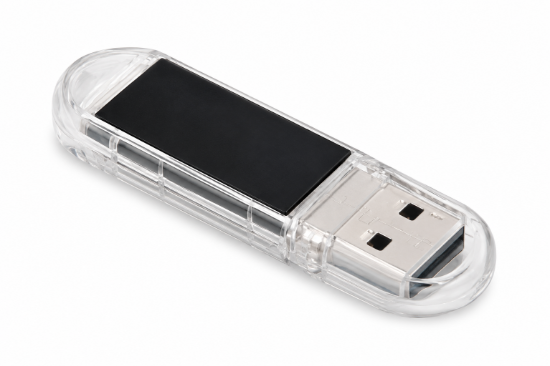
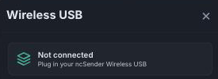

# Wireless USB

The Wireless USB is a small USB-A stick that ncSender uses to talk to your
wireless accessories — the Pendant, AutoDustBoot, and Smart RGB LED — over
the air. One Wireless USB can host all of them simultaneously; you plug it
into the computer running ncSender once and forget it.

{ width="360" }

## What it does

- **Radio bridge** between ncSender and each paired accessory (no Wi-Fi
  network required — it uses ESP-NOW, a low-latency direct-radio protocol).
- **Multi-device pairing**. On firmware v0.3.0 and newer, one Wireless USB
  can hold up to 8 paired devices at once. Older firmware only supports a
  single paired pendant.
- **Per-Wireless-USB licensing**. Some accessories check the Wireless USB's
  licence when they connect — activation is per-Wireless-USB, not per-device,
  so a licensed Wireless USB serves everything paired to it.

## The Wireless USB dialog

Everything you need to pair, unpair, activate, or check device status is in
one place — the **Wireless USB** dialog in ncSender.

**To open it:** click the **pendant icon** in the ncSender toolbar (next to
the connection status).

The dialog shows the Wireless USB's firmware version, its activation status,
and every device currently paired (with its own connection state and any
per-device info). If the Wireless USB isn't plugged in you'll see a
*Not connected* placeholder like the one above.

## Pairing a new device

The pendant, AutoDustBoot, and Smart RGB LED all pair the same way from the
ncSender side.

1. **Click the pendant icon** in the toolbar to open the Wireless USB
   dialog.
2. **Click "+ Pair New Device"**. A **30-second countdown** starts — the
   Wireless USB is now listening for a new device to pair.
3. **On the accessory, enter pairing mode.** The exact gesture varies by
   device:
    - **Pendant** — Setup → ESP-NOW → Scan
    - **AutoDustBoot** — hold the pair button for 3 seconds (LED blinks)
    - **Smart RGB LED** — hold the pair button for 3 seconds (strip flashes
      white)
4. **Verify.** The device appears in the Wireless USB dialog's device list
   as *Connected* within a few seconds.

!!! tip "The 30-second window closes fast"
    Start the accessory's pairing gesture as soon as you click *+ Pair New
    Device* — if the window closes before you finish, just click it again.

## Unpairing a device

In the Wireless USB dialog, click **Unpair** next to the device you want to
remove and confirm. The device stays paired on its own side until you clear
it there too (each accessory's page has its own unpair step).

## When to flash new firmware

Under normal use you never touch the Wireless USB. Flash a firmware update
when:

- **You're enabling wireless multi-device support.** Running the pendant
  alongside AutoDustBoot or Smart RGB LED on the same Wireless USB requires
  **v0.3.0 or newer**; older firmware only supports a single paired pendant.
- **A newer firmware fixes an issue you're hitting** — pairing failures,
  intermittent disconnects, LCD glitches, etc.

## How to flash the Wireless USB firmware

Unlike the pendant / AutoDustBoot / Smart RGB LED, the Wireless USB is
flashed from your browser, not from inside ncSender. You'll need
**Google Chrome or Microsoft Edge (v89+)** — Safari and Firefox do not
support the Web Serial API the flasher uses.

1. **Quit ncSender** on every computer that has this Wireless USB plugged
   in. Only one program can hold the serial port at a time — if ncSender is
   running, the flasher's *Connect* step will fail.
2. **Open the flasher** in Chrome or Edge:
   [Wireless USB Flasher &rarr;](../utility/wireless-usb-flasher.md)
3. **Pick a firmware version** from the list on the page. **v0.3.0** is
   the current release (multi-device support with per-Wireless-USB
   licensing).
4. **Put the Wireless USB into boot mode:**
    1. Press and hold the small **BOOT** button on the Wireless USB.
    2. While still holding, plug it into a USB port on your computer.
    3. Continue holding for about **1 second**, then release.
5. **Click Connect** in the flasher. A browser dialog asks which serial
   device to attach — pick the entry that just appeared (usually shows
   *ESP32-S3* or similar). If nothing appears in the list, the Wireless USB
   isn't in boot mode — unplug it and repeat step 4.
6. **Click Flash firmware.** A progress bar fills as the new firmware
   writes. It takes about 10–20 seconds. Do not unplug the Wireless USB
   while it's flashing.
7. When the progress reaches 100%, **unplug the Wireless USB and plug it
   back in**. On power-up it shows the new firmware version on its own LCD.

!!! tip "Checking the Wireless USB firmware version"
    The Wireless USB prints its firmware version on its own LCD at
    power-on (e.g. `v0.3.0`). You can also see it at the top of the
    **Wireless USB** dialog in ncSender.

!!! warning "Compatibility"
    Accessories and the Wireless USB running mismatched firmware major
    versions may fail to pair. If you update the Wireless USB to v0.3.x,
    make sure your accessories are on their v0.3.x-compatible firmware
    too (see each accessory's page for the exact minimum version).

### After a major firmware update

A major-version bump on the Wireless USB (for example `v0.2.x → v0.3.x`)
wipes the stored paired-device list. Every previously-paired accessory will
show as *disconnected* even though both devices power on normally. Re-pair
each one — you only have to do this once per major-version change.
