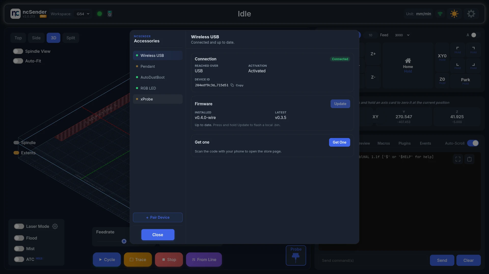
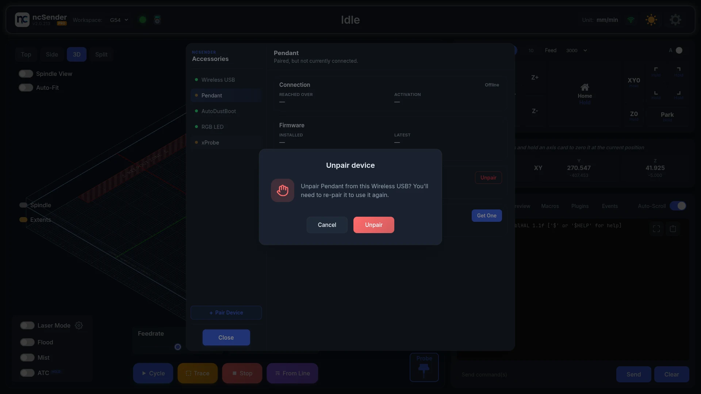

# Wireless USB

The Wireless USB is a small USB stick that links ncSender to your wireless
accessories: the Pendant, AutoDustBoot and RGB LED. One Wireless USB serves
all of them at once. Plug it into the computer running ncSender and leave it
there.

{ .center width="360" }

## What it does

- **Radio link** between ncSender and each paired accessory. No Wi-Fi network
  is needed.
- **Several devices at once.** On firmware v0.3.0 and newer, one Wireless USB
  holds up to 8 paired devices. Older firmware pairs a single pendant only.

## Accessories

Pairing, activation and firmware updates for the Wireless USB and every
accessory are in **Accessories**.

**To open it:** click the pendant icon in the ncSender toolbar. Its tooltip
reads *ncSender Accessories*.

Pick a device in the list to see it. For each device you can:

- **Connection** — see whether it is connected, whether it is reached over
  **USB** or **Wireless**, whether it is activated, and its **Device ID**.
  Click **Copy** to copy the Device ID for support.
- **Firmware** — see the installed and latest versions, and update.
- **Activation** — activate the device. Only shown when it needs it.
- **Configuration** — for the AutoDustBoot and RGB LED, install their plugin
  to change their settings.
- **Pairing** — unpair the device. Not shown for the Wireless USB itself.
- **Get one** — open the store page. On an ncSender kiosk this shows a code to
  scan with your phone.

Marks next to a device in the list:

- **!** — the device needs activation.
- **↑** — a firmware update is available.

Accessories opens on the device that needs attention first. Devices that are
not on sale yet are marked **Coming Soon** or **Not available**.

## Activating

The Wireless USB must be activated before you can pair anything to it. Until
then, **Pair Device** stays greyed out.

1. Open **Accessories** and select the device marked **!**.
2. Click **Activate**.
3. If the device has been activated before, that is all. If it is new to the
   store, enter the **Installation ID** that came with it, then click
   **Activate**.

<!-- CAPTURE NEEDED: assets/images/accessories/accessories-activate.webp (Activating an accessory) -->

The same steps activate the Pendant, AutoDustBoot and RGB LED.

## Pairing a new device

1. Open **Accessories**.
2. Click **Pair Device**. The Wireless USB listens for new devices for
   **60 seconds**. The button counts down.
3. **On the accessory, start pairing:**
    - **Pendant** — Setup → ESP-NOW → Scan
    - **AutoDustBoot** — hold **Retract ▲** and **Extend ▼** together (see
      [AutoDustBoot &rarr;](autodustboot.md#physical-buttons))
    - **RGB LED** — power it on
4. **Check it.** Select the device in the list. It shows **Connected**, and
   the Pairing card reads *Paired to this Wireless USB.*

<!-- CAPTURE NEEDED: assets/images/accessories/accessories-pair-device.webp (Pairing a device) -->

To stop early, click the counting button again.

!!! tip "Missed the window?"
    Start pairing on the accessory as soon as you click **Pair Device**. If
    the countdown runs out, click it again.

## Unpairing a device

1. Open **Accessories** and select the device.
2. In the **Pairing** card, click **Unpair**.
3. Confirm with **Unpair**.

To use the device again, pair it again. The device may still show itself as
paired on its own screen until you clear it there too.

## Updating firmware

On Wireless USB **v0.3.5 or newer**, update the Wireless USB and every
accessory from **Accessories**:

1. Open **Accessories** and select the device. A **↑** mark means an update
   is ready.
2. In the **Firmware** card, check **Installed** and **Latest**.
3. Click **Update to v…**.
4. Keep the device powered and connected until it finishes.

If an update is interrupted, the current firmware keeps working. Just start
the update again.

- Accessories with a USB cable plugged in update over the cable. Otherwise they
  update wirelessly. The RGB LED always updates wirelessly.
- While one device is updating, pairing, unpairing and other updates wait.

### Flashing a firmware file

To install a `.bin` file you downloaded:

1. Select the device in **Accessories**.
2. Press and hold **Update** for about a second.
3. Pick the file.

If the file name doesn't look like firmware for that device, ncSender warns
you before flashing. ncSender refuses a file that belongs to a different
accessory.

## Wireless USB older than v0.3.5

A Wireless USB older than v0.3.5 cannot update itself. Flash v0.3.5 once from
your browser. After that, use **Accessories** for every update.

On v0.3.3 and older, wireless updates for the pendant, AutoDustBoot and RGB
LED stall and never finish. Flash v0.3.5 first.

You need **Google Chrome or Microsoft Edge (v89+)**. Safari and Firefox don't
work.

1. **Quit ncSender** on every computer this Wireless USB is plugged into. If
   ncSender is running, the flasher can't connect.
2. **Open the flasher** in Chrome or Edge:
   [Wireless USB Flasher &rarr;](../utility/wireless-usb-flasher.md)
3. **Pick v0.3.5.**
4. **Put the Wireless USB into boot mode:**
    1. Press and hold the small **BOOT** button on the Wireless USB.
    2. While still holding, plug it into your computer.
    3. Keep holding for about **1 second**, then release.
5. **Click Connect** in the flasher, and pick the device that just appeared
   (usually *ESP32-S3*). If nothing appears, the Wireless USB isn't in boot
   mode. Unplug it and repeat step 4.
6. **Click Flash firmware.** It takes about 10–20 seconds. Don't unplug the
   Wireless USB while it's flashing.
7. At 100%, **unplug the Wireless USB and plug it back in**.

!!! tip "Checking the Wireless USB firmware version"
    Open **Accessories**, select **Wireless USB**, and look at **Installed**
    in the Firmware card. The Wireless USB also shows its version on its own
    screen when it powers on.

### After a Wireless USB update

If an accessory shows as not connected after a Wireless USB update, even
though both devices power on normally, pair it again. The pendant needs
firmware **v1.0.16 or newer** to pair with a Wireless USB on v0.3.x.
