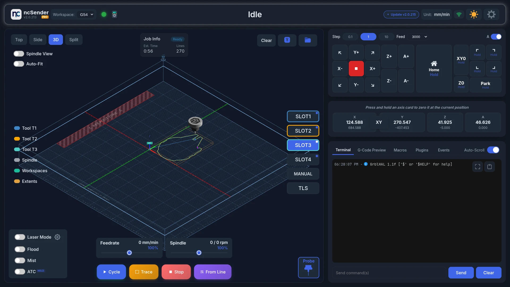
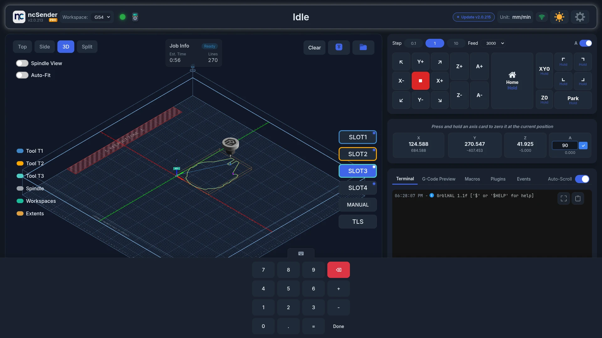

# 4th Axis (A-Axis)

!!! info "Pro Feature"
    4th Axis support is available in **ncSender Pro** only.

Jog and read out a 4th axis (A-axis) for rotary and indexing work.

<video controls autoplay loop muted playsinline aria-label="4th axis jogging">
  <source src="../assets/images/features/4th-axis.mp4" type="video/mp4">
</video>

## Features

- **DRO display**: an A card next to X, Y and Z.
- **Jog control**: A+ and A- buttons.
- **G-code support**: A-axis moves in loaded programs are sent as written.

The A controls only appear when your controller reports an A axis.

## Show or Hide the A Controls

Use the **A** switch in the Jog panel header to show or hide the A buttons. ncSender remembers your choice.

## Jog Behavior

- A jogs at 25% of the XY jog feed rate.
- A uses the same step size chips as X, Y and Z. The value is in degrees.
- A always reads in degrees, even in imperial mode.
- Long-press A+ or A- for continuous rotation.
- Double-click the A card to type a specific angle.

!!! note
    Keyboard and gamepad controls have no A actions. Jog A with the on-screen buttons.
