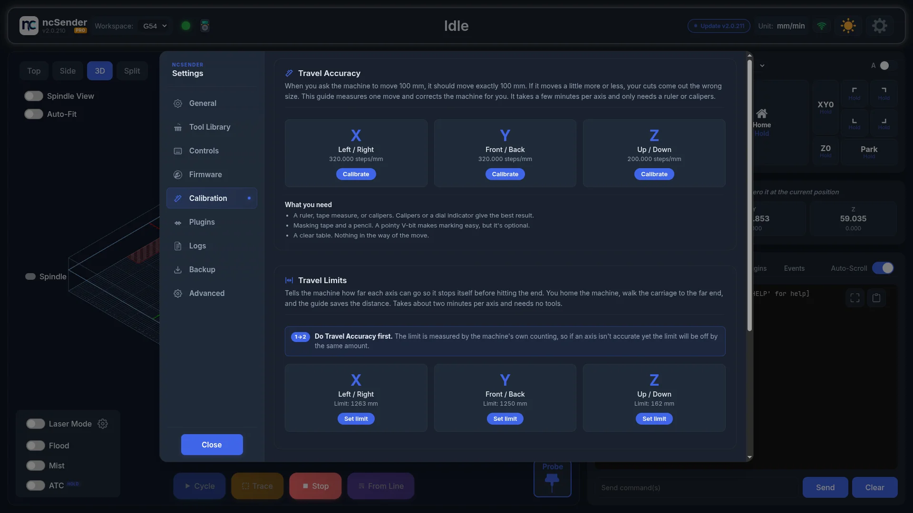
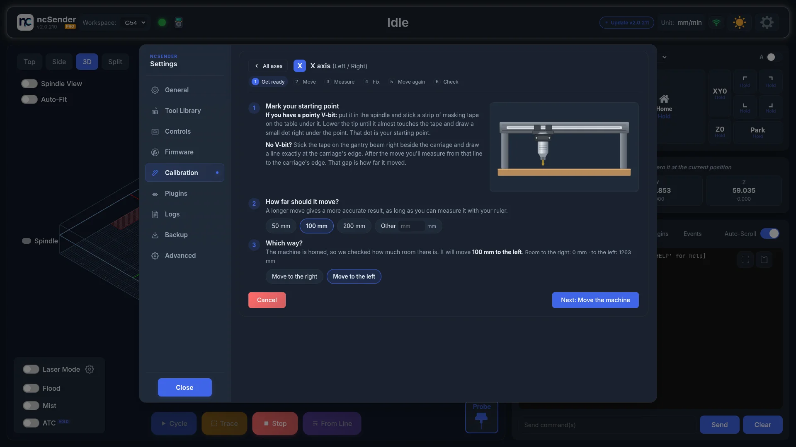
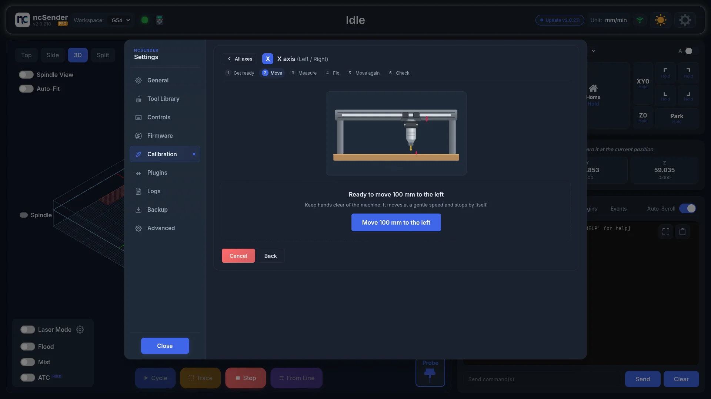
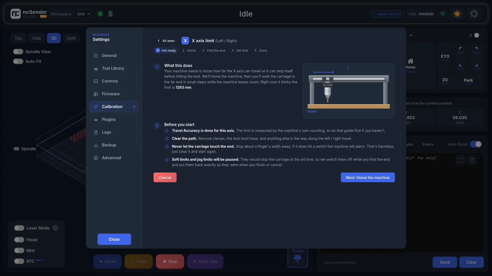
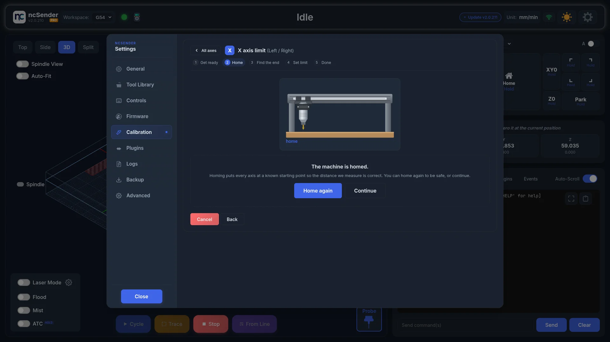
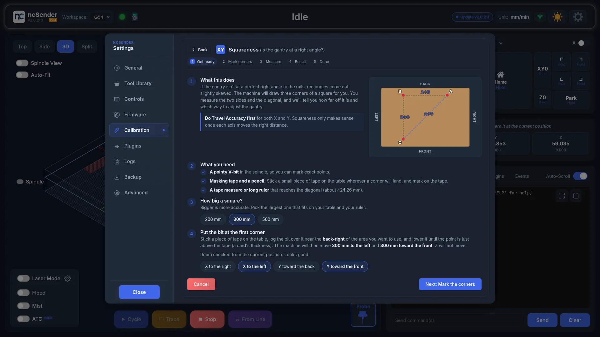
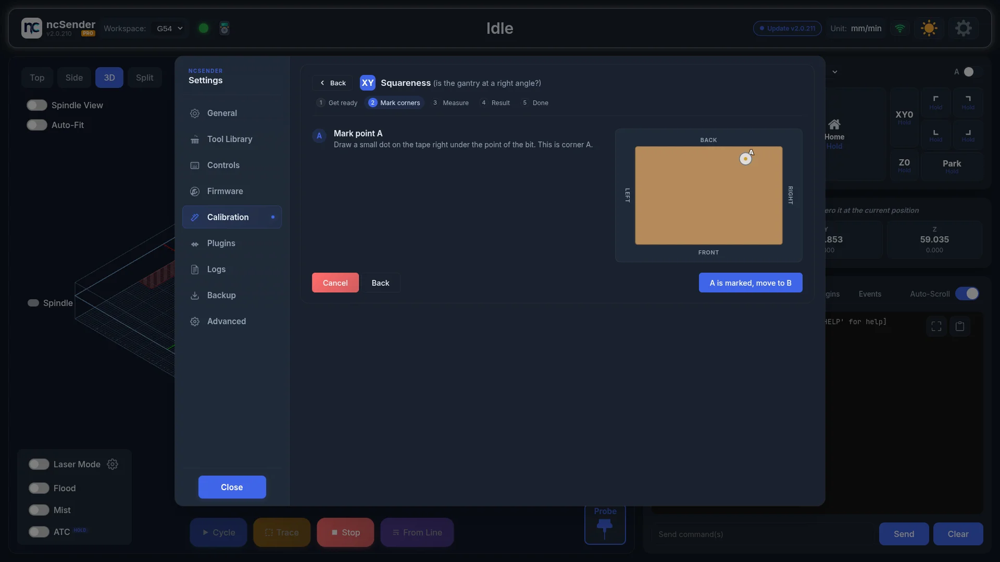

# Calibration

!!! info "Pro Feature"
    The Calibration guides are available in **ncSender Pro** only, on grblHAL controllers.

Three guided tools that walk you through dialing in your machine, step by step. Each one tells you
what to do in plain words and shows a drawing of it. Open them from **Settings → Calibration**.

| Guide | What it fixes | What you need |
|---|---|---|
| **Travel Accuracy** | The machine moves exactly the distance you ask for (steps/mm, `$100`–`$102`). | A ruler or calipers, masking tape, a pencil. A pointy V-bit helps. |
| **Travel Limits** | The machine knows how far each axis can go and stops before the end (`$130`–`$132`). | Nothing. Homing must be enabled. |
| **Squareness** | The gantry sits at a right angle to the rails, so rectangles come out square. | A V-bit, masking tape, a pencil, and a tape measure. |

!!! tip "Do them in this order"
    Travel Accuracy first, for every axis. Both other guides rely on the machine counting distance
    correctly, so an inaccurate axis throws off the limit and the squareness result by the same amount.

## Travel Accuracy

When you ask for a 100 mm move the machine should move exactly 100 mm. If it moves a little more or
less, every cut comes out the wrong size. The guide measures one move, works out the correction, saves
it to the controller, and then has you check it.

Pick an axis card. The current steps/mm value is shown on each card.

### 1. Get ready

**Mark your starting point.** Two ways to do it:

- **With a pointy V-bit**: stick masking tape on the table under the bit, lower the point until it
  almost touches, and draw a dot right under it.
- **Without a V-bit**: stick the tape on the gantry beam right beside the carriage and draw a line
  exactly at the carriage's edge. After the move you measure from that line to the carriage.

For Z, stand a ruler next to the spindle or rest a dial indicator against it, or put tape on the Z
column and mark the top edge of the carriage.

**How far should it move?** 50, 100, or 200 mm (20, 50, or 100 mm for Z), or type your own. Longer is
more accurate, as long as your ruler reaches.

**Which way?** If the machine is homed the guide reads the position and the max travel setting,
shows how much room there is each way, and picks a direction that fits. If it is not homed, it tells
you how much clear space to leave.

### 2. Move

Press the big button. The machine jogs the chosen distance at a gentle speed and the guide moves on
by itself when the controller reports idle. A **Stop** button is available while it moves.

### 3. Measure

<!-- CAPTURE NEEDED: assets/images/features/calibration-accuracy-measure.webp (Travel Accuracy, measure) -->

Measure from your dot to the spot right under the bit tip now (or from your gantry line to the
carriage's edge) and type exactly what you read. The guide tells you in plain words how far off the
axis is, for example "It moved 0.50% less than asked", and how much that would be on a part of that
size.

- Within 0.05% the axis is already accurate and you can finish.
- Above 10% it warns you to re-check the measurement and your units before saving, since a
  difference that large usually means a belt, leadscrew, or driver setting is wrong.

### 4. Fix

<!-- CAPTURE NEEDED: assets/images/features/calibration-accuracy-fix.webp (Travel Accuracy, fix) -->

Shows the current steps/mm next to the proposed value, saves it to the controller, and reads it back
to confirm it was accepted. The setting is kept after a restart and can be changed at any time from
the Firmware tab.

### 5. Move again and 6. Check

Move the machine back to the start, make a fresh mark, move again, and measure again. If the second
measurement lands within tolerance the axis is done. If not, press **Adjust again** to correct from the
new reading. **Skip the check** finishes without the second measurement.

<!-- CAPTURE NEEDED: assets/images/features/calibration-accuracy-check.webp (Travel Accuracy, check) -->

When an axis is done, **Calibrate Y next** (or the next axis) takes you straight to it.

## Travel Limits

The controller needs to know how far each axis can travel so it stops itself before hitting the end.
You home the machine, walk the carriage to the far end while the machine keeps count, and the guide
saves the distance.

Pick an axis card. The current limit is shown on each card.

### 1. Get ready

Read the checklist. Two items matter most:

- **Never let the carriage touch the end.** Stop about a finger's width away. If it hits a switch the
  machine alarms; that is harmless, clear it and start again.
- **Soft limits and jog limits are paused.** They would stop the carriage at the *old* limit, so the
  guide switches off `$20` and `$40` while you find the end and puts them back exactly as they were
  when you finish or cancel. If the app is closed or loses power mid-guide, the Calibration tab
  restores them the next time it opens and tells you so.

The guide is unavailable until homing is enabled (`$22`).

### 2. Home

Homing puts every axis at a known starting point. If the machine is already homed you can home again
to be safe or continue. The same keepout-zone check as the jog panel's Home button applies.

### 3. Find the end

<!-- CAPTURE NEEDED: assets/images/features/calibration-limits-find-end.webp (Travel Limits, find the end) -->

Jog the carriage away from home with the same jog control used everywhere else in ncSender. Only the
axis being calibrated is enabled. Start on the 10 mm step (hold it to pick a bigger one) until you are
about 100 mm from the end, then 1 mm, then 0.1 mm for the last bit.

Two readouts update live: **Distance from home**, and the **Current limit setting**. The limit box
turns green with "Past the old limit" once you are beyond it. Press **This is as far as it goes** when
the carriage is a finger's width from the end.

### 4. Set limit

<!-- CAPTURE NEEDED: assets/images/features/calibration-limits-set.webp (Travel Limits, set limit) -->

The measured distance becomes the new limit, minus an optional safety gap (2 mm by default; choose
**None** to put the limit exactly where the carriage is). **Save new limit** writes the setting, reads
it back to confirm, and switches the paused limits back on. **Set Y limit next** (or the next axis)
takes you straight to it.

## Squareness

If the gantry is not at a perfect right angle to the rails, rectangles come out slightly skewed. The
machine marks three corners of a square, you measure the two sides and the diagonal, and the guide
tells you how far off it is and which way to fix it.

### 1. Get ready

You need a pointy V-bit, masking tape and a pencil, and a tape measure long enough for the diagonal
(the guide shows the length). Pick the square size, 200, 300, or 500 mm; bigger is more accurate.

Stick a piece of tape on the table, jog the bit over it, and lower it to a card's thickness above.
When homed, the guide checks that there is room for both moves and picks directions that fit. You
can flip either direction with the chips. Z never moves.

### 2. Mark corners

Draw a dot on the tape under the bit for corner **A**, then press **A is marked, move to B**. The
machine moves along X. Stick tape under the bit, mark **B**, and press the button again. It moves
along Y. Mark **C**. The drawing shows the bit running along each leg as it goes.

### 3. Measure

<!-- CAPTURE NEEDED: assets/images/features/calibration-square-measure.webp (Squareness, measure) -->

Measure dot to dot, centre to centre: **A→B**, **B→C**, and the diagonal **A→C**. The guide shows the
ideal diagonal for reference and rejects numbers that cannot form a triangle.

### 4. Result

<!-- CAPTURE NEEDED: assets/images/features/calibration-square-result.webp (Squareness, result) -->

Within 0.05% of the side length the gantry is square. Otherwise the guide reports the error, for
example "out of square by 0.8 mm over 300 mm", the angle at corner B, and which end of the gantry sits
toward the front or back. The drawing shows the tilt exaggerated against a dotted reference square.

**How to fix it** depends on your machine:

- **Two Y motors with auto-squaring** (grblHAL reports a `$171` Y dual axis offset): the guide can
  fix it in firmware. Press **Apply offset**, then **Home now** so the new offset takes effect, and
  **Check again** with fresh tape. The first pass uses an estimate for the distance between the Y
  rails and the second check fine-tunes it automatically. If the offset turned out to work in the other
  direction on your machine, the next check notices, flips it, and remembers that for good. You never
  have to measure the rail spacing. A "prefer to adjust by hand" link is there if you want it.
    - **"That went the wrong way."** means the last offset made the error bigger. The guide has
      already flipped the direction, so just apply again.
    - **"That's more than the controller allows"** means the error is too big for the offset. Square
      the gantry by hand first (see below), then use the offset for the fine adjustment.
- **Single Y motor**: loosen the gantry where it bolts to the Y carriages, nudge the end the guide
  names toward the front or back by roughly the amount shown, tighten, and run the check again.

**Move back to A** returns the bit to the first corner when you are done.

## When something goes wrong

- **"Not available right now"**: the message on the tab says why. Usually the machine is not
  connected, a job is running, or the machine is in alarm. Travel Limits also needs homing enabled.

    <!-- CAPTURE NEEDED: assets/images/features/calibration-unavailable.webp (Calibration unavailable) -->

- **"Your controller stores its steps/mm in a config file, which this guide can't edit yet."**: you
  are on FluidNC. The guides only work with grblHAL.
- **"This device is in view-only mode."**: you opened ncSender from another browser without remote
  control. Use the host machine, or turn on **Allow Remote Control**. See
  [Remote Access](../settings/remote-access.md).
- **The machine alarms during a guide**: press **Clear alarm**. If it will not clear, release the
  E-stop or move off the limit switch first, then press it again.
- **A move was stopped part way**: put the bit back on your start mark and start that step again.
- **"Restored soft limits and jog limits"** on the Calibration tab means a Travel Limits run was
  interrupted earlier and the guide has already put those settings back. Nothing else to do.
