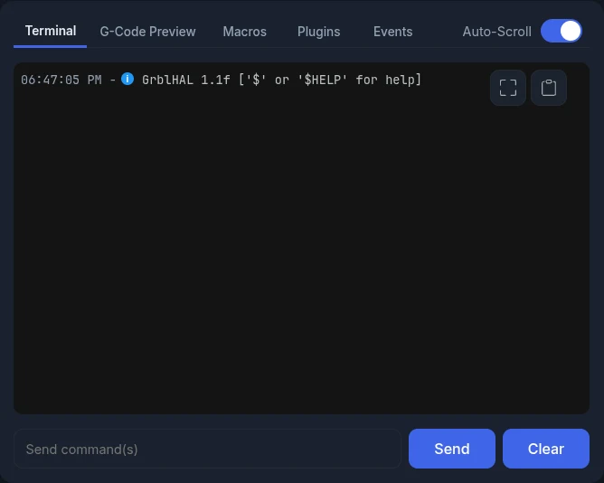
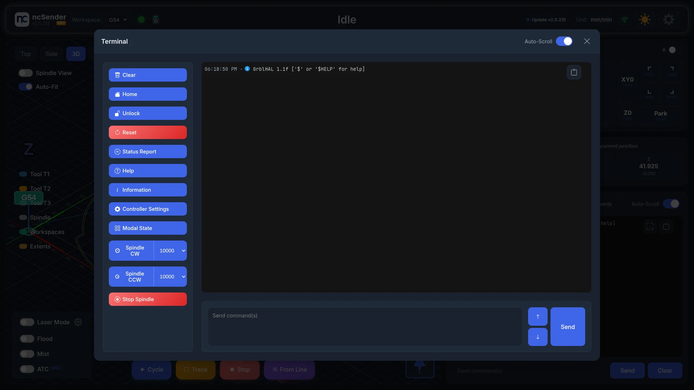

# Console & Terminal

Use the console to send commands to your controller, read its replies, and run
common commands with one click.

## Terminal

The **Terminal** tab shows everything sent to and received from the controller:

- **Time**: each line shows when it was logged.
- **Status icons**: a green check for accepted commands, a blue dot for info, and an
  error mark for problems.
- **Blocked**: a line ncSender refused to send is marked **blocked**, with the
  reason. For example, the [safety door](safety-door.md) is open, or (Pro) the move
  would enter the [keepout zone](keepout-zone.md).
- **Event G-code**: lines from [Program Events](program-events.md) are labelled.

### Sending Commands

Type a command in **Send command(s)** and press ++enter++. You can send more than one
command at once. Use ++arrow-up++ and ++arrow-down++ to go back through your earlier
commands.

When ncSender is not connected, the box reads **Connect to CNC to send commands**.

### Auto-Scroll

Turn on **Auto-Scroll** to keep the newest lines in view. Turn it off to read older
lines without the view jumping.

## Larger view & quick controls

Click **Open in larger view** to open the terminal in a large window. It has its own
**Auto-Scroll** switch and a **Copy all terminal content** button. It also has
one-click **quick controls**, which are only in the larger view.

The quick controls work only while connected and Idle.

| Button | Sends | What it does |
|--------|-------|--------------|
| **Clear** | — | Clears the terminal (sends nothing) |
| **Home** | `$H` | Homes the machine |
| **Unlock** | `$X` | Clears an alarm and unlocks |
| **Reset** | `Ctrl-X` | Resets the controller |
| **Status Report** | `0x87` | Asks for a full status report |
| **Help** | `$help` | Shows the controller help |
| **Information** | `$I` | Shows controller build info |
| **Controller Settings** | `$$` | Lists all controller settings |
| **Modal State** | `$G` | Shows the active G-code modes |

### Spindle controls

The spindle buttons moved to the visualizer, where they don't cover the
toolpath. See [Spindle control](visualizer.md#spindle-control).

## Other panel tabs

The Terminal shares its panel with these tabs:

- **[G-Code Preview](gcode-preview.md)**: the loaded file, with find & replace.
- **[Macros](macros.md)**: your saved macros.
- **Plugins**: buttons added by your plugins.
- **[Events](program-events.md)**: G-code that runs at Program Start and Program End.
