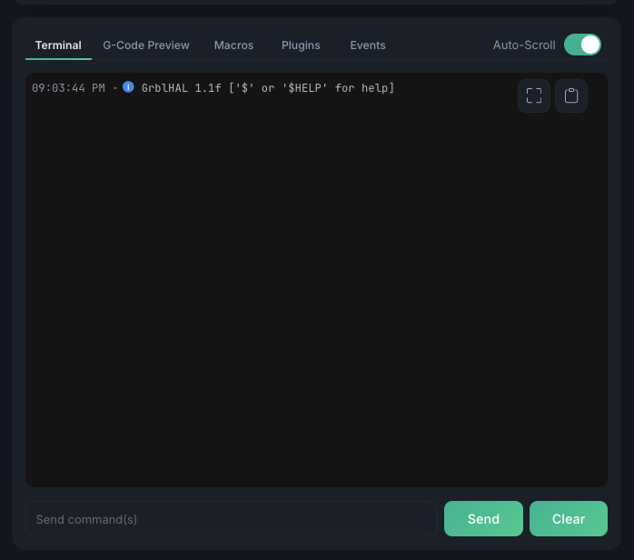
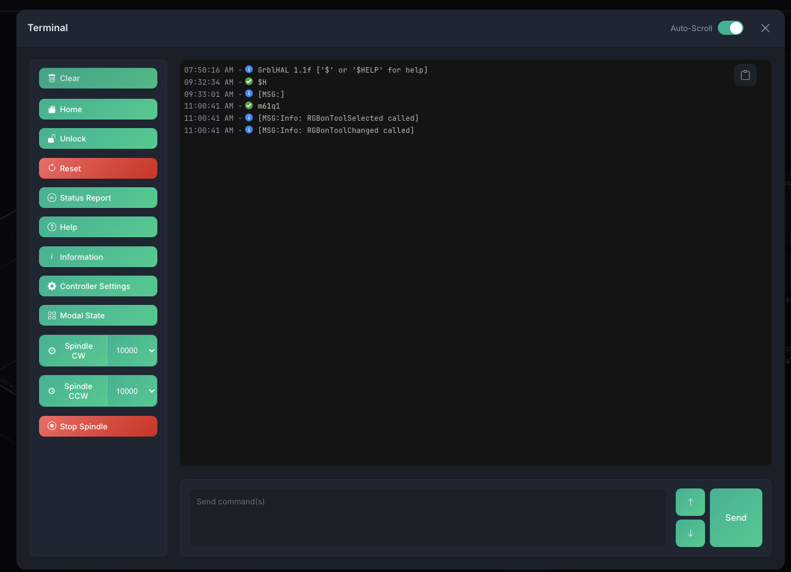

# Console & Terminal

The console panel provides direct access to your CNC controller with command input, response logging, and quick controls.

## Terminal

The **Terminal** is one tab of the panel below the visualizer, alongside
[G-Code Preview](gcode-preview.md), [Macros](macros.md), Plugins, and
[Events](program-events.md). It shows a real-time log of all communication with the
controller:

- **Timestamped** — every line is stamped with the time it was logged
- **Status icons** — each entry is marked by status: a green check for accepted
  commands, a blue dot for info messages, and an error marker for problems
- **Both directions** — your sent commands and the controller's replies are all logged

### Sending Commands

Type G-code or controller commands in the input field and press ++enter++ to send. Use ++arrow-up++ and ++arrow-down++ to navigate command history.

### Auto-Scroll

Toggle auto-scroll to keep the latest messages visible. Disable it to read through history without interruption.

## Detached terminal & quick controls

Click the **expand** button at the top-right of the terminal to open it in a large modal
window. The detached view adds a left sidebar of one-click **quick controls** — these
appear only in the detached modal, not in the docked panel.

| Button | Sends | Description |
|--------|-------|-------------|
| **Clear** | — | Clears the terminal log (no command sent) |
| **Home** | `$H` | Run homing cycle |
| **Unlock** | `$X` | Clear alarm and unlock |
| **Reset** | `Ctrl+X` (`0x18`) | Soft reset |
| **Status Report** | `0x87` | Full real-time status report |
| **Help** | `$help` | Show controller help |
| **Information** | `$I` | Controller build info |
| **Controller Settings** | `$$` | List all controller settings |
| **Modal State** | `$G` | Show active G-code modal state |

### Spindle controls

Buttons to spin up the spindle, each with an RPM dropdown (1000–24000 rpm in 1000-rpm
steps, default 10000):

- **Spindle CW** — `M3 S<rpm>`
- **Spindle CCW** — `M4 S<rpm>`
- **Stop Spindle** — `M5`

## Other panel tabs

The Terminal shares its panel with a few sibling tabs, each documented on its own page:

- **[G-Code Preview](gcode-preview.md)** — the loaded program with syntax highlighting and find & replace
- **[Macros](macros.md)** — your saved command macros
- **[Events](program-events.md)** — the Program Start / Program End event system
