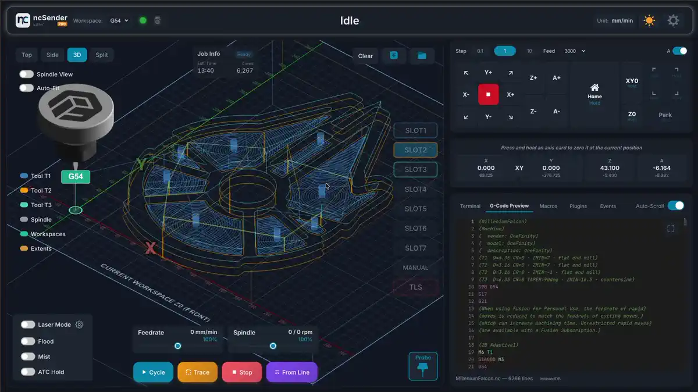
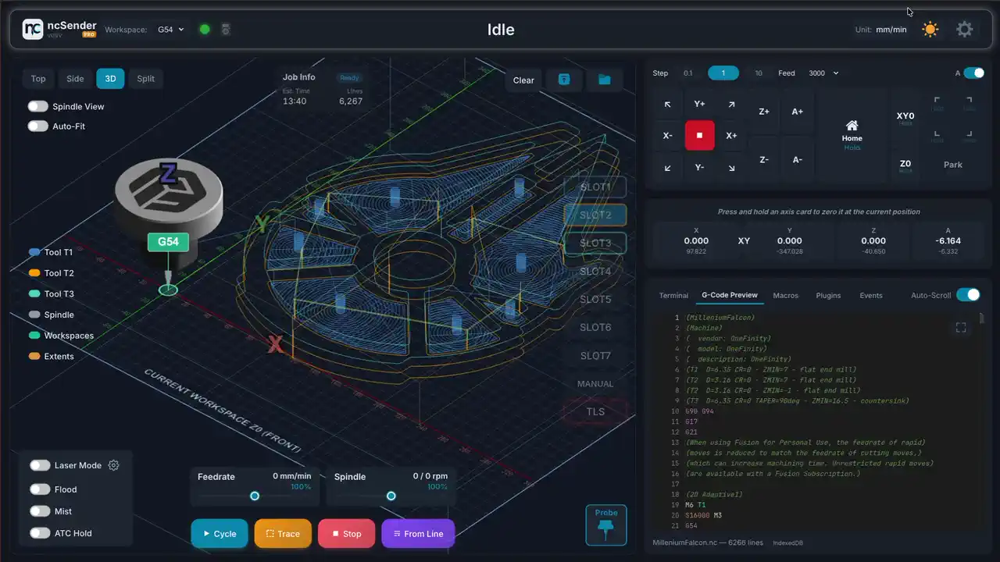

# DRO (Digital Readout)

The DRO is the live position display at the top of the status panel. Each axis
card shows the machine's current position in the active work coordinate system
(large number, e.g. G54 work coordinate) and the raw machine coordinate
(smaller number underneath).

Beyond just showing the position, the DRO is also **the control** for setting
and adjusting your work zeros — no dialog, no menu, just gestures on the axis
cards themselves.

## Setting work zeros (long-press)

**Press and hold** an axis card for about **¾ of a second** to zero that axis
at the machine's current position. A progress bar fills across the card as you
hold, and the zero fires when it completes.

- **Long-press the X card** → sets **X0** at the current position.
- **Long-press the Y card** → sets **Y0**.
- **Long-press the Z card** → sets **Z0**.
- **Long-press the "XY" join indicator** (the small pill between the X and Y
  cards) → sets **X0 and Y0 in one shot** (`G10 L20 X0 Y0`). The progress bar
  fills across both X and Y cards together, so it's obvious both are being
  zeroed.

Releasing before the progress completes cancels the zero — so a stray tap
won't accidentally reset your work offsets.

!!! note "Z zero with a Tool Length Setter"
    If TLS is enabled but no tool length has been set yet, long-pressing the Z
    card opens the TLR warning dialog instead of zeroing directly. That
    protects you from setting Z0 against a probe that hasn't been referenced.

## Entering a specific coordinate (double-click / double-tap)

To manually **type a coordinate value** (instead of zeroing at the current
position), **double-click** the axis card (mouse) or **double-tap** it
(touchscreen). The card flips to an input field:

- Type the value in the current units (mm or inches).
- Press ++enter++ or tap the ✓ button to apply.
- Press ++escape++ or click away to cancel.

This is how you'd, for example, set your X coordinate to `-10.5` when the
machine is currently at that physical spot without having to jog to `0` first.

## What's shown on each card

| Element | Meaning |
|---|---|
| **Axis letter** (X / Y / Z / A) | Which axis this card controls. |
| **Large number** (work coord) | Position in the active work coordinate system (G54, G55, …). This is the number that goes to zero when you long-press. |
| **Small number** (machine coord) | Raw machine position — always relative to the machine's home, unaffected by work offsets. |
| **Progress bar** | Fills across the card while you long-press, so you can see how close you are to triggering the zero. |
| **XY link pill** | Between the X and Y cards; long-press to zero both together. |
