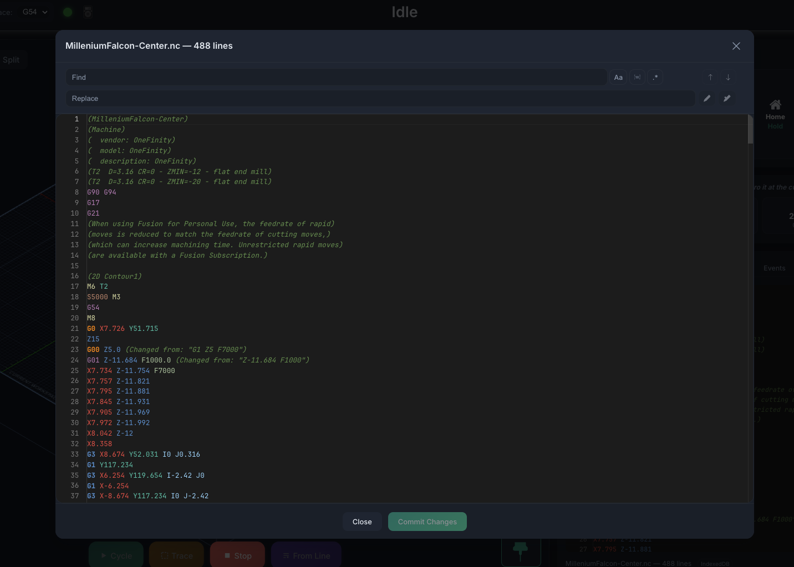

# G-Code Preview

The **G-Code Preview** tab shows the loaded program as text, next to the
[Terminal](console.md), [Macros](macros.md), Plugins, and [Events](program-events.md)
tabs in the panel below the visualizer.

The docked tab gives you a readable view of the program:

- **Syntax highlighting** — color-coded G-code
- **Line numbers** — for reference
- **Filename & line count** — shown in the footer
- **Current-line tracking** — while a job runs, completed lines are dimmed and the line
  currently streaming to the controller is highlighted. Turn on **Auto-Scroll** to keep
  that line in view.

## Detached window

Click the **expand** button at the top-right of the tab to open the preview in a large
window. What it offers depends on whether a job is running:

- **While a job runs** — a read-only viewer with the same current-line tracking and its
  own **Auto-Scroll** toggle.
- **When idle** — a full **editable** editor. Make changes to the loaded program, then
  **Commit Changes** to keep them or **Discard** to throw them away.

### Find & Replace

The detached window adds a Find & Replace toolbar:

- **Find** — type to search; a counter shows the current match (e.g. *3 of 12*), and
  ++enter++ / ++shift+enter++ jump to the next / previous match.
- **Match Case** (`Aa`, ++alt+c++), **Match Whole Word** (++alt+w++), and **Regular
  Expression** (`.*`, ++alt+r++) refine the search.
- **Replace** and **Replace All** are available when no job is running.
