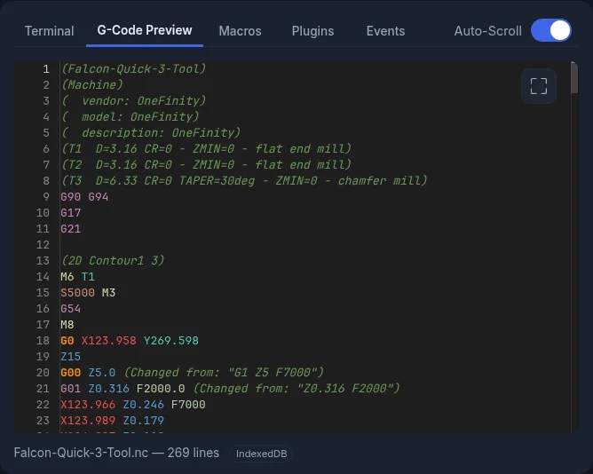

# G-Code Preview

The **G-Code Preview** tab shows the loaded file as text.

The tab shows:

- **Colour-coded G-code**
- **Line numbers**
- **File name and line count** at the bottom
- **Current line**: while a job runs, finished lines are dimmed and the line being
  sent is highlighted. Turn on **Auto-Scroll** to keep that line in view.

<!-- CAPTURE NEEDED: assets/images/features/gcode-preview-running.webp (Preview during a job) -->

With no file loaded, the tab reads **No G-code loaded**. Load a file from the
[Visualizer](visualizer.md#loading-a-file), or drop a `.gcode` or `.nc` file onto the
window.

## Start From Line

To start a job partway through, double-click a line, or select it in the line
numbers. The **Start From Line** dialog opens with that line filled in.

<video controls autoplay loop muted playsinline aria-label="Start From Line from the preview">
  <source src="../assets/images/features/gcode-preview-start-from-line.mp4" type="video/mp4">
</video>

## Larger view

Click **Open in larger view** to open the file in a large window. What you can do
depends on whether a job is running:

- **While a job runs**: you can read the file only. It follows the current line and
  has its own **Auto-Scroll** switch.
- **When idle**: you can edit the file.

<video controls autoplay loop muted playsinline aria-label="Editing in the larger view">
  <source src="../assets/images/features/gcode-preview-editor.mp4" type="video/mp4">
</video>

### Editing a file

1. Open the larger view while no job is running.
2. Make your changes.
3. Click **Commit Changes** to keep them. It turns on once you've changed something.

To throw away your edits, click **Discard**. Before you edit, this button reads
**Close**.

If you open **Start From Line** with unsaved edits, ncSender asks what to do: **Save
First**, **Discard** or **Cancel**. Unsaved edits are lost if a job starts.

### Find & Replace

- **Find**: type to search. The count shows where you are, for example *3 of 12*.
  Press ++enter++ for the next match and ++shift+enter++ for the previous one.
- **Match Case** (`Aa`, ++alt+c++), **Match Whole Word** (++alt+w++) and **Use
  Regular Expression** (`.*`, ++alt+r++) narrow the search.
- **Replace** and **Replace All** work when no job is running.
