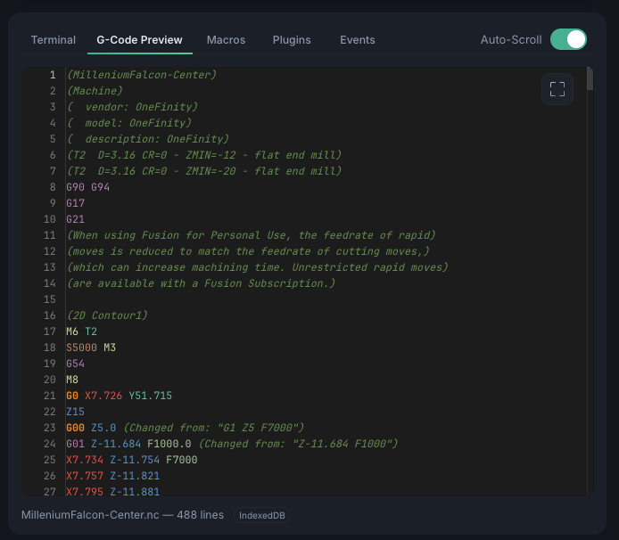

# G-Code Preview

The **G-Code Preview** tab shows the loaded program as text, next to the
[Terminal](console.md), [Macros](macros.md), Plugins, and [Events](program-events.md)
tabs in the panel below the visualizer.

<!-- TODO: Screenshot of G-code preview tab with syntax highlighting -->
{ .placeholder }

It gives you a readable view of the program with:

- **Syntax highlighting** — color-coded G-code
- **Line numbers** — for reference
- **Find & Replace** — search with regex, case-sensitive, and whole-word options
- **Current line tracking** — highlights the line being executed during a job

Use it to review a program before running it, or to watch which line is streaming to the
controller while a job runs.
