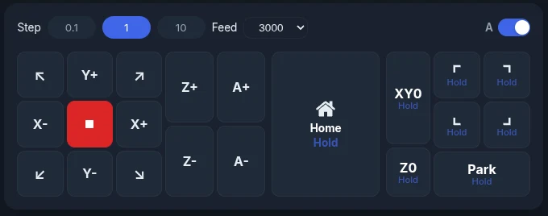

# Jog Controls

Use the jog controls to move the machine by hand: to position your workpiece, set
zeros, or check clearances.

## Jog Panel Layout

The jog panel has:

- **XY buttons**: move X and Y, including the four diagonals.
- **Stop button** (red, in the middle): stops all motion right away. It is always
  available.
- **Z+ / Z-**: move up and down.
- **A toggle**: switches the Z buttons to A+ / A- for a rotary axis (only when your
  controller has an A axis).
- **Step and Feed**: how far and how fast each jog moves.
- **Home**: see [Homing](#homing).
- **XY0 / Z0, corner buttons and Park**: see [Go To Zero & Park](#go-to-zero-park).

## Step Sizes

<video controls autoplay loop muted playsinline aria-label="Step sizes">
  <source src="../assets/images/features/jog-step-sizes.mp4" type="video/mp4">
</video>

There are three step buttons: small, medium and large. **Tap** a button to use it.
**Press and hold** it (half a second) to open a list of every value in its range.
Each button remembers the last value you picked.

=== "Metric (mm)"

    | Button | Values in the list |
    |--------|--------------------|
    | 0.1 | 0.01, 0.05, 0.1, 0.2 … 0.9 |
    | 1 | 1, 2, 3 … 9 |
    | 10 | 10, 20 … 100, 150, 200, 250, 300 |

=== "Imperial (inches)"

    | Button | Values in the list |
    |--------|--------------------|
    | 0.01 | 0.001, 0.005, 0.01, 1/64, 0.02, 1/32, 0.03 … 0.06, 1/16, 0.07 … 0.09 |
    | 0.1 | 0.1, 1/8, 0.2, 1/4, 0.3, 0.4, 1/2, 0.6, 5/8, 0.7, 3/4, 0.8, 0.9 |
    | 1 | 1, 2, 3 … 10 |

## Feed Rates

Each step button has its own feed rate and its own **Feed** list. Pick a rate from
the list next to the step buttons. The defaults are:

| Step button | Metric | Imperial |
|---|---|---|
| Small | 500 mm/min | 20 in/min |
| Medium | 3000 mm/min | 100 in/min |
| Large | 6000 mm/min | 200 in/min |

The rate is for X and Y. Z jogs at half of it, and the A axis at a quarter.

## Jog Modes

### Step Jog

**Tap** a direction button to move one step.

### Continuous Jog

<video controls autoplay loop muted playsinline aria-label="Continuous jog">
  <source src="../assets/images/features/jog-continuous.mp4" type="video/mp4">
</video>

**Hold** a direction button to keep moving. The machine stops as soon as you let go.

### Diagonal Jog

The four corner arrows (↖ ↗ ↙ ↘) move X and Y together.

## Keyboard and Gamepad

The default keys are:

| Key | Action |
|-----|--------|
| ++arrow-left++ / ++arrow-right++ | Jog X- / X+ |
| ++arrow-up++ / ++arrow-down++ | Jog Y+ / Y- |
| ++page-up++ / ++page-down++ | Jog Z+ / Z- |

To change keys or set up a gamepad, go to **Settings → Controls**. There you can also
set keys to switch between step sizes and to home the machine.

Keyboard jogging is off when your controller requires homing at startup and the
machine is not homed yet.

!!! tip "Quick Zero"
    Double-click an axis card in the DRO to type a coordinate. Press and hold an axis
    card to zero it where the machine is. See [DRO](dro.md).

## Homing

<!-- CAPTURE NEEDED: assets/images/features/jog-home.webp (Homing) -->

Homing uses press-and-hold so it can't start by accident:

- **Hold** **Home** for about 1 second to home all axes. A bar fills while you hold.
- **Double-tap** **Home** to split it into **HX**, **HY** and **HZ**. Hold one to home
  just that axis.

!!! info "Not-homed indicator"
    When homing is set up on your controller and the machine has not been homed yet,
    the **Home** button pulses. It stops once homing finishes. If your machine has no
    homing, the button never pulses.

<!-- CAPTURE NEEDED: assets/images/features/jog-not-homed.webp (Home button pulsing before homing) -->

**Pro:** if a [keepout zone](keepout-zone.md) is on, ncSender asks you to confirm
before homing X and Y.

## Go To Zero & Park

<video controls autoplay loop muted playsinline aria-label="Go to zero">
  <source src="../assets/images/features/jog-zero-buttons.mp4" type="video/mp4">
</video>

These buttons **move the machine** to a spot. They don't set one. Hold a button to
move; a bar fills while you hold.

- **XY0**: hold to go to work X0 Y0. Z rises to a safe height first. **Double-tap** to
  split it into **X0** and **Y0**, each moving one axis.
- **Z0**: hold to move Z to its work zero.

!!! tip "Setting zero vs. going to zero"
    These buttons *go to* a zero you already set. To *set* a work zero, press and hold
    the axis card in the [DRO](dro.md).

### Corner Buttons

<!-- CAPTURE NEEDED: assets/images/features/jog-corners.webp (Corner buttons) -->

Hold **Top-Left**, **Top-Right**, **Bottom-Left** or **Bottom-Right** to move to that
corner of the machine's travel.

### Park

Hold **Park** for about 1 second to go to your saved parking spot. Z rises to a safe
height first.

To save a parking spot:

1. Jog to the spot you want.
2. Double-tap **Park**. The button changes to **Save**.
3. Tap **Save**. It shows **Saved**, then goes back to **Park**.

If you don't tap **Save** within 6 seconds, the button goes back to **Park** without
saving.

<!-- CAPTURE NEEDED: assets/images/features/jog-park-save.webp (Saving a parking spot) -->

If no spot is saved yet, holding **Park** shows **Parking Location Not Set** with these
same steps.

<!-- CAPTURE NEEDED: assets/images/features/jog-park-not-set.webp (Parking Location Not Set) -->

## Homing Requirement

- **XY0, X0 / Y0 and Z0** always work when your machine has no homing. When homing is
  set up but the machine is not homed, holding one shows the **Machine is not homed**
  prompt first. Choose **Continue** to move anyway or **Abort** to stop.
- **Park and the corner buttons** need homing. They stay off until the machine is homed,
  and they never work on a machine without homing.

**Pro:** jogs stop at the edge of the [keepout zone](keepout-zone.md).
