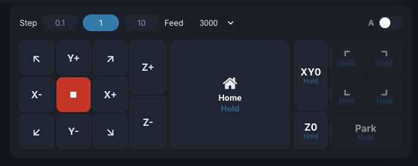
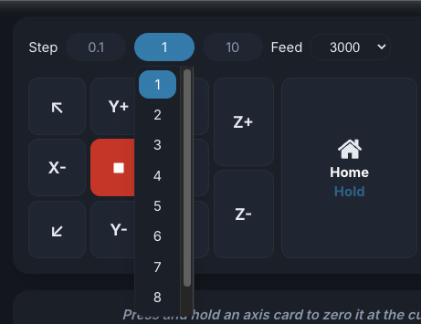
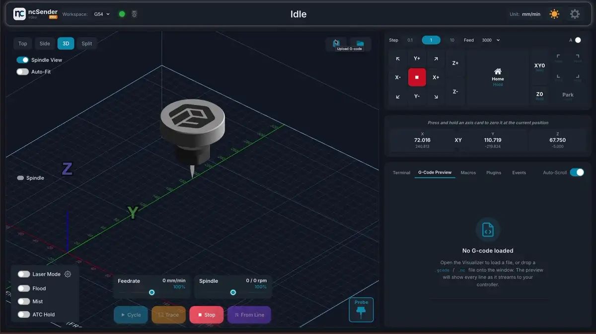
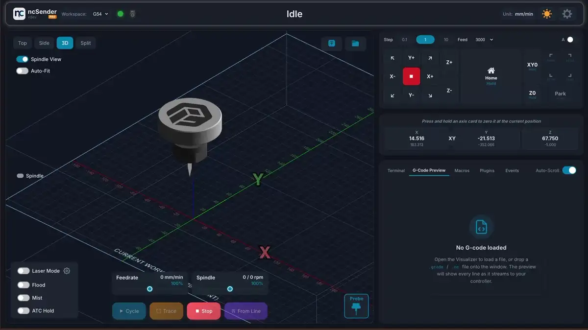

# Jog Controls

Jog controls let you manually move the machine to position your workpiece, set zeros, or verify clearances.

## Jog Panel Layout

The jog panel consists of:

- **3×3 XY grid** — Directional buttons including the four diagonals
- **Center stop button** (red) — Soft reset (`0x18`); halts all motion immediately and always stays enabled
- **Z+ / Z- buttons** — Vertical movement
- **A toggle** (top-right) — Switches the Z buttons to A+ / A- for 4th-axis rotation (when a rotary axis is configured)
- **Step selector + Feed dropdown** — Jog step size and feed rate
- **Home** — Homing (see [Homing](#homing))
- **XY0 / Z0 / Park** — Go-to-zero and parking (see [Go To Zero & Park](#go-to-zero-park))

## Step Sizes

There are three step buttons — a small, medium, and large range. **Tap** a button to
select it; **long-press (500 ms)** to open a dropdown with every value in that range.
Each button remembers the last value you picked, so switching between ranges keeps
your preferred step for each.

=== "Metric (mm)"

    | Button | Values available in the dropdown |
    |--------|----------------------------------|
    | 0.1 | 0.05, 0.1, 0.2 … 0.9 |
    | 1 | 1, 2, 3 … 9 |
    | 10 | 10, 20 … 100, 150, 200, 250, 300 |

=== "Imperial (inches)"

    | Button | Values available in the dropdown |
    |--------|----------------------------------|
    | 0.01 | 0.001, 0.005, 0.01 … 0.09 |
    | 0.1 | 0.1, 0.125, 0.2, 0.25 … 0.9 |
    | 1 | 1, 2, 3 … 10 |

## Feed Rates

Each step button has its own feed rate, set with the **Feed** dropdown next to the
step selector. The rate applies to XY moves; the other axes are scaled from it:

- **Z-axis** automatically jogs at 50% of the XY feed rate
- **A-axis** (4th axis) jogs at 25% of the XY feed rate

## Jog Modes

### Step Jog

A quick **tap** (released within ~300 ms) moves a fixed distance — the selected step
size. Each tap sends one discrete movement command.

### Continuous Jog

**Hold** a direction button (longer than ~300 ms) to move continuously. The machine
moves at the selected feed rate until you release the button, at which point an
automatic jog cancel (`0x85`) stops it right away.

### Diagonal Jog

The four corner buttons (↖ ↗ ↙ ↘) move both X and Y axes simultaneously.

## Keyboard Shortcuts

| Key | Action |
|-----|--------|
| ++arrow-left++ / ++arrow-right++ | Jog X- / X+ |
| ++arrow-up++ / ++arrow-down++ | Jog Y+ / Y- |
| ++page-up++ / ++page-down++ | Jog Z+ / Z- |

!!! tip "Quick Zero"
    Double-click an axis card in the DRO to manually type a coordinate value. Long-press an axis card to zero it at the current position.

## Homing

Use the **Home** button in the center of the panel to run a homing cycle. As with the
other action buttons, homing is a deliberate press-and-hold so it can't fire by accident:

- **Hold** the Home button (about 1 second) to home **all axes** (`$H`). A progress bar
  fills while you hold, and the cycle starts when it completes.
- **Double-tap** the Home button to split it into individual **HX / HY / HZ** buttons.
  Hold one to home just that axis (`$HX`, `$HY`, `$HZ`) — handy when you only need to
  re-establish a single axis.

## Go To Zero & Park

The buttons on the right of the panel **move the machine** to a position — they don't set
one. Hold a button to run its move; a progress bar fills as you hold.

- **XY0** — Hold to rapid to work X0 Y0. The machine retracts to a safe Z height first,
  then moves in XY. **Double-tap** to split into separate **X0** and **Y0** buttons, each
  of which holds-to-move a single axis.
- **Z0** — Hold to move Z to its work zero.
- **Park** — Hold ~1 second to move to the saved parking position (safe Z retract first);
  keep holding to about 2 seconds to **save** the current machine position as the new
  park location.

!!! tip "Setting zero vs. going to zero"
    These buttons *travel* to a stored zero. To *set* a work zero at the current
    position instead, press and hold the matching axis card in the DRO (see the
    **Quick Zero** tip above).

!!! note "Homing requirement"
    When homing is disabled (`$22=0`) these move buttons are always enabled. When homing
    is enabled, the machine must be homed first before it will travel to a stored
    position.
