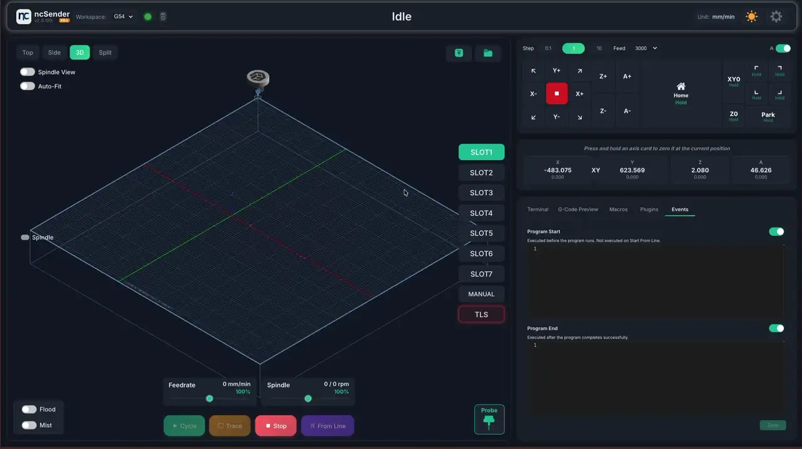
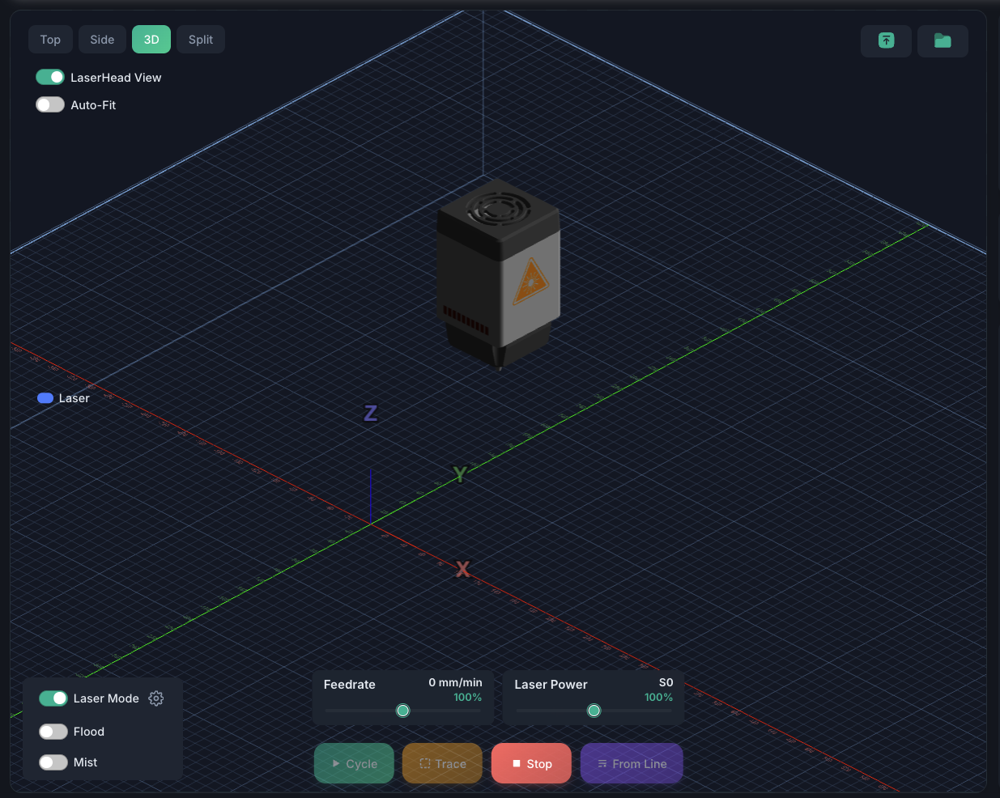
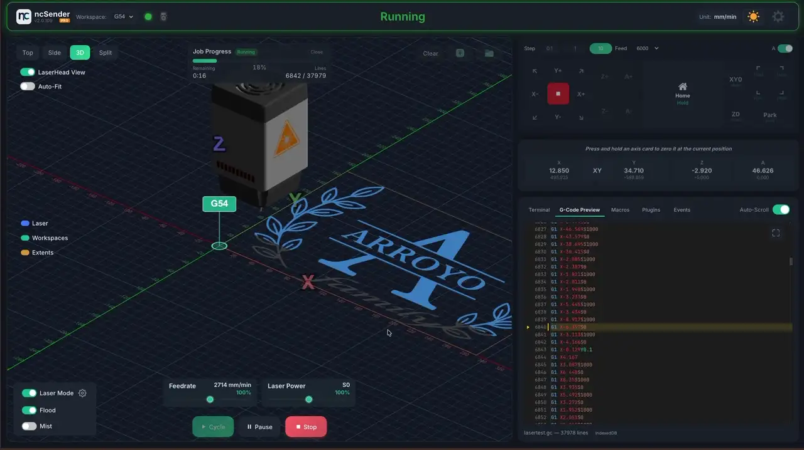

# Laser Mode

!!! info "Pro Feature"
    Laser mode is available in **ncSender Pro** only.

Laser mode transforms the visualizer and controls for laser engraving and cutting workflows.

## Enabling Laser Mode

1. Open **Laser Settings** from the visualizer toolbar
2. Under **Spindle use for Laser**, select the spindle output your laser is wired to
   (e.g. *PWM2 (Spindle 1)*)
3. Adjust **Z-Offset Laser** if you want a different visual head height (optional)
4. Click **Save**
5. Toggle **Laser Mode** in the visualizer controls

!!! warning
    Laser mode requires unloading any active tool first. If a tool is loaded, you'll be prompted to unload it before switching to laser mode.

## Laser Settings

| Setting | Description |
|---------|-------------|
| **Spindle use for Laser** | Which spindle output drives the laser module (e.g. *PWM2 (Spindle 1)*) |
| **Mode of operation ($32)** | Firmware laser mode. You don't set this by hand — toggling **Laser Mode** automatically sets `$32=1` when on and `$32=0` when off. This prevents the laser silently not firing (forgot `$32` on) or parking moves being skipped (forgot `$32` off). |
| **Z-Offset Laser (mm)** | Visual height of the laser head above the workbed in the visualizer (default: 30mm). Does not affect machine position or G-code. |

## Visualizer Changes

When laser mode is active:

- **Laser head model** replaces the spindle model
- **Beam visualization** shows a laser beam from the head to the workbed surface
- **Burn effect** animates where the laser contacts the workpiece
- **Power bar** displays current laser power as a color-coded bar (0-100%)
- **Rapids hidden** — G0 moves are not displayed (laser doesn't fire during rapids)

## Z-Offset

The Z-Offset setting controls the visual height of the laser head above the grid. This creates a visible beam between the nozzle and the workpiece surface for a realistic visualization.

- Default: 30mm
- Range: 0-100mm
- Purely visual — does not affect any machine commands

## Power Tracking

The power bar shows the current S-value (laser power) as a percentage of maximum:

- Segments fill from left to right as power increases
- Color transitions from dim to bright
- Shows 0% during G0 rapid moves (laser off)
