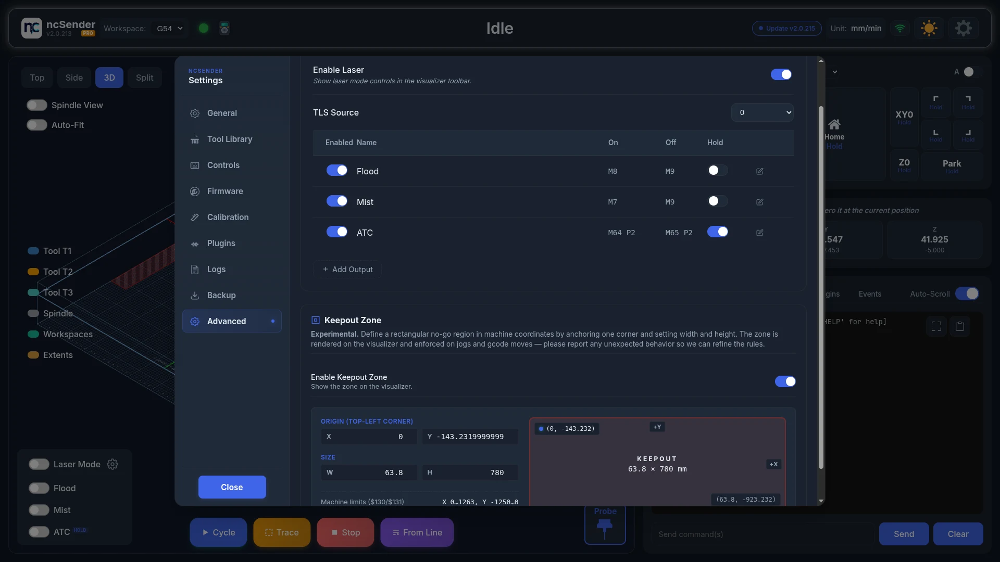

# Laser Mode

!!! info "Pro Feature"
    Laser mode is available in **ncSender Pro** only.

Laser mode sets up the visualizer and controls for laser engraving and cutting.

## Turn On the Laser Controls

The Laser Mode switch is hidden until you turn it on in Settings.

1. Open **Settings → Advanced**.
2. In **Auxiliary I/O**, turn on **Enable Laser**.
3. Close Settings. A **Laser Mode** switch and a gear button now appear with the **Flood** and **Mist** switches in the visualizer.

## Enabling Laser Mode

1. Click the gear button next to **Laser Mode** to open **Laser Settings**.
2. Under **Spindle use for Laser**, pick the spindle output your laser is wired to (for example *PWM2 (Spindle 1)*).
3. Click **Save**.
4. Turn on **Laser Mode**.

The **Laser Mode** switch stays greyed out until you have picked and saved a laser spindle.

Entries marked **- enable in firmware first** can't be picked. Turn that spindle on in your controller's firmware first. The spindle in use is marked **- active**.

!!! warning "Unload the tool first"
    If a tool is in the spindle, ncSender shows **Tool Loaded in Spindle**. Click **Unload Tool** to unload it and continue.

<!-- CAPTURE NEEDED: assets/images/features/laser-mode-toggle.webp (Turning on Laser Mode) -->

## Turning Laser Mode Off

When you turn Laser Mode off, ncSender asks you to confirm that the laser has been removed from the spindle. Click **Confirm** only after you have taken it off. Running the spindle with the laser still mounted can damage the laser head.

You can't change Laser Mode or Laser Settings while a job is running or paused.

## Laser Settings

| Setting | Description |
|---------|-------------|
| **Spindle use for Laser** | Which spindle output drives the laser module (for example *PWM2 (Spindle 1)*). |
| **Mode of operation ($32)** | Firmware laser mode. You don't set this by hand. Turning **Laser Mode** on sets `$32=1`, and turning it off sets `$32=0`. This stops the laser from silently not firing, and stops parking moves from being skipped. |

## Visualizer Changes

<!-- CAPTURE NEEDED: assets/images/features/laser-visualization.webp (Laser mode visualization) -->

When laser mode is on:

- A **laser head** replaces the spindle.
- A **beam** runs from the head to the work surface, with a **burn effect** where it touches.
- **Rapids are hidden.** G0 moves are not drawn, because the laser doesn't fire during them.
- The view button reads **LaserHead View** instead of **Spindle View**.
- The **Probe** button and the tool legend are hidden.

## Power Tracking

In laser mode the override panel label changes to **Laser Power** and shows the current S value.

- The power bar fills as power goes up.
- Power drops to 0 during G0 rapid moves, because the laser is off.
