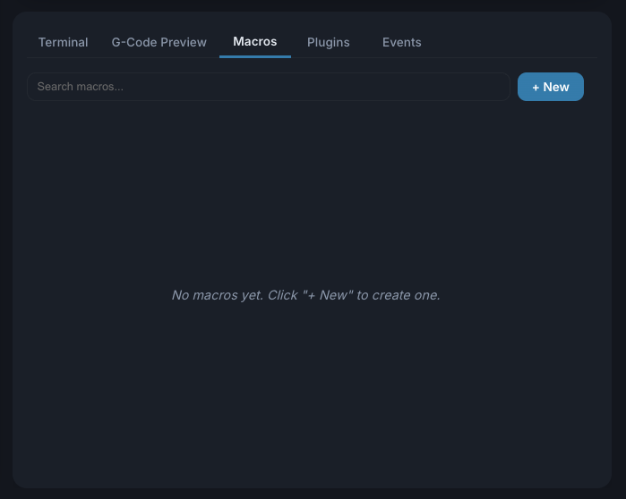
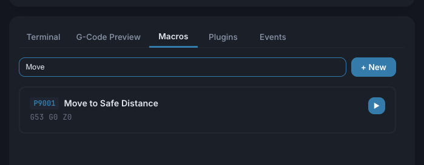

# Macros

Macros let you save frequently-used G-code sequences as reusable buttons.

## Creating a Macro



1. Go to the **Macros** tab in the console panel
2. Click **+ New** to create a new macro
3. Enter a **Name** and optional **Description**
4. Write your G-code in the editor
5. Click **Save**

Each macro is assigned a unique ID in the range 9001-9999.

## Running a Macro

You can run a macro in several ways:

- Click the **Play** button next to the macro in the list
- Type `M98 P<macro_id>` in the console (e.g., `M98 P9001`)
- Include `M98 P<macro_id>` as a line inside a G-code file
- Assign it to a custom button or event

When ncSender sees `M98 P<id>`, it looks the macro up in your library,
expands its body inline, and streams the resulting G-code to the
controller. The controller never receives the `M98` itself — it just
sees the expanded commands.

## Nested Macros

Macros can call other macros. A macro body that contains
`M98 P9002` will, at run time, splice in the body of macro `9002`.
This works to any depth up to **16 levels**.

ncSender also detects **recursive calls** (a macro that ends up
calling itself, directly or through a chain). The job is aborted with
an error like:

```
Macro recursion detected: 9001 → 9002 → 9001
```

This protects you from accidentally writing a macro loop that would
never finish.

## Controller Macros (Pass-Through Mode)

By default ncSender intercepts every `M98` and expands it from its
own macro library. If your controller has its own subprogram support
(for example a grblHAL board with an SD card holding `.macro` files),
you may want the controller itself to handle `M98` instead.

Toggle **Use controller macros** at the top of the Macros tab to
switch modes:

| Toggle | What happens to `M98 P<id>` |
|---|---|
| **OFF** (default) | ncSender intercepts, looks up the macro in its library, expands the body inline, and streams it to the controller. Supports nesting + recursion detection (see above). |
| **ON** | ncSender forwards the `M98` to the controller unchanged. Only macros known to the controller itself (e.g. grblHAL SD-card subprograms) will run. ncSender's macro library UI is hidden while this mode is active. |

Use the ncSender library (toggle off) if your controller has no
SD-card or doesn't support subprograms. Use controller mode (toggle on)
if you want your existing controller-side macros to be authoritative
and unchanged by ncSender.

## Macro Editor

The macro editor provides:

- **Syntax highlighting** — G-code keywords are color-coded
- **Line numbers** — For easy reference
- **Multiple lines** — Write complex sequences with multiple commands
- **Dark/light theme** — Matches your app theme preference

## Searching Macros



Use the search bar to filter macros by name, description, body text, or ID number.

## Example Macros

### Go to Machine Zero
```gcode
G53 G0 Z0
G53 G0 X0 Y0
```

### Park Position
```gcode
G53 G0 Z0
G53 G0 X0 Y-1200
```

### Probe Z and Zero
```gcode
G91
G38.2 Z-50 F100
G10 L20 P0 Z0
G0 Z5
G90
```

!!! tip
    Macros support any G-code your controller understands, including firmware-specific commands like `$H` (home) or `$X` (unlock).
