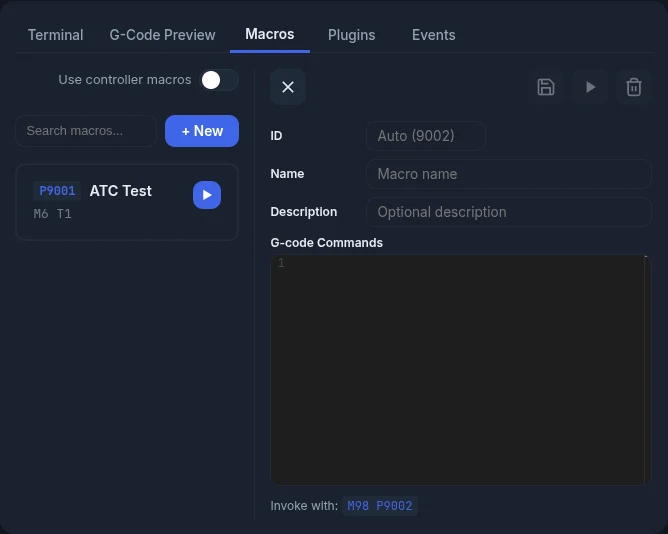
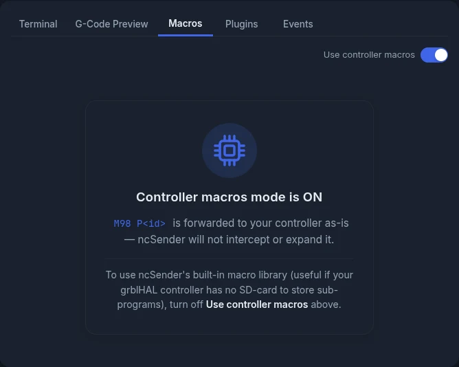
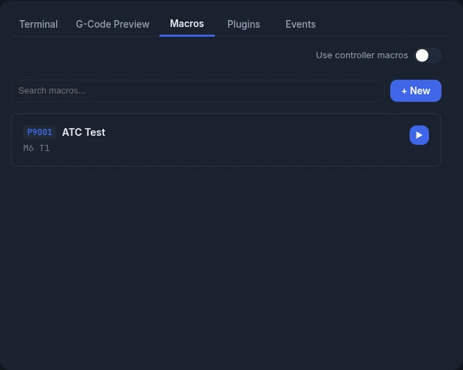

# Macros

Macros let you save G-code you use often and run it with one click.

## Creating a Macro



1. Go to the **Macros** tab.
2. Click **+ New**.
3. Leave **ID** empty to use the next free number, shown as *Auto (9001)*. Or type
   your own ID from 9001 to 9999.
4. Enter a **Name** and, if you like, a **Description**.
5. Type your G-code under **G-code Commands**.
6. Click **Save**.

The ID can't be changed after you save. The editor shows how to call the macro, for
example *Invoke with: M98 P9001*.

The editor also has:

- **Run**: runs the macro. Needs a connection.
- **Delete**: deletes the macro. It asks you to confirm first.

## Running a Macro

You can run a macro in several ways:

- Click the **Play** button next to the macro in the list.
- Type `M98 P<id>` in the [Terminal](console.md), for example `M98 P9001`.
- Add an `M98 P<id>` line to a G-code file.
- Add an `M98 P<id>` line to a [Program Event](program-events.md).

When ncSender sees `M98 P<id>`, it finds the macro in your library and sends its
G-code in its place. The controller never gets the `M98` itself. The terminal shows
the macro's lines, with their indentation kept.

<!-- CAPTURE NEEDED: assets/images/features/macros-run.webp (Running a macro) -->

## Nested Macros

A macro can call another macro. A macro that contains `M98 P9002` runs macro 9002 at
that point. Macros can call each other up to **16 levels** deep.

If a macro ends up calling itself, directly or through other macros, ncSender stops
the job with an error like:

```
Macro recursion detected: 9001 → 9002 → 9001
```

This keeps a macro loop from running forever.

## Controller Macros (Pass-Through Mode)

Normally ncSender runs every `M98` from its own macro library. If your controller has
its own macros (for example a grblHAL board with an SD card), you may want the
controller to handle `M98` instead.

Turn on **Use controller macros** in the Macros tab to switch:

| Toggle | What happens to `M98 P<id>` |
|---|---|
| **Off** (default) | ncSender runs the macro from its library. Nesting and loop checks work (see above). |
| **On** | ncSender sends `M98` to the controller as it is. Only macros stored on the controller run. The macro library is hidden, and a note reads **Controller macros mode is ON**. |



Keep it off if your controller has no SD card or doesn't support macros. Turn it on if
you want to use the macros stored on your controller.

## Macro Editor

The editor has:

- **Colour-coded G-code**
- **Line numbers**
- **Multiple lines**, so you can write longer sequences
- **Light and dark theme**, matching the app

## Searching Macros



Type in **Search macros...** to filter by name, description, G-code or ID.

## Example Macros

### Go to Machine Zero
```gcode
G53 G0 Z0
G53 G0 X0 Y0
```

### Park Position
```gcode
G53 G0 Z0
G53 G0 X0 Y-1200
```

### Probe Z and Zero
```gcode
G91
G38.2 Z-50 F100
G10 L20 P0 Z0
G0 Z5
G90
```

!!! tip
    Macros can use any command your controller understands, including `$H` (home) and
    `$X` (unlock).
