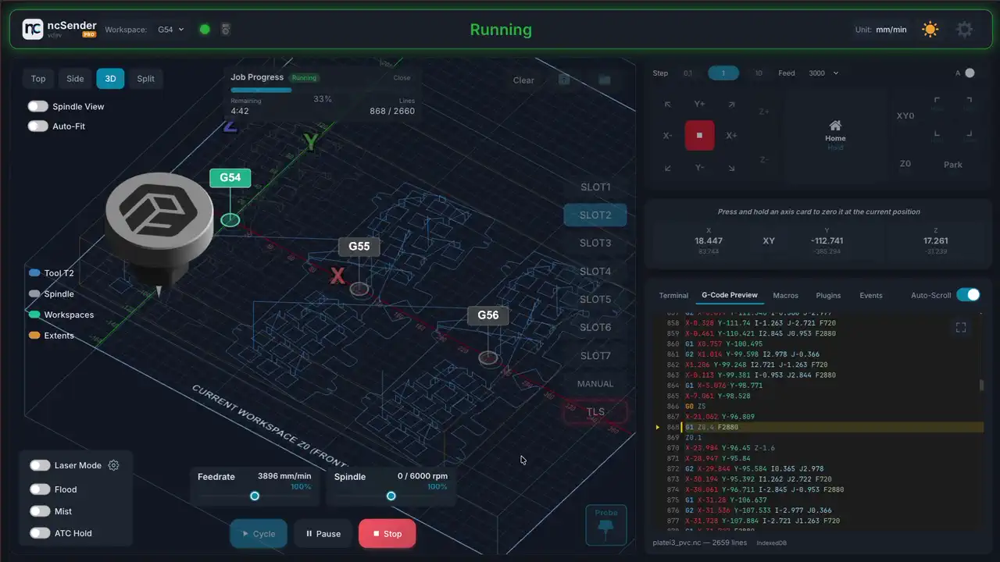
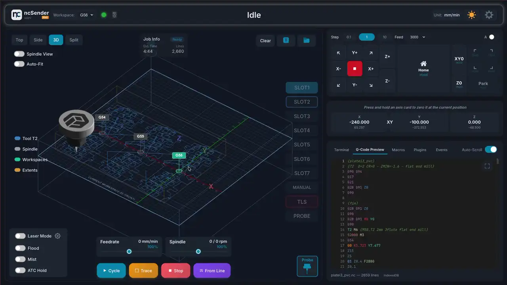

# Multi-Workspace

!!! info "Pro Feature"
    Multi-Workspace is available in **ncSender Pro** only.

Run multiple workspaces (G54–G59) in a single job, each with its own work offset and toolpath — ideal for batch production and tiling setups.

## How It Works

Instead of running the same program multiple times with manual offset changes, Multi-Workspace lets you define multiple work coordinate systems and execute them all in one job.

## Use Cases

- **Batch production** — Cut the same part at multiple positions on the table
- **Tiling** — Break a large job into sections that fit within machine travel
- **Fixtures** — Define permanent workpiece positions for repeatable setups

## Workspace Visualization

The 3D visualizer shows origin markers for all active workspaces (G54-G59), so you can verify positions before running.

