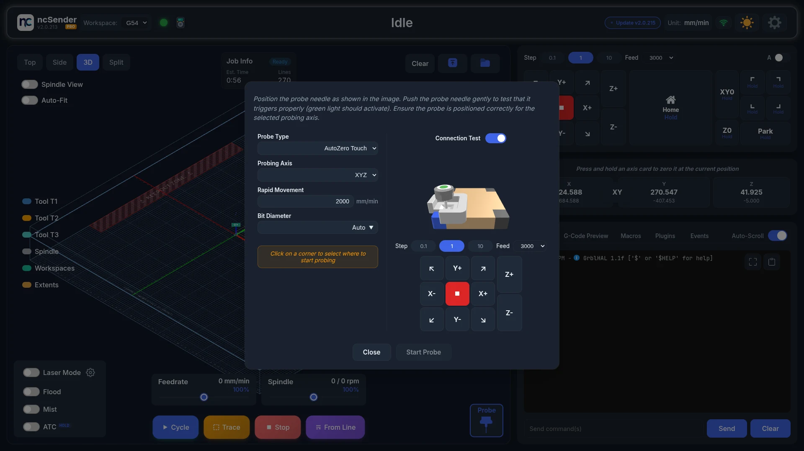
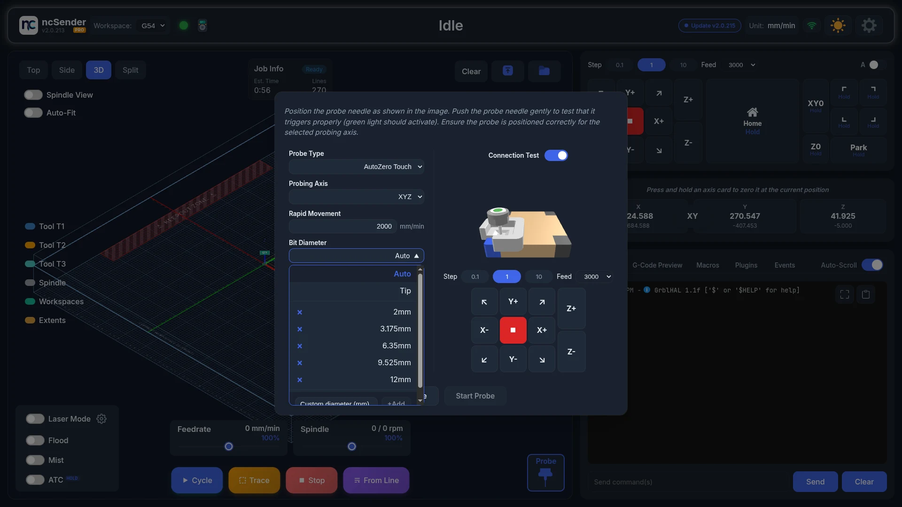
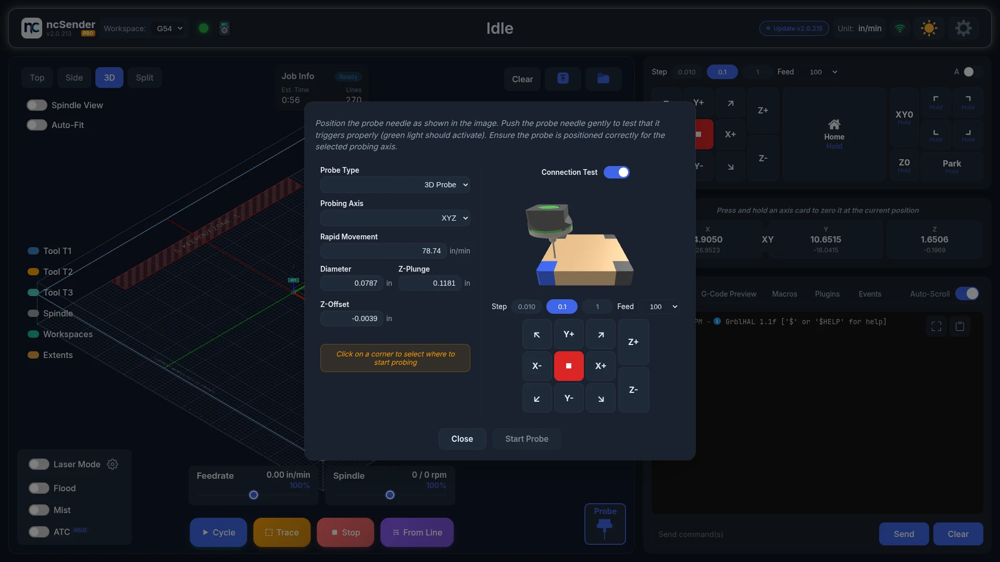

# Probing

Use the probe dialog to find your work zero with a touch probe.

## Probe Types

Pick one under **Probe Type**. The fields change with the type and the
**Probing Axis**. The dialog opens on **AutoZero Touch** with axis **Z**.

<video autoplay loop muted playsinline preload="metadata" aria-label="Probe types" poster="../assets/images/features/probe-types-poster.jpg">
  <source src="../assets/images/features/probe-types.mp4" type="video/mp4">
</video>

### 3D Probe

For 3D touch probes with a ball tip.

**Probing Axis:**

- **Z**: find the top of the material.
- **X** or **Y**: find one edge.
- **XY**: find a corner.
- **XYZ**: find a corner and the top.
- **Center - Inner**: find the center of a hole or pocket.
- **Center - Outer**: find the center of a part.

**Settings:**

- **Diameter**: the ball tip diameter.
- **Z-Plunge** (XYZ and center modes)
- **Z-Offset**
- **Rapid Movement**: the speed for fast moves.
- **X Dimension** and **Y Dimension**: the rough size of the hole or part (center
  modes).
- **Probe Z First**: probe the top before finding the center (Center - Outer).

### Standard Block

For a rectangular touch plate.

**Probing Axis:** Z, X, Y, XY or XYZ.

**Settings:**

- **Bit Diameter**: pick a saved diameter or add your own with **+Add**.
- **Z Thickness**: the plate height.
- **XY Thickness**: the side wall thickness.
- **Z Probe Distance**
- **Rapid Movement**

### AutoZero Touch

A touch plate that needs almost no setup.

**Probing Axis:** Z, X, Y, XY or XYZ.

**Settings:**

- **Bit Diameter**: **Auto** (the default) finds it for you. Choose **Tip** for a
  pointed bit, or pick a saved diameter or add one with **+Add**.
- **Rapid Movement**

### Tool Length Setter

For a fixed tool length setter.

**Settings:**

- **Tool Length Setter Height**

There is no probing axis or rapid movement setting for this type.

### Units

Probe settings use your unit preference: mm and mm/min, or inches and in/min.

## Using the Probe Dialog

1. Press **Probe** in the [Visualizer](visualizer.md#probe-button).
2. Choose your **Probe Type** and **Probing Axis**.
3. Check the settings.
4. Use the jog buttons and step size in the dialog to move the probe into place.
5. Tell ncSender where to probe:
    - **XY or XYZ**: click the corner on the picture.
    - **X or Y**: click the side. **Start Probe** stays off until you pick a side.
    - **Center modes**: place the probe 3–5 mm above the rough center of the hole
      or part.
6. Click **Start Probe**.

<video autoplay loop muted playsinline preload="metadata" aria-label="Probing cycle" poster="../assets/images/features/probe-cycle-poster.jpg">
  <source src="../assets/images/features/probe-cycle.mp4" type="video/mp4">
</video>

To stop a probe cycle, press **Stop** in the Visualizer. If the probe ends in an
alarm, **Start Probe** changes to **Unlock**. Press it to clear the alarm.

The **Start Probe** key in **Settings → Controls** also works while the dialog is
open.

!!! warning "Safety"
    Always check your settings before probing. A wrong Z-Plunge or speed can damage
    the probe or the workpiece.

## Connection Test

Turn on **Connection Test** to check the probe works before each cycle.

1. Turn on **Connection Test**. **Start Probe** is off.
2. Touch the probe to the plate, or push the probe tip gently. The picture shows
   the probe as triggered.
3. **Start Probe** turns on.

<!-- CAPTURE NEEDED: assets/images/features/probe-connection-test.webp (Connection test) -->
