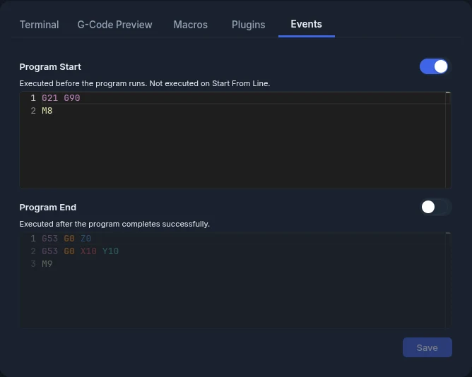

# Program Events

Program events run your own G-code automatically before or after a job.

## Event Types

### Program Start

Runs **before** a program starts.

!!! note
    Program Start does **not** run when you use **From Line**. It only runs on a full program start.

**Common uses:**

- Set default feed rate or units
- Turn on coolant
- Home specific axes
- Add a spindle warm-up delay

### Program End

Runs **after** a program finishes.

Program End does **not** run when you stop a job. It only runs when the program reaches its last line.

**Common uses:**

- Return to a park position
- Turn off spindle and coolant
- Turn off auxiliary outputs

## Configuring Events



1. Open the **Events** tab in the console panel (next to **Terminal**, **G-Code Preview**, **Macros** and **Plugins**).
2. Type your G-code in the editor for each event.
3. Click **Save**. The button stays greyed out until you change something.

**Pro:** the [on-screen keyboard](virtual-keyboard.md) works in both event editors.

## Enable/Disable Toggle

Each event has a switch next to its title. Turn it off to pause an event without deleting its G-code.

- The switch saves by itself. You don't need to click **Save**.
- A disabled event is greyed out.
- ncSender skips disabled events. The controller never receives them.

## Seeing Events in the Terminal

ncSender wraps the event's lines in markers in the terminal, so you can tell them apart from your program:

```
(Program Start Event Begin)
G21 G90
M8
(Program Start Event End)
```

Program End shows `(Program End Event Begin)` and `(Program End Event End)` the same way.

<!-- CAPTURE NEEDED: assets/images/features/events-terminal-markers.webp (Program End markers in the terminal) -->

If one line of an event fails, ncSender skips the rest of that event.

## Examples

!!! example "Program Start Example"
    ```gcode
    G21 G90           ; Millimetres, absolute positioning
    M8                ; Flood coolant on
    ```

!!! example "Program End Example"
    ```gcode
    G53 G0 Z0         ; Retract to machine Z0
    G53 G0 X0 Y-1200  ; Move to park position
    M5                ; Stop spindle
    M9                ; Coolant off
    ```
