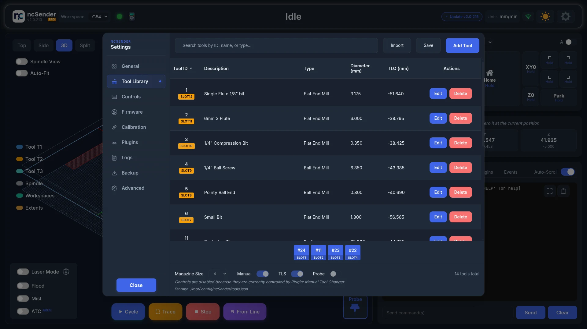
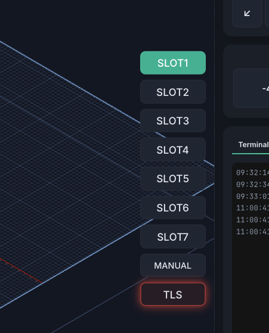
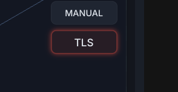
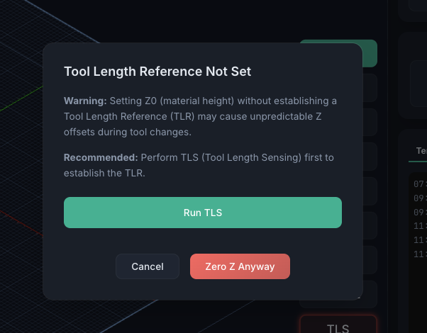

# Tool Management

ncSender keeps a **Tool Library** — an inventory of your cutting tools — and surfaces
the tools you use most as **tool buttons** in the visualizer, alongside the Tool Length
Setter (TLS) and Probe. When you install a tool-changer plugin, it takes over these
controls and drives tool changes for you.

## Tool Library

Open **Settings → Tool Library**. This is where you keep an inventory of your bits and
assign them to the slots (pockets) in your tool magazine.

Add, edit, and delete tools here. Each tool holds:

- **Tool number** — the pocket / magazine slot it's assigned to (leave unassigned to
  keep a bit in inventory without occupying a slot)
- **Name** — a description such as *1/4" Flat Endmill*
- **Type** — flat, ball, V-bit, drill, chamfer, surfacing, thread-mill, or probe
- **Diameter**
- **Tool length offset (TLO)** and its **TLS probe offsets** (X / Y / Z)
- **Notes** and **SKU** for your own reference

### Import / Export

The header shows **Import** and **Export** buttons for backing up your library or
moving it between machines.

- **Export** writes the current library to a `.json` file you can save anywhere.
- **Import** reads a saved `.json` file back in. If a tool number in the file already
  exists locally, ncSender surfaces the conflict and asks whether to overwrite.

!!! info "Pro Feature"
    The **Import** button in ncSender Pro also accepts **Vectric tool libraries
    (`.vtdb`)** — the SQLite database VCarve / Aspire / Cut2D use for their tool
    databases. Pick the file, review the mapped tools, and confirm the import.
    Everything else on this page works the same in both editions.

### Assigning a tool to a magazine slot

A tool only occupies a magazine pocket once you give it a slot. There are two ways to do
that:

- **From the Add / Edit Tool dialog** — set the **Assigned To Slot** dropdown to a slot
  (`Slot 1`, `Slot 2`, …). Leave it on **None (Not in magazine)** to keep the bit in
  inventory without a pocket.
- **From the tool table** — click the tool's **slot cell** (the `SLOT#` / *No Slot* badge
  in the Tool ID column) to open a slot picker, then choose a slot.

The available slots are limited by **Magazine size** — you can only assign Slot 1 through
Slot N, where N is the magazine size.

!!! tip "Slots swap automatically"
    If you assign a tool to a slot that another tool already occupies, ncSender **swaps**
    them — the other tool moves to the slot the current tool just left. You won't get a
    conflict error.

!!! note "Shrinking the magazine"
    Lowering the magazine size unassigns any tools sitting in slots above the new size (it
    asks you to confirm first). The tools stay in your library — they just lose their slot.

Assigned tools show an amber **`SLOT#`** badge in the table; unassigned ones show
*No Slot*. The slot strip along the bottom is a quick visual map of the magazine — click
an occupied slot to jump to that tool in the table.

### Tool button controls

The Tool Library also decides what appears in the visualizer's tool area:

- **Magazine size** — how many numbered tool buttons (T1, T2, …) to show. Set it to the
  number of pockets you use; set it lower to hide unused slots.
- **Manual** — show the **Manual** tool-change button (for non-ATC workflows).
- **TLS** — show the **Tool Length Setter** button.
- **Probe** — show the **Probe** button (tool T99).

!!! note "Plugins take over these controls"
    When a **Tool Changer** category plugin is installed and enabled, these controls are
    disabled and a message shows which plugin owns them — *"Controls are disabled because
    they are currently controlled by Plugin: …"*. The plugin decides how many buttons
    appear and whether TLS / Probe are shown. Disable the plugin to hand the controls
    back to the Tool Library.

## Tool Buttons

The tool buttons live at the bottom-right of the visualizer.

- **T1, T2, … TN** — one button per magazine slot. The **active tool** is highlighted, and
  any tool that appears in the loaded G-code is marked so you can see what the job needs.
- **Manual** — for manual tool-changer workflows; active when the current tool isn't one
  of the numbered slots.
- **TLS** — runs the Tool Length Setter (see below). Disabled when no tool is loaded.
- **Probe** — the probe tool (T99); active while the probe is the current tool.

Press and hold a tool button (about half a second) to trigger it. Numbered tools issue a
tool change (`M6`); the TLS button runs `$TLS`.

## Tool Changer Plugins

Tool management is extended through **Tool Changer** category plugins:

- **[Rapid Change ATC](../plugins/rapid-change-atc.md)** — automatic tool changer support
- **[Manual Tool Changer](../plugins/manual-tool-changer.md)** — guided manual tool changes with TLS

While one of these is enabled it becomes the *source* for the tool settings above — it sets
the button count and forces the appropriate TLS / Probe options on. Removing or disabling
the plugin returns control to the Tool Library.

### How `M6` is handled (grblHAL)

Whether a plugin is installed changes what happens when the program (or a tool button)
issues an `M6` tool change:

- **No tool-changer plugin** — ncSender passes `M6` straight through to the controller.
  On grblHAL, the firmware then handles the change according to its **`$341` Tool Change
  Mode** setting.
- **Tool-changer plugin enabled** — ncSender **intercepts** `M6` and runs the plugin's
  own tool-change routine instead of leaving it to the firmware.

The grblHAL `$341` Tool Change Mode options are:

| `$341` | Tool Change Mode | Behaviour |
|--------|------------------|-----------|
| 0 | **Normal** | Allows jogging for a manual touch off; set the new position manually. |
| 1 | **Manual touch off** | Rapids to the tool-change position; use jogging or `$TPW` for touch off. |
| 2 | **Manual touch off @ G59.3** | Rapids to the tool-change position, then to G59.3 for a manual touch off. |
| 3 | **Automatic touch off @ G59.3** | Rapids to the tool-change position, then to G59.3 for an automatic touch off. |
| 4 | **Ignore M6** | The controller ignores `M6` entirely. |

The tool-change position above is the tool-axis home, G59.3, or G30 position depending on
your other grblHAL settings.

!!! note "FluidNC"
    This passthrough behaviour is documented for grblHAL. FluidNC tool-change handling
    isn't covered here yet.

## Tool Length Setter (TLS)

The TLS establishes a **Tool Length Reference (TLR)** so Z stays consistent across tool
changes. Pressing **TLS** (or running `$TLS`) performs the measurement:

1. Switches to the TLS probe input (if a separate probe source is configured).
2. Moves to the TLS position and probes Z to touch off the tool.
3. Sets the tool length offset for the current tool.
4. Restores the normal probe source and returns to the previous XY position.

### The glowing TLS button

When a tool is loaded but its length hasn't been measured yet, the **TLS button pulses
with a red glow**. It's a reminder that no Tool Length Reference is set — run TLS before
you rely on Z.

If you try to **set Z0 (material height) without a Tool Length Reference**, ncSender
interrupts with a warning dialog — *"Tool Length Reference Not Set"* — explaining that
zeroing Z without a TLR can cause unpredictable Z offsets during tool changes. You can:

- **Run TLS** — measure now to establish the reference (recommended), or
- **Zero Z Anyway** — proceed and set Z0 without a TLR, or
- **Cancel**.

!!! warning "Laser mode"
    Tool buttons and the TLS glow/warning don't apply in laser mode — there's no tool
    length to reference.
