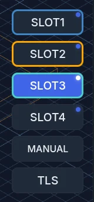

# Tool Management

ncSender keeps a **Tool Library** of your cutting tools. The tools in your magazine
show as **slot buttons** in the visualizer, next to the Tool Length Setter (TLS) and
Probe. If you install a tool-changer plugin, it takes over these controls and runs
tool changes for you.

## Tool Library

Open **Settings → Tool Library** to keep a list of your bits and assign them to the
slots (pockets) in your tool magazine.

Add, edit and delete tools here. Each tool has:

- **Tool ID**: the tool's own number. Each tool needs a different ID.
- **Assigned To Slot**: the magazine slot it sits in. See
  [Assigning a tool to a magazine slot](#assigning-a-tool-to-a-magazine-slot).
- **Tool Name / Description**: for example *1/4" Flat Endmill*.
- **Tool Type**: Flat End Mill, Ball End Mill, V-Bit, Drill, Chamfer, Surfacing or
  Thread Mill.
- **Diameter**
- **TLO**: the stored tool length offset.
- **TLS X Offset**, **TLS Y Offset** and **TLS Z Offset**: move where this tool is
  measured. Use them for a tool that sits off spindle center, such as a laser, or to
  start the measurement higher or lower for a long or short tool. Hover over each
  field for details.
- **Notes** and **SKU / Part Number** for your own use.

### Import / Export

Use **Import** and **Export** to back up your library or move it to another machine.

- **Export** saves the library to a `.json` file.
- **Import** loads a saved `.json` file. If a tool ID in the file already exists,
  ncSender lists them and asks before replacing.

**Pro:** **Import** also accepts **Vectric tool databases (`.vtdb`)** from VCarve,
Aspire and Cut2D.

### Assigning a tool to a magazine slot

A tool only takes a magazine slot once you assign it. There are two ways:

- **In Add Tool or Edit Tool**: set **Assigned To Slot** to a slot. Leave it on
  **None (Not in magazine)** to keep the bit in the library without a slot.
- **In the tool table**: click the tool's slot badge (**Slot#** or **No Slot**), then
  pick a slot.

<video controls autoplay loop muted playsinline aria-label="Assigning a slot">
  <source src="../assets/images/features/tool-assign-slot.mp4" type="video/mp4">
</video>

You can only pick Slot1 up to the **Magazine Size**.

!!! tip "Slots swap automatically"
    If another tool already sits in the slot you pick, the two tools swap. The list
    shows "(Swap with …)" next to that slot.

!!! note "Shrinking the magazine"
    Lowering **Magazine Size** removes tools from the slots above the new size. It
    asks first. The tools stay in your library.

Assigned tools show a **Slot#** badge in the table. The slot strip is a map of the
magazine: click a slot to jump to its tool.

### How a tool number finds its tool

A tool's **TLO** and **TLS X/Y/Z Offsets** belong to the **tool**, not to the slot it
sits in. Move a tool to another slot and its offsets go with it.

When a file or a button asks for a tool, for example `M6 T4`, ncSender looks up the
number in this order:

1. **Slot.** If a tool is assigned to that slot, that tool is used.
2. **Tool ID.** If no tool is in that slot, the tool with that Tool ID is used.
3. **No match.** No stored offsets are applied.

| You run | Tool Library | Tool used |
|---------|--------------|-----------|
| `M6 T4` | Tool ID 68 is in Slot 4 | Tool ID 68, with its offsets |
| `M6 T87` | Tool ID 87 is in no slot | Tool ID 87, with its offsets |
| `M6 T4` | Slot 4 is empty, Tool ID 4 is in no slot | Tool ID 4, with its offsets |
| `M6 T99` | Nothing matches 99 | No stored offsets |

So a tool doesn't need a slot to use its offsets. Keeping bits out of the magazine is
fine. Give a tool a slot only if you want its slot button.

!!! warning "The slot wins"
    If a slot number and a Tool ID are the same number, the slot is used. With a
    tool in Slot 4, `M6 T4` always gets that tool, never the tool whose Tool ID is 4.
    Give tools you keep outside the magazine Tool IDs higher than your
    **Magazine Size** to avoid this.

The tool-changer plugins follow the same rule, and so does the TLO saved after a TLS
measurement.

### Probe slot

When **Probe** is on, the library adds a **Probe (T99)** slot. The number is your
probe tool number, 99 by default. Assign your probe to it in **Assigned To Slot** or
in the slot picker. It shows as a dashed **PROBE** box in the slot strip.

The probe can then store a TLO like any other tool. The Probe slot stays assigned
when you shrink the magazine.

### Tool button controls

These settings decide which buttons show in the visualizer:

- **Magazine Size**: how many slot buttons to show.
- **Manual**: show the **Manual** button, for changing tools by hand.
- **TLS**: show the **TLS** button.
- **Probe**: show the **Probe** button.

!!! note "Plugins take over these controls"
    When a **Tool Changer** plugin is on, these settings are locked and a message
    names the plugin: *"Controls are disabled because they are currently controlled
    by Plugin: …"*. The plugin decides which buttons show. Turn the plugin off to get
    the settings back.

## Tool Buttons

The buttons are, in order:

- **Slot1, Slot2 …**: one per magazine slot. The current tool is highlighted. Tools
  used in the loaded file are marked, so you can see what the job needs.
- **Manual**: for changing tools by hand. It is active when the current tool isn't
  in a slot.
- **Probe**: loads your probe tool. The tooltip shows its number, for example
  *Probe (Hold to load T99)*.
- **TLS**: measures the current tool (see below). It is off when no tool is loaded.

To use the buttons:

- **Hold** a slot button for 1 second to change to that tool.
- **Hold** the current tool's button to unload it.
- **Hold** **TLS** to measure the current tool.
- **Tap** a slot button to see its tool ID, diameter and type.

<video controls autoplay loop muted playsinline aria-label="Tap a slot to see its tool">
  <source src="../assets/images/features/visualizer-slot-tap.mp4" type="video/mp4">
</video>

<!-- CAPTURE NEEDED: assets/images/features/tool-change-hold.webp (Hold to change tool) -->

A **dot** on a slot button, or on **Probe**, means that tool has a stored TLO. Hover
over it to see the value.

Tool change prompts show the tool's name, not just its number.

!!! note "Machine is not homed"
    If homing is set up but the machine isn't homed, a tool change or TLS shows
    **Machine is not homed** first. Choose **Continue** to go ahead or **Abort** to
    stop.

<!-- CAPTURE NEEDED: assets/images/features/tool-unhomed-gate.webp (Machine is not homed) -->

A tool change typed or sent outside a job is blocked while the
[safety door](safety-door.md) is open.

## Tool Changer Plugins

**Tool Changer** plugins add more tool-change features:

- **[Rapid Change ATC](../plugins/rapid-change-atc.md)**: automatic tool changer
  support.
- **[Pneumatic ATC](../plugins/pneumatic-atc.md)**: pneumatic automatic tool
  changer support.
- **[Manual Tool Changer](../plugins/manual-tool-changer.md)**: guided manual tool
  changes with TLS.

While one is on, it controls the tool settings above: how many buttons show, and
whether TLS and Probe show. Turn the plugin off to give control back to the Tool
Library.

### How `M6` is handled (grblHAL)

What happens when a file or a button asks for a tool change (`M6`) depends on
whether a plugin is on:

- **No tool-changer plugin**: ncSender sends `M6` to the controller. grblHAL then
  follows its **Tool Change Mode** setting (`$341`).
- **Tool-changer plugin on**: ncSender runs the plugin's tool change instead.

The grblHAL Tool Change Mode options are:

| `$341` | Tool Change Mode | What happens |
|--------|------------------|--------------|
| 0 | **Normal** | You can jog to touch off, then set the new position by hand. |
| 1 | **Manual touch off** | Moves to the tool-change position. Jog or use `$TPW` to touch off. |
| 2 | **Manual touch off @ G59.3** | Moves to the tool-change position, then to G59.3 to touch off by hand. |
| 3 | **Automatic touch off @ G59.3** | Moves to the tool-change position, then to G59.3 to touch off automatically. |
| 4 | **Ignore M6** | The controller ignores `M6`. |

The tool-change position is the tool-axis home, G59.3 or G30, depending on your other
grblHAL settings.

!!! note "FluidNC"
    This page covers grblHAL. FluidNC tool changes aren't covered here yet.

## Tool Length Setter (TLS)

The TLS sets a **Tool Length Reference (TLR)** so Z stays right after a tool change.
Hold **TLS** (or send `$TLS`) to measure:

1. ncSender switches to the TLS probe input, if you use a separate one.
2. The machine moves to the TLS and touches off the tool.
3. The tool length offset is saved for the current tool.
4. The probe input is switched back and the machine returns to where it was in X
   and Y.

<!-- CAPTURE NEEDED: assets/images/features/tool-tls-run.webp (Running TLS) -->

### The glowing TLS button

When a tool is loaded but hasn't been measured, the **TLS** button pulses. It is a
reminder that no Tool Length Reference is set. Run TLS before you trust Z.

<!-- CAPTURE NEEDED: assets/images/features/tool-tls-glow.webp (Pulsing TLS button) -->

If you try to **set Z0 without a Tool Length Reference**, ncSender shows **Tool
Length Reference Not Set**. Setting Z0 without a TLR can give wrong Z heights after a
tool change. You can choose:

- **Run TLS**: measure now (recommended).
- **Zero Z Anyway**: set Z0 without a TLR.
- **Cancel**

<!-- CAPTURE NEEDED: assets/images/features/dro-tlr-warning.webp (Tool Length Reference Not Set) -->

!!! warning "Laser mode"
    Tool buttons and the TLS warnings don't apply in laser mode, because a laser has
    no tool length.
