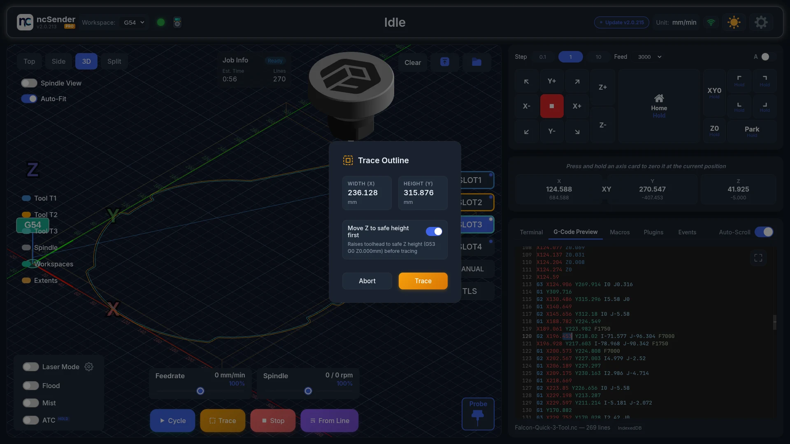

# Trace

!!! info "Pro Feature"
    Trace is available in **ncSender Pro** only.

Trace moves the machine around the outline of your program, so you can check it fits your material before cutting.

<video autoplay loop muted playsinline preload="metadata" aria-label="Trace animation" poster="../../assets/images/features/trace-poster.jpg">
  <source src="../../assets/images/features/trace.mp4" type="video/mp4">
</video>

## How It Works

Trace moves around the rectangle that holds the whole program. Use it to check that:

- The program fits on the workpiece.
- The origin is in the right place.
- No clamps or fixtures are in the way.

## Usage

1. Load a G-code program.
2. Set your work zero (X0, Y0).
3. Click **Trace** next to **Start**, **Stop** and **From Line**.
4. The **Trace Outline** dialog shows the **Width (X)** and **Height (Y)** of the program.
5. Leave **Move Z to safe height first** on unless you have a reason not to.
6. Click **Trace**, or **Abort** to close without moving.
7. Watch the machine go around the outline and check it stays on your material.

The machine goes to the front-left corner of the outline, then around it counter-clockwise. The outline includes arcs and every workspace the program uses.

## Safe Height

With **Move Z to safe height first** on, Z rises to your **Safe Z Height** before moving. Set it in **Settings → General → Safe Z Height**.

With it off, Z stays where it is. Make sure the bit clears everything first.

!!! tip
    Trace uses rapid moves (G0), so it finishes quickly.

## When Trace Is Unavailable

The **Trace** button is greyed out when:

- No program is loaded.
- The safety door is open.
- The machine needs homing and hasn't been homed.

While a job runs, **Pause** takes the place of **Trace**.

If the machine goes into alarm during a trace, ncSender stops sending the rest of the moves.

!!! note "Keepout Zone"
    Trace moves follow your [Keepout Zone](keepout-zone.md) rules.
