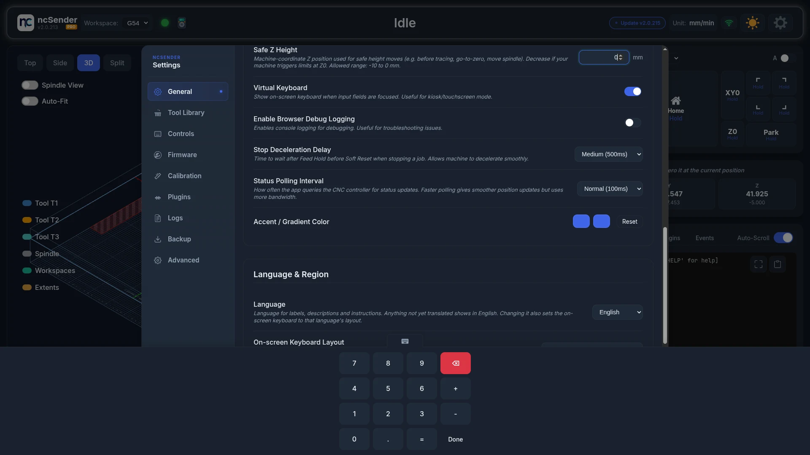
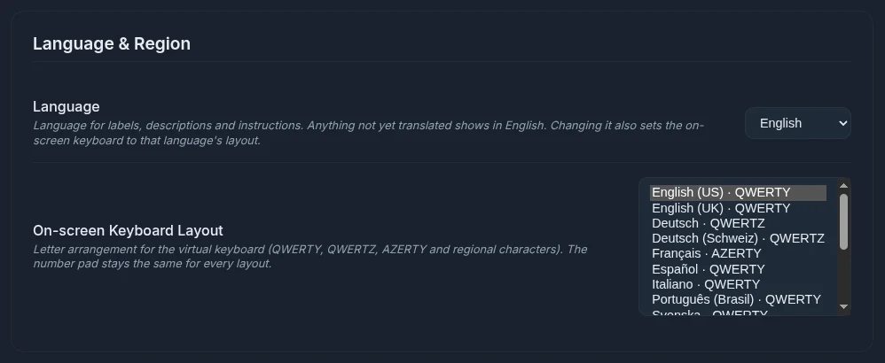
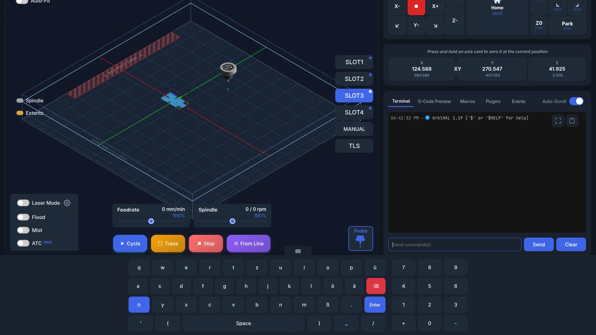

# Virtual Keyboard

!!! info "Pro Feature"
    Virtual Keyboard is available in **ncSender Pro** only.

An on-screen keyboard for kiosk and touch screen setups with no physical keyboard.

<video controls autoplay loop muted playsinline aria-label="Virtual Keyboard animation">
  <source src="../assets/images/features/virtual-keyboard.mp4" type="video/mp4">
</video>

## Features

- **Regional layouts**: 16 letter layouts, including QWERTZ and AZERTY, with regional characters.
- **Shift**: hold Shift for the second character on dual keys.
- **Number pad**: opens by itself for number fields, such as coordinates and settings.
- **Opens by itself**: appears when you tap a text field or code editor.
- **Touch-friendly**: sized for fingers.

The keyboard doesn't open for read-only fields, checkboxes, sliders, file pickers or color pickers.

## Supported Inputs

The virtual keyboard works with:

- Console command input
- Coordinate entry (DRO double-click)
- Settings inputs
- Macro editor
- Program Start and Program End event editors
- Plugin dialog inputs and plugin code editors

## Hide and Reopen

- Tap the tab on top of the keyboard to hide it.
- While a field still has focus, a small keyboard tab stays on screen. Tap it to bring the keyboard back.
- After you hide it, the keyboard stays hidden until you tap a different field.

## Choose a Layout

1. Open **Settings → General**.
2. Scroll to **Language & Region**.
3. Pick a layout in **On-screen Keyboard Layout**.

Available layouts:

- English (US) · QWERTY (default)
- English (UK) · QWERTY
- Deutsch · QWERTZ
- Deutsch (Schweiz) · QWERTZ
- Français · AZERTY
- Español · QWERTY
- Italiano · QWERTY
- Português (Brasil) · QWERTY
- Svenska · QWERTY
- Norsk · QWERTY
- Dansk · QWERTY
- Suomi · QWERTY
- Nederlands · QWERTY
- Polski · QWERTY
- Čeština · QWERTZ
- Türkçe · QWERTY

Regional layouts add characters such as ü ö ä ß, é è à ç and £. The number pad is the same for every layout.

Changing **Language** also sets the matching layout. You can still pick a different layout afterwards. The **Space**, **Enter** and **Done** keys follow the language. See [Language & Region](language-region.md).

## Settings

Turn the virtual keyboard on or off in **Settings → General → Application Settings → Virtual Keyboard**.

Turn it off when a physical keyboard is connected, so it doesn't pop up.
