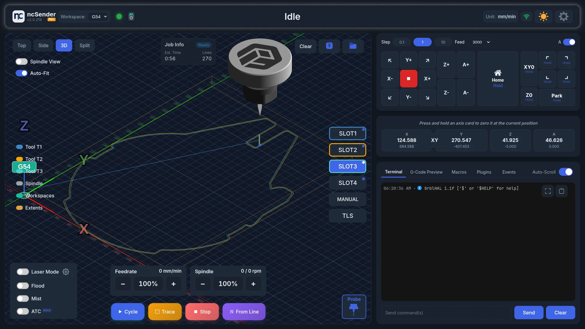
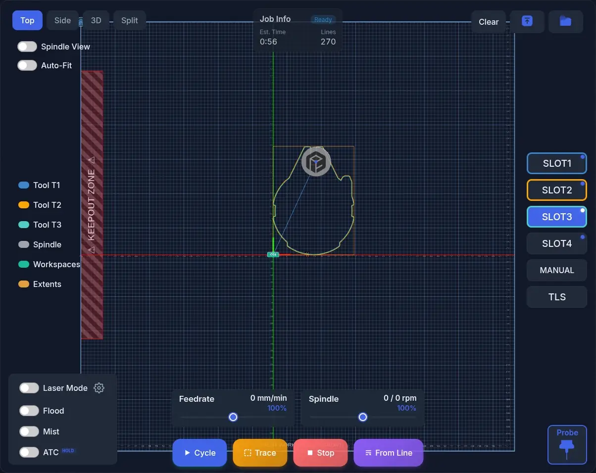
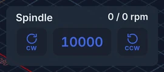
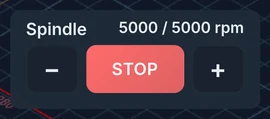
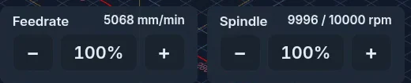
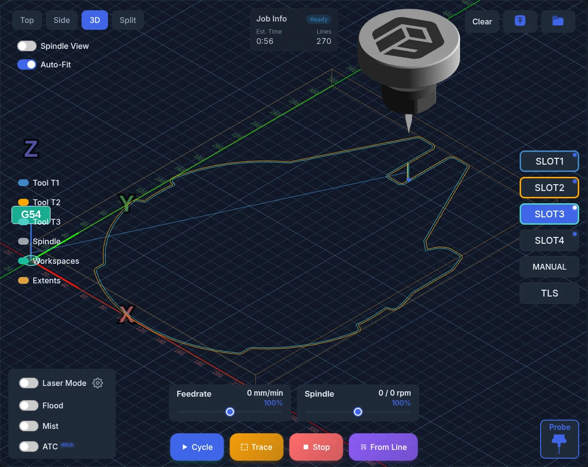
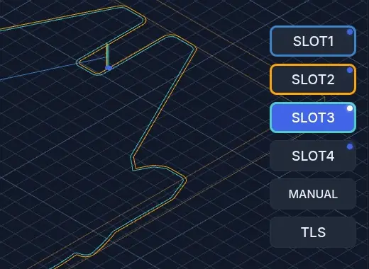
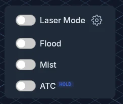
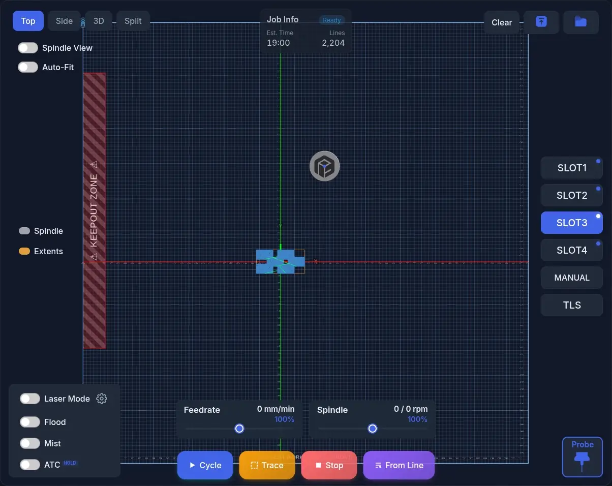

# Visualizer

The Visualizer shows your G-code toolpath in 3D and tracks where the machine
is while it runs. You also start, pause and stop jobs from here.

## Changing the View

Pick a view with the **Top**, **Side**, **3D** and **Split** buttons:

| View | What it shows | Best for |
|------|---------------|----------|
| **Top** | Looking down on the XY plane | Checking 2D layouts and positions |
| **Side** | Looking from the front at the XZ plane | Checking depth passes and Z moves |
| **3D** | A perspective view you can rotate | General use, inspecting toolpaths |
| **Split** | Top, Side and 3D at the same time | Detailed inspection |

### Moving Around

- **Pan**: left-click and drag, in any view.
- **Rotate**: right-click and drag. This works in 3D, and in the 3D pane of
  Split.
- **Zoom**: use the mouse wheel. The view zooms toward the point under the
  cursor. On a touchscreen, pinch. The view zooms toward the point between your
  fingers.

### View Toggles

- **Spindle View** (or **LaserHead View** in [Laser Mode](laser-mode.md)):
  keeps the camera close to the moving head so you can watch the cut. The
  spindle turns while it runs, so you can check the direction (CW or CCW).
- **Auto-Fit**: when on, the camera fits the loaded file. When off, it shows
  the whole grid.

## Loading a File

- **Upload G-code**: pick a `.nc`, `.gcode`, `.gc`, `.ngc`, `.tap` or `.txt`
  file from your computer.
- **Open Folder**: browse files saved in ncSender's G-code library.
- **Drag and drop**: drop a file onto the ncSender window.
- **Clear**: unload the current file. You can't clear a file while a job is
  running.

## Running a Job

- **Cycle**: starts the loaded file. When the machine is on hold, it resumes.
  Cycle works when a file is loaded and the machine is Idle, or when it is on
  Hold. It stays off while the safety door is open.
- **Pause**: holds the running job. It takes the place of **Trace** while a job
  is running or on hold.
- **Stop**: stops the job. If a probe cycle is running, **Stop** stops the probe
  instead.
- **Trace**: moves around the outline of the toolpath with the spindle off, so
  you can check clearances and workholding. See [Trace](trace.md).
- **From Line**: starts the job from a line you choose. Use it to pick up after a
  broken bit or a power cut. You can also double-click a line in the
  [G-Code Preview](gcode-preview.md) tab. **From Line** is hidden while a job is
  running.

All job buttons are off while ncSender is not connected. They are also off when
the controller requires homing at startup and the machine is not homed yet.

While a job runs:

- The toolhead follows the machine in real time.
- Completed paths change colour.
- The **Job Progress** card shows progress and run time.
- The live feed rate and spindle RPM (actual and target) show on the override
  cards.

### Spindle control

When no job is running, the **Spindle** card runs the spindle instead of
overriding it — an override only means something while a program is feeding.

- Tap **CW** or **CCW** to start the spindle at the speed shown.
- Tap the speed to pick from a list of preset speeds.
- Tap **−** or **+** to change the speed by 1000 RPM. Hold to keep changing it.
  The speed never goes below or above what your controller allows (`$31`
  and `$30`).

Once the spindle is turning, the card changes:

- The middle button becomes **STOP** (`M5`).
- **−** and **+** still change the speed, and the spindle follows straight
  away, keeping the direction you started it in.

The actual and target RPM always show at the top right of the card.

The controls are hidden while a job is running, while the machine is homing
or in alarm, and while the door is open. **STOP** stays available whenever
the machine is connected.

!!! tip "Where did the terminal buttons go?"
    The spindle buttons used to live in the enlarged Terminal. They moved
    here so you can reach them without covering the toolpath.

### Overrides

Use the **Feedrate** and **Spindle** overrides to speed up or slow down a
running job. The change takes effect right away, without pausing.

- Tap **−** or **+** to change the value by 10 %. Hold the button to keep
  changing it.
- Tap the percentage to reset it to 100 %. It shows in blue when it isn't at
  100 %.
- Overrides go from 10 % to 200 %.

Rapid moves follow the **Feedrate** override, in the fixed steps grblHAL
supports:

| Feedrate override | Rapid moves |
|---|---|
| Above 50 % | 100 % |
| 26 – 50 % | 50 % |
| 11 – 25 % | 25 % |
| 10 % | 5 % |

!!! note
    The 5 % rapid step needs grblHAL build 20260831 or newer. On older
    firmware, rapid moves stay at 25 %.

In Laser Mode the second card is **Laser Power**.

## Probe Button

Press **Probe** to open the probing dialog. See [Probing](probing.md).

The button is off while a job is running, while connecting, in an alarm, while
homing, or when homing is required first. It is hidden in Laser Mode.

## Transform Menu

Use the transform menu to rotate, mirror or offset the loaded file, or to move
the spindle to a spot.

- **Mouse**: right-click the canvas.
- **Touchscreen**: press and hold one finger for about half a second. If your
  finger slides, the menu doesn't open.

The menu always opens fully on screen. It is not available while a job is
running. Press ++escape++ or click outside the menu to close it.

The items depend on the view:

| Action | Top | Side | 3D | Split |
|---|---|---|---|---|
| **Rotate 90° CW / Rotate 90° CCW** | ✓ | — | ✓ | — |
| **Mirror X Axis / Mirror Y Axis** | ✓ | — | ✓ | — |
| **Offset Material** | ✓ | ✓ | ✓ | ✓ |
| **Reset to Original** *(only after a plugin or a transform changed the file)* | ✓ | ✓ | ✓ | ✓ |
| **Move To** *(needs a connection)* | ✓ | — | — | — |

### Moving to a Spot

1. Switch to **Top** view.
2. Right-click where you want the spindle to go, then choose **Move To**.
3. The **Move To** dialog opens with X and Y filled in from your click. These
   are machine coordinates. Change them if needed.
4. Press **Move**. The spindle rises to a safe Z height first, then moves.

<!-- CAPTURE NEEDED: assets/images/features/visualizer-move-to.webp (Move To) -->

!!! note "Why Move To is Top-only"
    Only in Top view does a click match an exact X and Y on the machine. In the
    other views the spot you click is ambiguous, so Move To is hidden.

## Toolpath Display

- **Rapid moves (G0)**: dashed lines.
- **Cutting moves (G1)**: solid lines.
- **Arcs (G2/G3)**: smooth curves.
- **Machine travel**: a cyan outline shows how far the machine can move.

### Toolhead

A 3D model shows where the machine is:

- **Spindle**: a turning spindle with its collet. The bit is hidden when no tool
  is loaded.
- **Laser head**: a laser head with its beam. Needs
  [Laser Mode](laser-mode.md) (Pro).

<!-- CAPTURE NEEDED: assets/images/features/visualizer-toolheads.webp (Spindle and laser head) -->

### Workspace Markers

Markers show where the origins of G54 to G59 are on the machine. The active
workspace is highlighted.

### Legend

Click an item in the legend to show or hide it:

- **Tool T1, T2, …**: one entry for each tool in the file, in the same colour as
  its paths.
- **Spindle** (or **Laser**): the toolhead.
- **Workspaces**: the G54 to G59 markers. Only shown when more than one
  workspace is set.
- **Extents**: a box around the toolpath. Only shown when a file is loaded.

## Tool Slots

The slot buttons change the tool in the spindle. They are, in order:
**Slot1**, **Slot2** …, **Manual**, **Probe** and **TLS**.

- **Hold** a slot for 1 second to change to that tool. Hold the current tool to
  unload it.
- **Tap** a slot to see its tool ID, diameter and type. Tap again to hide it.
- A **dot** on a slot means that tool has a stored tool length offset (TLO). The
  Probe button shows the same dot.
- With more than 8 slots, use the arrows to scroll.

See [Tool Management](tool-management.md) for setup.

## Coolant and Outputs

- **Flood** and **Mist**: turn coolant on or off. They work during a job too.
- **Your own outputs**: any outputs you set up in Settings.
- **Hold** outputs: an output marked "Hold" needs a 1-second press, so you
  can't switch it by accident.
- **Laser Mode** (Pro): switches between spindle and laser. The button next to
  it opens the laser settings. See [Laser Mode](laser-mode.md).

## Keepout Zone

The keepout zone is available in ncSender Pro only.

When the keepout zone is on, it shows as a red box labelled **KEEPOUT ZONE**. It
pulses if the loaded file passes through it. ncSender moves around the zone or
refuses moves that end inside it. See [Keepout Zone](keepout-zone.md).

## Out-of-Bounds Warning

<!-- CAPTURE NEEDED: assets/images/features/visualizer-out-of-bounds.webp (Out-of-bounds warning) -->

If the toolpath goes past the machine's travel, a red banner shows
**Toolpath exceeds machine boundaries**. When known, it adds which way the file
goes past the limit, for example *at X+, Y-* or *at Z below machine limit
(-120)*. The banner moves every few seconds so you notice it.

The check uses machine coordinates. It runs again when you change the work zero,
workspace, tool length offset or home position, and it keeps checking during the
job. The banner goes away on its own when the toolpath fits again or the file is
unloaded.

!!! tip
    If the toolpath is outside the machine right after homing, check the home
    corner setting before the file. See the
    [FAQ](../faq.md#the-toolpath-sits-outside-the-machine-after-homing).

## Alarm Dialog

<!-- CAPTURE NEEDED: assets/images/features/visualizer-alarm.webp (Alarm dialog) -->

When the controller raises an alarm, a dialog opens. It closes on its own when
the alarm clears.

- The **title** names the alarm in plain words, such as *Hard limit hit* or
  *Homing required*.
- The **main line** tells you how to clear it, for example *Release the E-stop
  button, then press Unlock. Re-home afterwards if the machine was moving.*
- The controller's own message is kept below, with an **Alarm N** badge.

An alarm without a code, common right after power-on, is named after its cause.
For example, a pressed E-stop shows as **Power-on safety check**: press the
E-stop in, release it, then unlock.

### Press to Unlock

**Press to Unlock** resets the controller and unlocks it. It keeps trying about
every 3 seconds for up to 30 seconds, and counts down while it works. It stops
as soon as the alarm clears.

If the controller refuses because the cause is still there, the dialog says so.
Release the E-stop, clear the switch or fix the motor fault, and the next try
goes through.

!!! tip "Undoing changes to a file"
    If a plugin or the [transform menu](#transform-menu) changed the loaded
    file, choose **Reset to Original** in the transform menu to get the original
    back.
