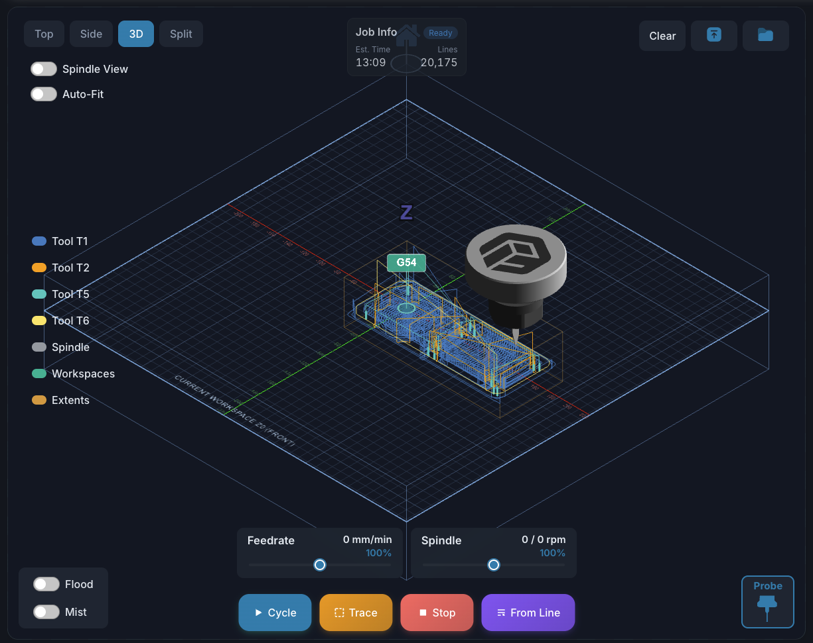
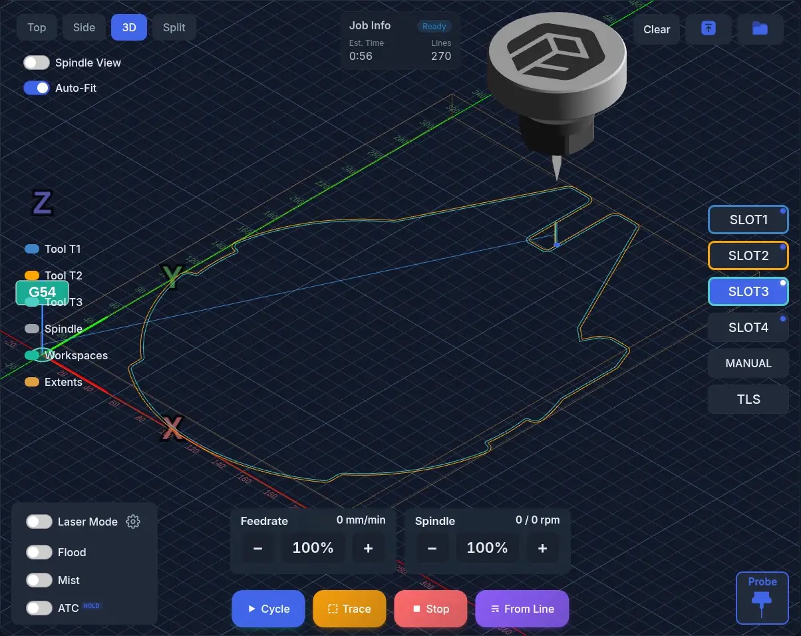
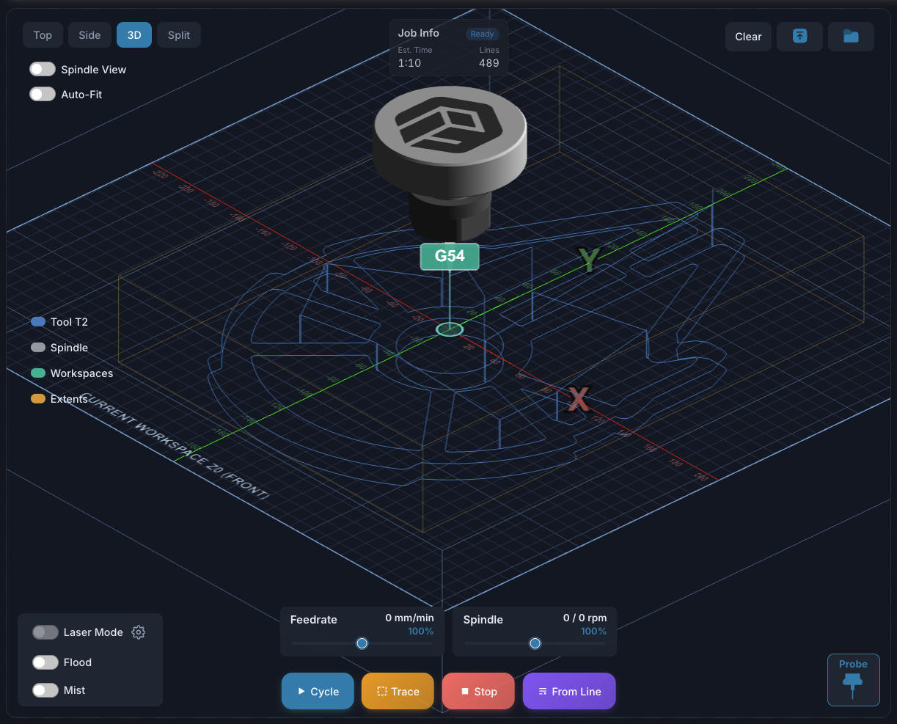
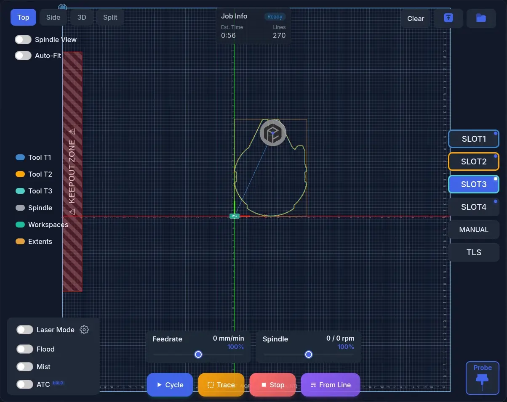
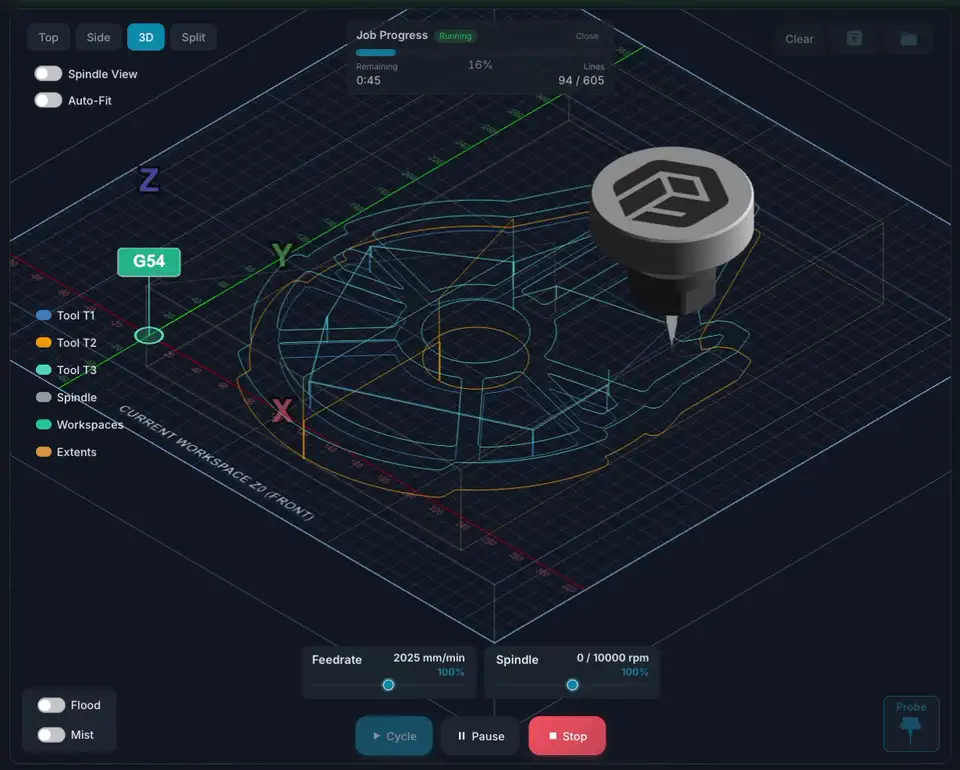
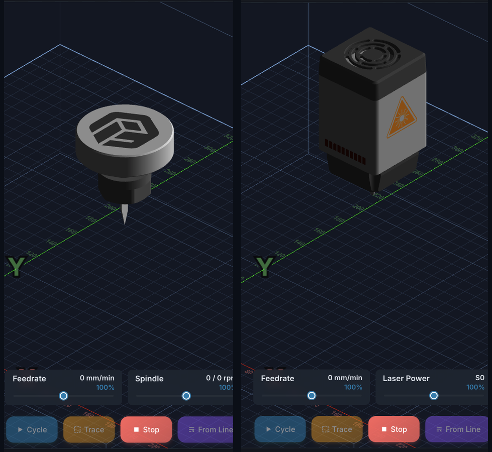
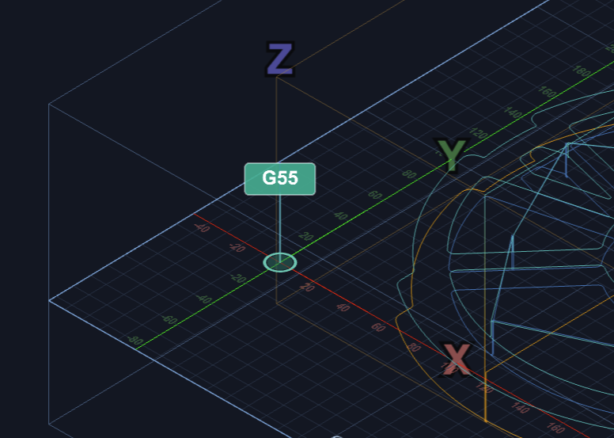
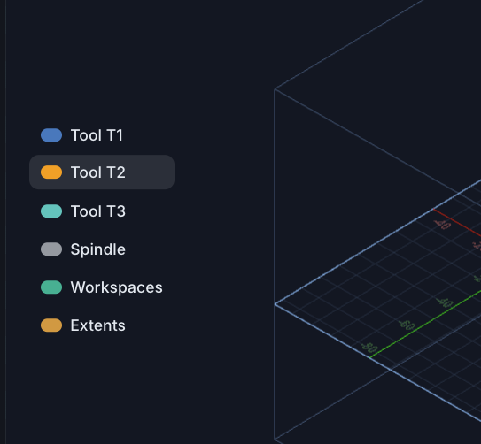
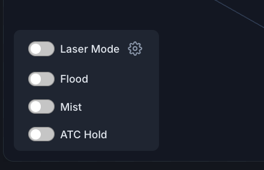
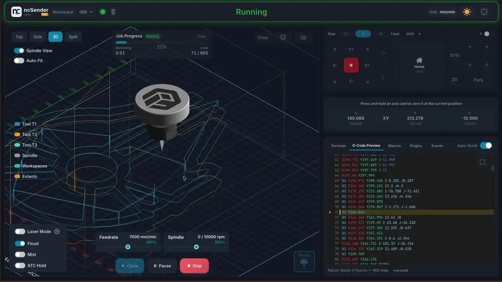

# Visualizer

The 3D Visualizer is the centerpiece of ncSender, providing a real-time
preview of your G-code toolpath and live machine position tracking.

## Views

ncSender offers four different viewing modes:

| View | Description | Best For |
|------|-------------|----------|
| **3D** | Isometric perspective view with rotation | General use, inspecting toolpaths |
| **Top** | Orthographic top-down view (XY plane) | Verifying 2D layouts, checking positions |
| **Side** | Orthographic front-facing view (XZ plane) | Checking depth passes, Z movements |
| **Split** | Quad-view showing Top, Side, and 3D simultaneously | Detailed inspection |

## Navigation

- **Pan** — Click and drag to move the view
- **Zoom** — Mouse wheel or trackpad pinch to zoom in/out
- **Rotate** (3D view only) — Right-click and drag to orbit

## Controls

The visualizer surfaces its controls as floating toolbars around the canvas,
so the 3D preview stays full-bleed. Each cluster is labeled below.

### View buttons (top-left)

Switch between **Top**, **Side**, **3D**, and **Split** at any time. The
active button is highlighted. See [Views](#views) for what each mode shows.

### View toggles (top-left)

- **Spindle View / LaserHead View** — frames the camera tight on the moving
  spindle (or laser head, when [Laser Mode](laser-mode.md) is on) so you can
  watch cuts as they happen. The spindle rotates while active so you can
  visually confirm direction (CW/CCW).
- **Auto-Fit** — when on, the camera frames the loaded G-code's bounds. When
  off, it frames the full grid. Auto-Fit only kicks in when a file is
  loaded; otherwise the view stays put.

### File controls (top-right)

- **Clear** — drop the currently loaded G-code (only shown when a file is
  loaded; disabled while a job is running).
- **Upload (↑)** — pick a `.nc` / `.gcode` / `.gc` / `.ngc` / `.tap` / `.txt`
  file from disk.
- **Open Folder** — browse files stored in ncSender's gcode library.

### Job action bar (bottom-center)

- **Cycle / Resume** — start the loaded program, or resume from Hold.
  Disabled until you've loaded a file, homed, and cleared any alarms.
- **Stop** — abort the current job. Sends a soft-reset to the controller.
- **Trace** — dry-run the toolpath with the spindle off so you can verify
  travel limits and workholding before cutting.
- **From Line** — start the job from a specific line number. Useful for
  resuming after a tool change, a power blip, or just for testing a
  specific section. Double-clicking a line in the G-Code Preview tab also
  opens this dialog with that line pre-filled.

### Probe (bottom-right)

Opens the probing dialog (Z-touch, X/Y edge, corner, center, 3D, etc.).
Hidden in Laser Mode. Disabled if no probe is configured or the machine
isn't homed.

### Overrides (bottom-center)

Two live sliders for **Feedrate** and **Spindle** overrides (each 10–200 %,
in 10 % steps). Changes are sent as grblHAL real-time commands and take
effect mid-program without pausing the job.

## Transform Context Menu

Open a context menu on the visualizer to apply quick toolpath
transforms, an offset, or move the spindle to a clicked location.

- **Mouse** — right-click on the canvas
- **Touch screen** — single-finger long-press for ~500 ms
  (drift more than ~12 px and the gesture is cancelled)

The menu is disabled while a job is running.

### What's available in each view

The items shown depend on the active view:

| Action | Top | Side | 3D | Split |
|---|---|---|---|---|
| **Rotate 90° CW / CCW** | ✓ | — | ✓ | — |
| **Mirror X Axis / Mirror Y Axis** | ✓ | — | ✓ | — |
| **Offset Material** | ✓ | ✓ | ✓ | ✓ |
| **Reset to Original** *(only when the file has been modified by a plugin or a prior transform)* | ✓ | ✓ | ✓ | ✓ |
| **Move To** *(jog the spindle to the clicked X/Y)* | ✓ | — | — | — |

!!! note "Why Move To is Top-only"
    The Top view is the only one where the click maps cleanly to a
    machine X/Y position. The 3D view's perspective projection makes
    its X/Y ambiguous, so the option is hidden there to prevent
    surprise jogs. Move To also requires an active controller
    connection.

Press **Escape** or click outside the menu to dismiss it.

## Toolpath Rendering

When a G-code file is loaded, the visualizer renders the complete toolpath:

- **Rapid moves (G0)** — Dashed lines showing non-cutting travel
- **Feed moves (G1)** — Solid lines showing cutting paths
- **Arcs (G2/G3)** — Smooth curved paths
- **Current position** — Animated toolhead (spindle or laser) following execution progress

## Toolhead Display

The visualizer shows an animated 3D model at the current machine position:

- **Spindle mode** — a rotating spindle with collet
- **Laser mode** — a laser head with a beam reaching the workbed (**Pro only**)

Toggle **Spindle View** / **LaserHead View** in the
[view toggles](#view-toggles-top-left) to frame the camera on the head so
you can watch the cut up close.

<!-- TODO: Side-by-side screenshot of spindle vs laser toolhead -->
{ .placeholder }

## Workspace Markers

The visualizer displays workspace origin markers for G54 through G59. These
show where each coordinate system's origin sits relative to the machine.

- The active workspace is highlighted
- Toggle visibility from the **Workspaces** item in the right-side legend
- Markers auto-scale with zoom level

## Tool Legend

A small legend on the right edge of the canvas lists every element drawn
on top of the grid:

- **Tool T1, T2, …** — one row per tool number used in the loaded program,
  color-coded to match its paths. Click a row to hide / show that tool's
  segments.
- **Spindle** (or **Laser** in laser mode) — toggle the animated toolhead.
- **Workspaces** — toggle the G54–G59 origin markers (only shown when more
  than one workspace has been configured).
- **Extents** — toggle the toolpath bounding box overlay (only shown when a
  file is loaded).

The bottom-right area also has a separate row of active **tool slots**
(numbered slots, Manual, TLS, Probe) for changing the active tool — that's
covered on the [Tool Management](tool-management.md) page.

## Aux Controls

The bottom-left cluster has toggle switches for auxiliary outputs:

- **Flood Coolant (M8)** — Toggle flood coolant on/off
- **Mist Coolant (M7)** — Toggle mist coolant on/off
- **Custom Aux Outputs** — M64/M65 digital outputs (configurable in
  Settings)

!!! note "Realtime control"
    Flood and Mist toggles use grblHAL realtime commands (0xA0/0xA1) that
    bypass the planner buffer, so you can toggle coolant even mid-program.

## Out-of-Bounds Detection

If the loaded toolpath exceeds the machine's travel limits, ncSender
displays a warning at the top of the visualizer. This catches the problem
before you start the job rather than mid-cut.

## Program Execution

During program execution:

- The toolhead follows the current position in real-time
- Completed paths are highlighted
- Progress bar and runtime are displayed at the top
- Feed rate and spindle RPM are shown in the info bar

!!! tip "Resetting modified toolpaths"
    If a plugin or the [transform context menu](#transform-context-menu)
    changed the loaded G-code, the same context menu's **Reset to
    Original** item reverts to the unmodified source file.
