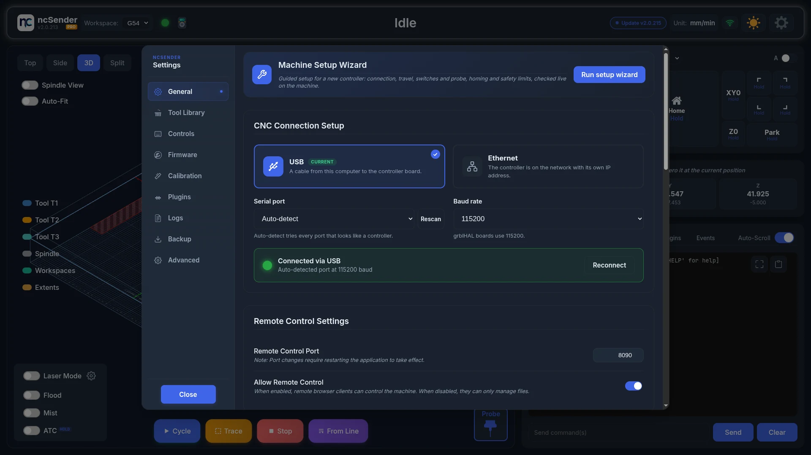
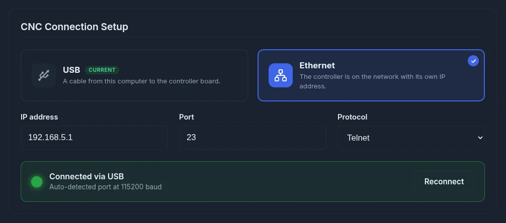
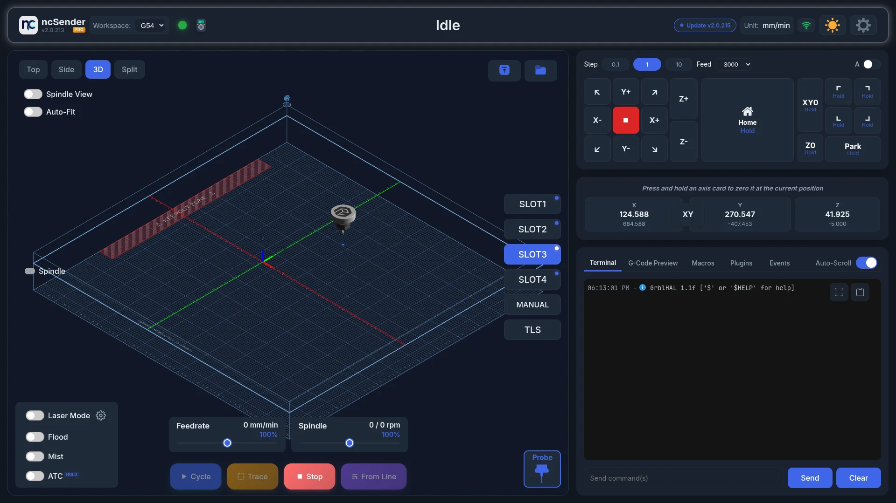

# First Connection

!!! tip "New controller?"
    On its first launch ncSender opens the [Machine Setup Wizard](setup-wizard.md),
    which sets up the connection and checks travel, switches, homing and
    safety limits live on the machine. To run it again later, open
    **Settings → General** and click **Run setup wizard**. This page covers
    the connection on its own.

## Connecting via USB

1. Connect your CNC controller to your computer with a USB cable.
2. Open ncSender.
3. Set up the connection in the wizard, or in **Settings → General → CNC Connection Setup**.
4. Click **Save & connect**.

After the connection is saved, ncSender connects on its own every time it starts.

!!! tip "Auto-detect"
    **Auto-detect** tries every port that looks like a CNC controller. If
    your board is not found, click **Rescan**, then pick its port by name
    under **Serial port**.

## Connection Settings

| Setting | Description | Default |
|---------|-------------|---------|
| **Connection type** | USB or Ethernet | USB |
| **Serial port** | USB only: **Auto-detect** or a specific port | Auto-detect |
| **Baud rate** | USB only: communication speed | 115200 |
| **IP address** | Ethernet only: the controller's address | 192.168.5.1 |
| **Port** | Ethernet only | 23 (Telnet) or 81 (WebSocket) |
| **Protocol** | Ethernet only: Telnet or WebSocket | Telnet |

Click **Save & connect**. When it works, the status reads **Connected via USB**
(or Ethernet) with the port and baud rate, or the address, it is using.
Click **Reconnect** to drop the connection and connect again.

### Baud Rates

grblHAL boards use **115200**. The list also offers 230400, 250000, 460800
and 921600 for boards set up to use them.

## Verifying Connection

Once connected, you should see:

- The toolbar status change from **Connecting...** to **Idle**, or to **Homing Required** if the machine must be homed first. **Setup Required** means no connection has been saved yet.
- Machine coordinates in the DRO (Digital Readout).
- The controller greeting message in the **Terminal**.

<!-- CAPTURE NEEDED: assets/images/getting-started/connected-homing-required.webp (Homing Required after connecting) -->

When the status is **Homing Required**, press **Home**. The status changes to **Idle**.

## If an Alarm Appears

Many grblHAL boards start in an alarm. ncSender shows an alarm dialog with a
plain-language title and what to do.

- **Power-on safety check**: press the E-stop button in, release it, then
  press **Press to Unlock**. The controller asks for this once after every
  power-on to confirm the E-stop works.
- **Other alarms**: follow the fix in the dialog, then press **Press to Unlock**.

One press keeps trying to unlock for up to 30 seconds. If the cause is still
active (E-stop held, a limit switch pressed, a motor fault input), the dialog
says so. Fix the cause and it unlocks on the next try.

<!-- CAPTURE NEEDED: assets/images/getting-started/alarm-dialog-unlock.webp (Alarm dialog and unlock) -->

## Troubleshooting Connection Issues

- **No ports detected**: check the USB cable and drivers.
- **Controller not found by Auto-detect**: pick its port by name under **Serial port**. Auto-detect skips Bluetooth, debug and accessory ports, and ports that don't look like a CNC board.
- **Controller not responding**: try a different USB cable or baud rate.
- See [Troubleshooting](../troubleshooting.md) for more help.
