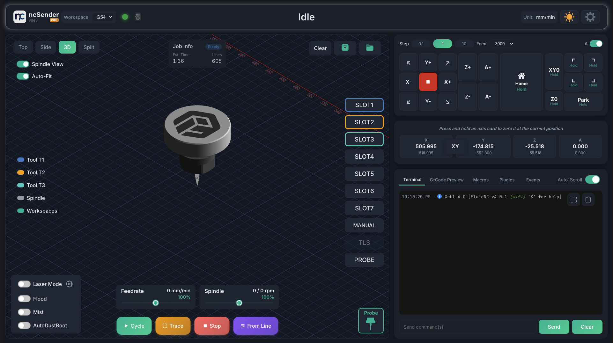

# Installation



## Downloads

### Community Edition (Free)

Download the latest release from [GitHub Releases](https://github.com/siganberg/ncSender/releases).

| Platform | Download |
|----------|----------|
| Windows x64 | `.exe` installer |
| macOS (Apple Silicon) | `.dmg` |
| macOS (Intel) | `.dmg` |
| Linux x64 | `.deb` |
| Linux ARM64 (Raspberry Pi) | `.deb` |

### Pro Edition

Download from [ncSender Pro Releases](https://github.com/siganberg/ncsenderpro.releases/releases).

After installing, see [License Activation](license-activation.md) to unlock the Pro features with your Installation ID.

## System Requirements

- **Windows**: Windows 10 or later (x64)
- **macOS**: macOS 12 Monterey or later (Apple Silicon and Intel)
- **Linux**: Ubuntu 22.04+ or Debian 12+ (x64 and ARM64)

## Installation Steps

=== "Windows"

    1. Download the `.exe` installer —
       [Community](https://github.com/siganberg/ncSender/releases/latest) ·
       [Pro](https://github.com/siganberg/ncsenderpro.releases/releases/latest)
    2. Run the installer and follow the prompts
    3. Launch ncSender from the Start menu

=== "macOS"

    1. Download the `.dmg` file (Apple Silicon or Intel build) —
       [Community](https://github.com/siganberg/ncSender/releases/latest) ·
       [Pro](https://github.com/siganberg/ncsenderpro.releases/releases/latest)
    2. Open the DMG and drag ncSender to Applications
    3. On first launch, clear the quarantine attribute:
    ```bash
    xattr -c /Applications/ncSender.app
    ```
    This is a one-time step. Later versions installed through the app's own
    [updater](software-updates.md) don't need it.

=== "Linux"

    1. Download the `.deb` package (x64 or ARM64) —
       [Community](https://github.com/siganberg/ncSender/releases/latest) ·
       [Pro](https://github.com/siganberg/ncsenderpro.releases/releases/latest)
    2. Install: `sudo dpkg -i ncSender_*.deb`
    3. Launch from the application menu or run `ncsender`

=== "Raspberry Pi 5"

    !!! info "Pro Feature"
        The pre-built Raspberry Pi 5 OS image ships with **ncSender Pro** only.

    A ready-to-boot SD-card image is published for the Pi 5 — no manual OS
    setup required. It boots straight into ncSender Pro in kiosk mode.

    1. Download the latest `ncSenderOS-pi5-vX.Y.Z.img.xz` from the
       [ncSender Pro OS releases page](https://github.com/siganberg/ncSenderProOs.releases/releases).
       (If you see a `.rp.img.xz` file next to it, ignore it — that's a
       vendor-specific build, not the general image.)
    2. Flash it to a microSD card (16 GB or larger recommended) using
       [balenaEtcher](https://etcher.balena.io/) — select the `.img.xz` file,
       select your card, then click **Flash**. Etcher decompresses the archive
       on the fly, so there's no need to extract it first.
    3. Insert the card into your Pi 5, connect a display, keyboard, and your
       CNC controller, then power it on. ncSender Pro launches automatically
       on first boot.
