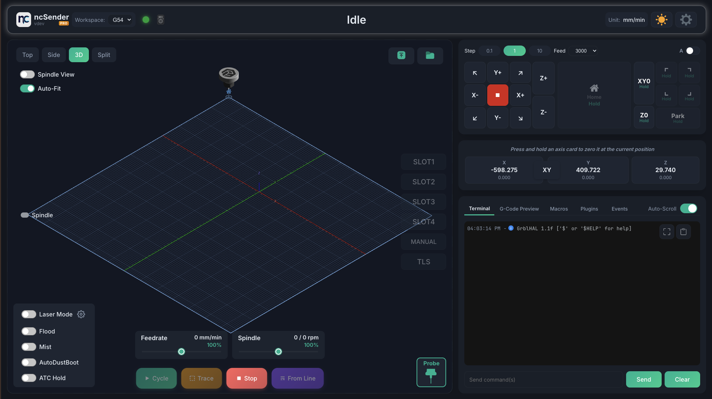
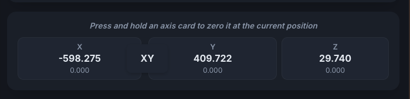
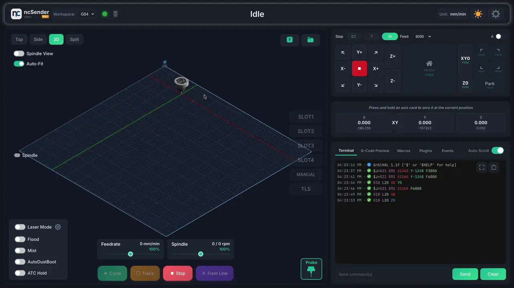
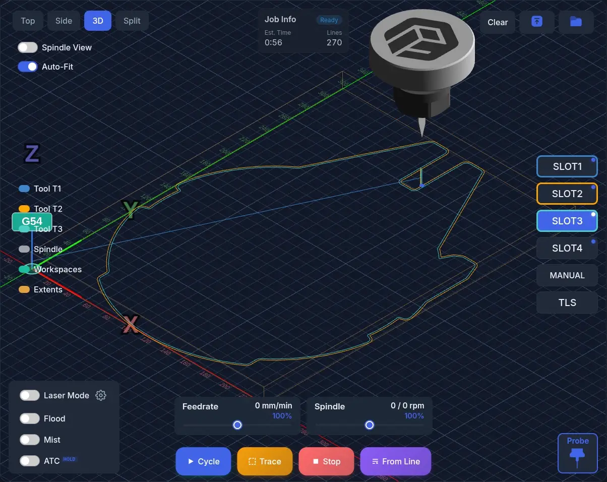
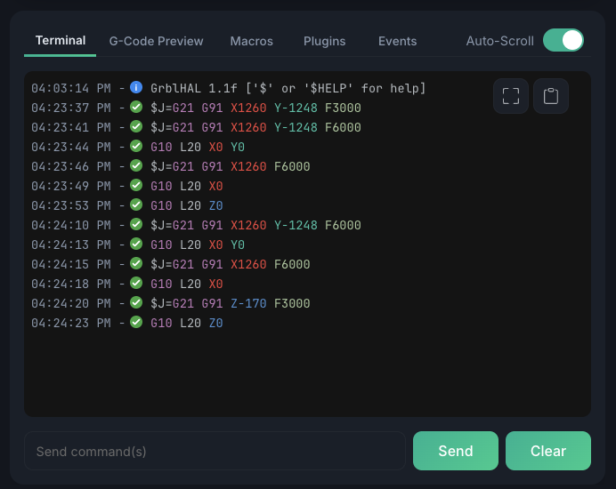

# Interface Overview

ncSender's interface is organized into several key areas.

## Main Layout

The interface consists of:

1. **Status Bar** — Connection status, machine state, and quick actions
2. **DRO (Digital Readout)** — Live X, Y, Z (and A) coordinates with long-press to zero
3. **3D Visualizer** — Real-time G-code preview with toolpath rendering
4. **Console Panel** — Tabbed panel with Console, Macros, Tools, Events, and G-code preview
5. **Jog Controls** — Step/continuous jogging with keyboard shortcuts
6. **Control Bar** — Start, Pause, Stop, and program controls

## DRO (Digital Readout)

The DRO displays both work and machine coordinates for each axis.

- **Long-press** an axis card to zero it at the current position
- **Double-click** to manually enter a coordinate value
- **XY link** button zeros both X and Y simultaneously

## Visualizer

The 3D visualizer shows:

- Loaded G-code toolpath
- Current machine position with animated toolhead
- Work coordinate system marker (G54, G55, etc.)
- Workspace boundaries

## Console Panel Tabs

| Tab | Description |
|-----|-------------|
| **Console** | Command input and response history |
| **Macros** | Custom macro buttons |
| **Tools** | Plugin tool menu items |
| **Events** | Program Start/End event G-code |
| **G-Code** | Preview of loaded program |
