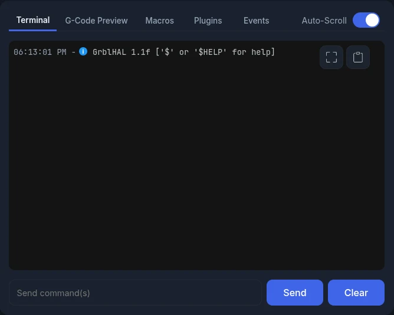
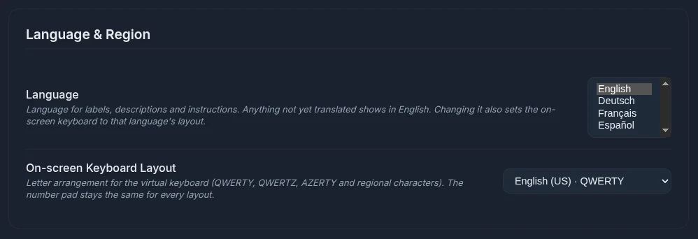
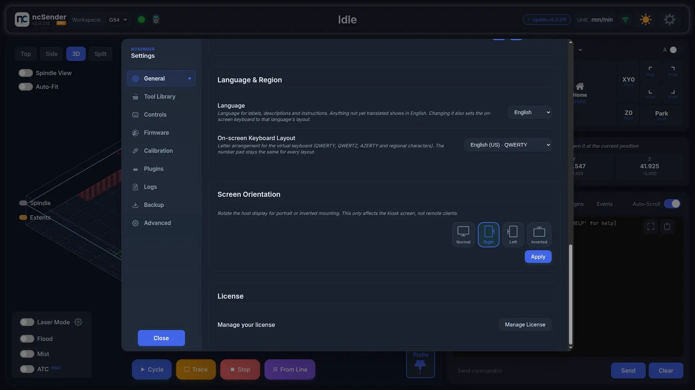
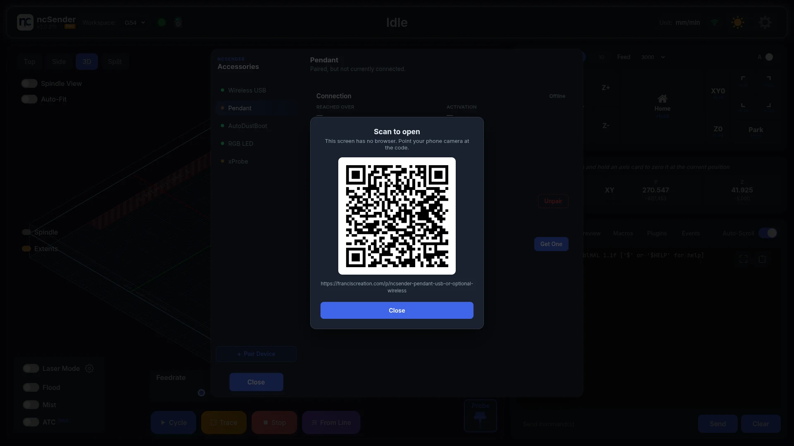

# Interface Overview

This page shows where to find the things you use every day. Each feature has
its own page with the details.

## Check the Machine Status

The toolbar shows what the machine is doing: **Idle**, **Running**,
**Homing Required**, **Alarm**, **Setup Required** and so on. It also shows
the pin states (limit switches, probe, door), the units, and the light/dark
theme toggle.

- **Homing Required**: the **Home** button shows that the machine needs homing. Press it before jogging or running a job.
- **Setup Required**: no connection is saved yet. See [First Connection](first-connection.md).

## Zero an Axis

The DRO (Digital Readout) shows work and machine coordinates for each axis.

- **Long-press** an axis card to zero it at the current position.
- **Long-press** the **XY** button to zero X and Y together.
- **Double-click** (or **double-tap** on a touchscreen) a work coordinate to type in a value.

If a tool setter is enabled and no tool length is set yet, long-pressing Z
shows a warning instead of zeroing. Measure the tool first.

<!-- CAPTURE NEEDED: assets/images/getting-started/dro-zero-axis.webp (Zeroing an axis) -->

<!-- CAPTURE NEEDED: assets/images/getting-started/dro-edit-value.webp (Typing a coordinate value) -->

See [DRO](../features/dro.md).

## View the Toolpath

The 3D visualizer shows the loaded G-code, the tool position and the machine
work area. Rotate and zoom with the mouse or touch.

See [Visualizer](../features/visualizer.md).

## Send Commands and Run Macros

The console panel has five tabs:

| Tab | Use it to |
|-----|-----------|
| **Terminal** | Type commands and see the controller's replies |
| **G-Code Preview** | Read the lines of the loaded program as they run |
| **Macros** | Run your saved macros |
| **Plugins** | Open tools added by plugins |
| **Events** | Set G-code that runs at Program Start and Program End |

See [Console & Terminal](../features/console.md), [Macros](../features/macros.md)
and [Program Events](../features/program-events.md).

## Clear an Alarm

When the controller raises an alarm, ncSender shows what happened and how to
fix it. Fix the cause, then press **Press to Unlock**. See
[If an Alarm Appears](first-connection.md#if-an-alarm-appears).

## Open Settings

Click **Settings** in the toolbar. The tabs are **General**, **Tool Library**,
**Controls**, **Firmware**, **Calibration** (Pro), **Config**, **Plugins**,
**Logs**, **Backup** and **Advanced**.

## Manage Accessories

Click the **Accessories** icon in the toolbar to pair, activate and update a
pendant, Wireless USB or other ncSender accessory. The icon also shows whether
the Wireless USB is connected.

See [Wireless USB](../accessories/wireless-usb.md).

## Install an Update

When a new version is available, the toolbar shows **Update vX.Y.Z**. Click it
to open **Software Update**. See [Software Updates](software-updates.md).

## Change the Language

Language and keyboard layout settings are part of ncSender Pro.

1. Open **Settings → General → Language & Region**.
2. Pick a **Language**: English, Deutsch, Français or Español. Anything not yet translated shows in English.
3. The on-screen keyboard switches to that language's layout. To choose a different one, pick it under **On-screen Keyboard Layout** (QWERTY, QWERTZ, AZERTY and regional variants).

## Open Links on a Kiosk

A kiosk screen has no web browser. When you tap a link (help, store, release
notes), ncSender shows a **Scan to open** QR code. Point your phone camera at
it to open the page there.

