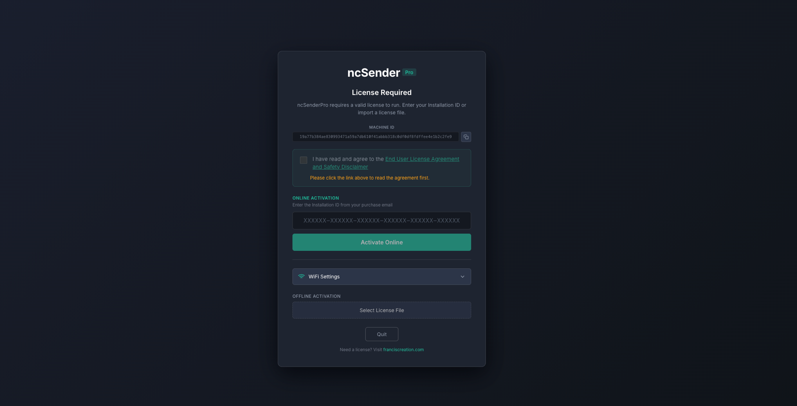
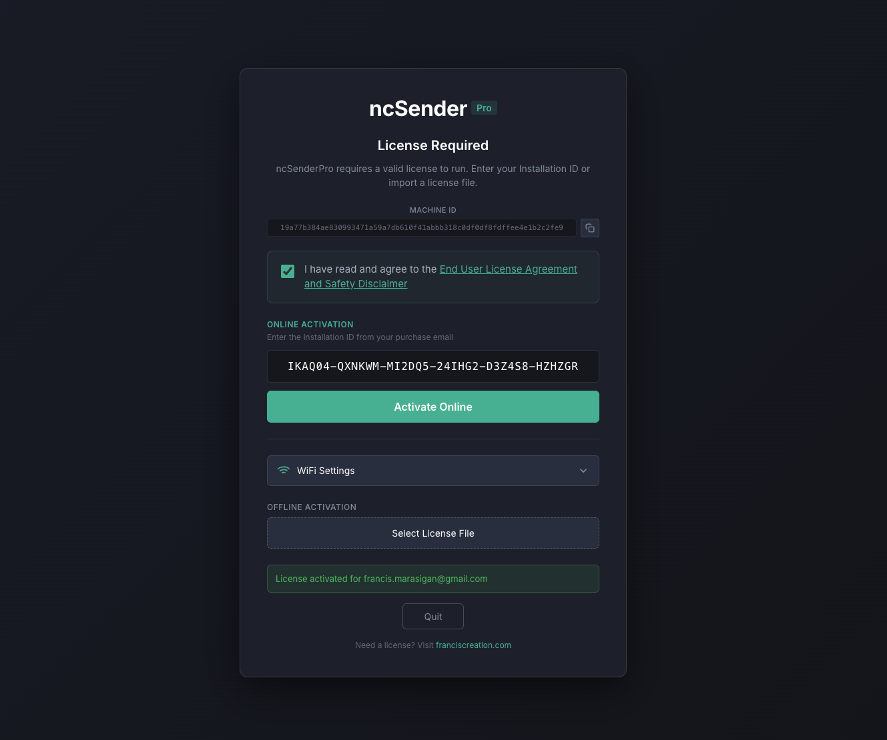
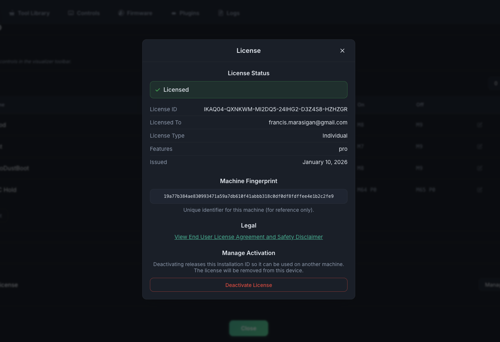
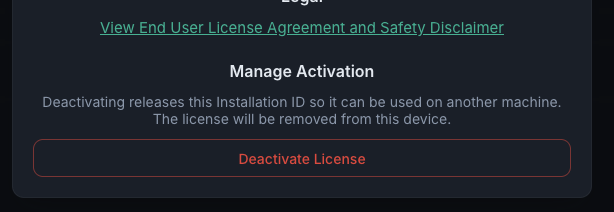
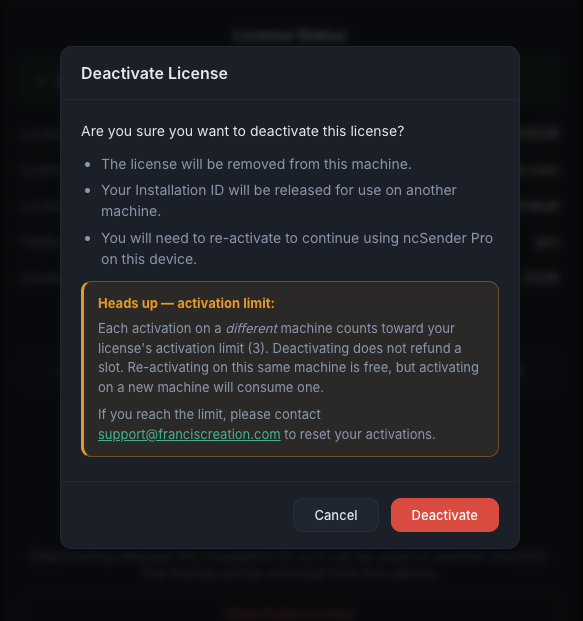

# License Activation

!!! info "Pro Feature"
    License activation and deactivation apply to **ncSender Pro** only. The Community edition does not require a license.

ncSender Pro is licensed per machine. After installing the Pro edition, you'll need to activate it using the Installation ID that was emailed to you after purchase. If you later move to a different machine, you can deactivate from the current device to free that slot.

## Activating ncSender Pro

When you launch ncSender Pro for the first time on an unlicensed machine, the **License Activation** screen appears automatically.

### Steps

1. **Read the End User License Agreement** by clicking the agreement link on the activation screen, then check the agreement box.
2. **Paste your Installation ID** into the input field. The ID is a 36-character code (formatted in six groups of six, separated by dashes) that you received in your purchase email.
3. Click **Activate Online**. ncSender Pro will contact the licensing server, bind the license to this machine, and unlock the Pro features.

!!! note "Internet Connection Required"
    Online activation needs network access to `franciscreation.com`. If your CNC PC is offline, contact support to arrange an offline license file you can import using **Select License File** on the same screen.

### Activation Limit

Each license includes a fixed number of activation slots (currently **3**). A slot is consumed the first time you activate on a *different* machine — re-activating on the same machine never burns a slot.

If you run out of slots, email [support@franciscreation.com](mailto:support@franciscreation.com) and we'll reset your activations.

## Viewing Your License

Once activated, you can review your license details any time:

1. Open **Settings** from the toolbar.
2. Click **Manage License**.

The **License** dialog shows the License ID, customer name, license type, included features, issue date, and the machine fingerprint for this device.

## Deactivating ncSender Pro

Deactivate when you want to **move ncSender Pro to a different machine** or stop using it on the current one. Deactivation removes the license from this device and releases the binding on the server so you can re-activate elsewhere.

### Steps

1. Open **Settings → Manage License**.
2. Scroll to the **Manage Activation** section at the bottom of the dialog.
3. Click **Deactivate License**.

4. A confirmation dialog appears explaining what will happen. Review it carefully, then click **Deactivate** to confirm.

5. ncSender Pro contacts the licensing server, removes the local license, and reloads — you'll see the **License Activation** screen again.

!!! warning "Deactivation Does Not Refund a Slot"
    Deactivating releases the *binding* so you can re-activate elsewhere, but it does **not** add an activation slot back. Moving to a brand-new machine still consumes one of your activations. Moving back to a machine you've previously activated does not.

### Troubleshooting

- **"Not bound to this machine"** — The server's binding for this license is on a different device or in a pending state. ncSender Pro will still remove the local license so you can re-activate cleanly.
- **"License was not found on the server"** — The server has no record of this license. Double-check the License ID; if it looks correct, contact support.
- **"Cannot reach the deactivation server"** — Network connectivity issue. Verify the machine can reach `franciscreation.com` and try again.
- **Out of activation slots** — Email [support@franciscreation.com](mailto:support@franciscreation.com) with your License ID and we'll reset the count.
