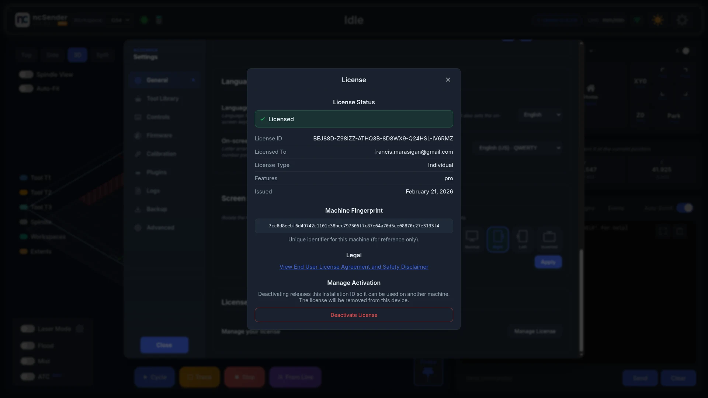
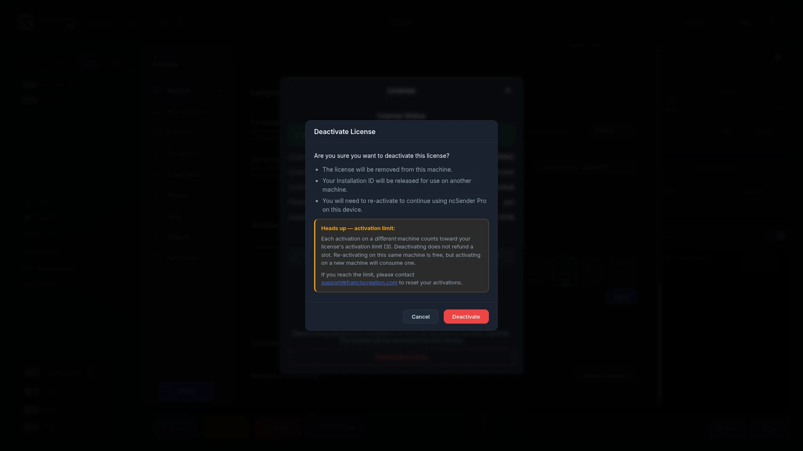

# License Activation

!!! info "Pro Feature"
    License activation and deactivation apply to **ncSender Pro** only. The Community edition does not require a license.

ncSender Pro is licensed per machine. After installing the Pro edition, activate it with the Installation ID from your purchase email. If you later move to a different machine, deactivate on the current device first, then activate on the new one.

!!! note "Accessories are activated separately"
    This page is about the app licence. A pendant or Wireless USB is activated
    from **Accessories** and does not need an Installation ID. See
    [Wireless USB](../accessories/wireless-usb.md).

## Activating ncSender Pro

The first time you launch ncSender Pro on an unlicensed machine, the **License Required** screen opens. It also shows the **Machine ID** of this device.

<!-- CAPTURE NEEDED: assets/images/getting-started/license-gate.webp (License Required screen) -->

### Steps

1. **Read the agreement.** Click the **End User License Agreement and Safety Disclaimer** link and press **I Accept**. The checkbox only unlocks after you open the link.
2. **Tick** "I have read and agree to the End User License Agreement and Safety Disclaimer".
3. Under **Online Activation**, **paste your Installation ID**. It is six groups of six characters separated by dashes (`XXXXXX-XXXXXX-XXXXXX-XXXXXX-XXXXXX-XXXXXX`).
4. Click **Activate Online**. ncSender Pro contacts the licensing server, binds the license to this machine and loads the app.

<!-- CAPTURE NEEDED: assets/images/getting-started/license-activate.webp (Activating ncSender Pro) -->

If you activate from a phone or laptop browser, the kiosk or PC running ncSender updates on its own and shows "License activated from another device".

!!! note "Internet Connection Required"
    Online activation needs network access to `franciscreation.com`.

    - **Kiosk not on the network yet?** Click **WiFi Settings** on the same screen to join a network first.
    - **CNC PC offline?** Contact support for a licence file. Import it under **Offline Activation** with **Select License File**.

### Activation Limit

Your Installation ID is meant for use on **one machine at a time**, and can be moved between up to **3 different machines** in total. That gives you room to transfer the license if your machine breaks, you upgrade hardware, or you switch PCs.

Re-activating on a machine you've activated before doesn't count against the limit, for example after an OS reinstall or a hard-drive swap on the same PC.

**If you run out of activations:** email [support@franciscreation.com](mailto:support@franciscreation.com) with your License ID and we'll reset your count so you can activate on new machines again.

## Viewing Your License

1. Open **Settings** from the toolbar.
2. In the **General** tab, go to the **License** section and click **Manage License**.

The **License** dialog shows:

- **License Status**
- **License Information**: License ID, Licensed To, License Type, Features and Issued date
- **Machine Fingerprint** for this device
- **Legal**: a link to view the End User License Agreement and Safety Disclaimer
- **Manage Activation**: where you deactivate

## Deactivating ncSender Pro

Deactivate when you want to **move ncSender Pro to a different machine** or stop using it on this one. Deactivation removes the license from this device and releases it on the server so you can activate elsewhere.

### Steps

1. Open **Settings → General → License → Manage License**.
2. Go to **Manage Activation**.
3. Click **Deactivate License**.
4. Read the confirmation, then click **Deactivate**.

5. ncSender Pro contacts the licensing server, removes the local license and reloads. You see the **License Required** screen again.

!!! warning "Moving to a new machine still counts"
    Deactivating does not refund an activation. Activating on a machine you've never used before counts against your 3-machine limit. Activating on a machine you've used before (for example, moving back to an older PC) does not.

### Troubleshooting

- **"Not bound to this machine"**: the server's binding for this license is on a different device or pending. ncSender Pro still removes the local license so you can re-activate cleanly.
- **"License was not found on the server"**: the server has no record of this license. Double-check the License ID; if it looks correct, contact support.
- **"Cannot reach the deactivation server"**: a network problem. Check that the machine can reach `franciscreation.com` and try again.
- **Out of activations**: email [support@franciscreation.com](mailto:support@franciscreation.com) with your License ID and we'll reset the count.
