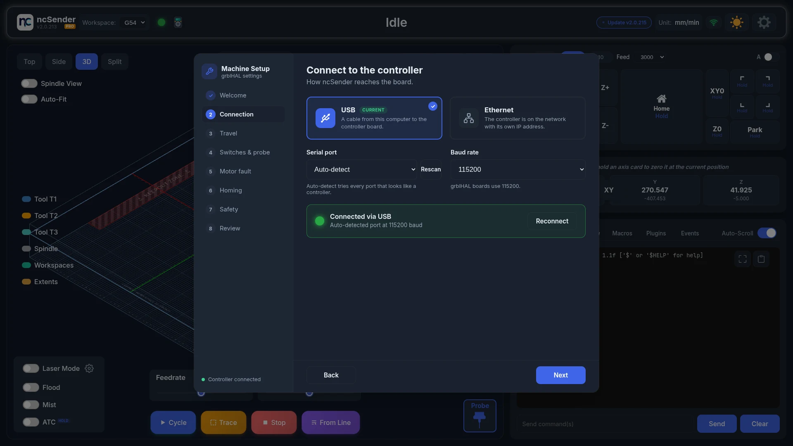
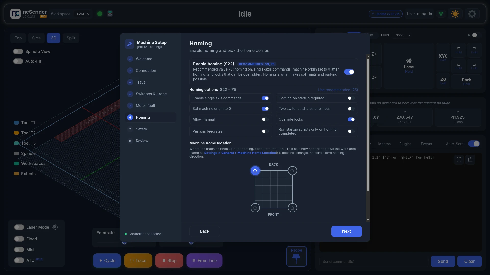
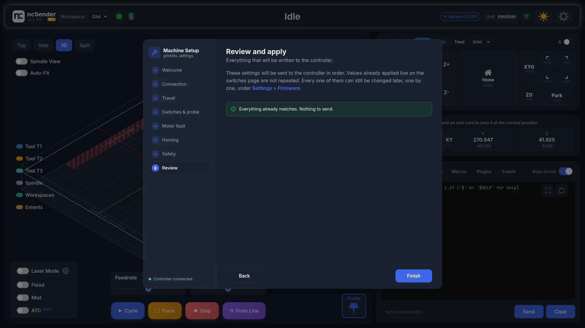

# Machine Setup Wizard

A new or freshly flashed grblHAL controller needs a handful of settings before
it can be trusted to move. The Machine Setup Wizard walks through them in
about five minutes and checks each one live on the machine: connection,
travel, limit switches and probe, homing and safety limits.

## When it runs

- **First launch.** The wizard opens on its own the first time ncSender starts.
- **Any time later.** Open **Settings → General** and click **Run setup
  wizard** in the *Machine Setup Wizard* card at the top of the page.

!!! note "Machine already set up and working?"
    Click **Skip for now** on the welcome page. The wizard is meant for a new
    controller; re-applying settings to a working machine is not needed.
    Skipping marks the wizard as done, so it will not open again on the next
    launch. Closing it from a later step does not, and it will come back,
    unless you already applied settings.

## Walking through it

Completed steps get a check mark. Click one to go back to it. The wizard also
shows whether the controller is connected.

Nothing is written to the controller until the **Review** step, with two
exceptions called out below: switch inversion and motor fault inputs are sent
immediately, because you need to see the result while you press the switch.

### Connection

Pick **USB** or **Ethernet**.

| Connection | Fields |
|------------|--------|
| **USB** | Serial port (**Auto-detect** or a specific port, with **Rescan**) and baud rate. grblHAL boards use 115200. |
| **Ethernet** | IP address, port and protocol (**Telnet** on port 23 or **WebSocket** on port 81). |

Click **Save & connect**. ncSender connects on its own and shows the live
result. **Next** stays disabled until the controller answers.

This is the same connection setup found under **Settings → General**, so you
can change it later without running the wizard again. See
[First Connection](first-connection.md).

### Travel

Enter how far each axis can move from one end to the other. These become
`$130`, `$131` and `$132` (max travel), which soft limits and the work area in
the visualizer are built on. Each row shows the value the controller has now.
Fields follow your unit preference and convert to millimetres for you.

### Switches & probe

Press each limit switch by hand and watch its light. The colours match the
pin states in the toolbar: green while released, red while pressed. If a row
shows the other way round, turn on **Invert** for it.

The **Probe** row works the same way; a **Toolsetter** row appears when the
controller reports a second probe input.

<!-- CAPTURE NEEDED: assets/images/getting-started/wizard-switches-invert.webp (Checking a limit switch and Invert) -->

!!! warning "Applied immediately"
    Invert is written to the controller the moment you toggle it (`$5` for
    limit switches, `$6` for probes), so the light shows the real result. An
    inversion that reads backwards can trip an alarm. If a red **Controller
    alarm** bar appears on this page, flip the inversion back, then press
    **Unlock** on the bar.

### Motor fault

This step only appears when the board reports `$744`, which closed-loop
stepper and servo controllers use for a dedicated fault input.

Each axis has an **Enable** and an **Invert** toggle, written to `$744` and
`$745` right away. Enabling the input is recommended: it lets the controller
stop the moment a drive faults. If a healthy motor raises a motor fault alarm
as soon as you enable it, the input reads backwards. Turn on **Invert** for
that axis, then press **Unlock** on the alarm bar.

<!-- CAPTURE NEEDED: assets/images/getting-started/wizard-motor-fault.webp (Motor fault step) -->

### Homing

- **Enable homing (`$22`).** The recommended value is 75: homing on,
  single-axis commands, machine origin set to 0 after homing, and locks that
  can be overridden. Click **Use recommended (75)** or set the individual
  options one by one. Turning homing off also turns soft limits off.
- **Machine home location.** Pick the corner the machine ends up in after
  homing, seen from the front. This sets how ncSender draws the work area and
  is the same setting as **Settings → General → Machine Home Location**. It
  does not change the controller's homing direction.
- **Pull-off after homing (`$27`).** How far each axis backs off its switch.
  2 to 5 mm is typical.

### Safety

| Setting | Recommended | What it does |
|---------|-------------|--------------|
| **Soft limits (`$20`)** | On | Rejects any move that would leave the travel you entered. Needs homing, so it stays off while homing is disabled. |
| **Hard limits (`$21`)** | Off | Stops the machine immediately if a limit switch triggers during a job. Electrical noise can trip it mid-cut, so leave it off unless every switch is well shielded and reads correctly. |
| **Limit jog commands to travel (`$40`)** | On | Clamps jog moves to the machine travel instead of raising an alarm when a jog would overshoot. |

### Review and apply

The review table lists every setting that differs from what the controller
has now, with the current and new values side by side. Values already applied
live on the switches and motor fault pages are not repeated.

Click **Apply**. Settings are written one at a time in a safe order (homing
before soft limits, since soft limits will not enable without homing). If a
write fails, the wizard stops and tells you how many settings went through.

When everything already matches, the button reads **Finish** and nothing is
sent.

<!-- CAPTURE NEEDED: assets/images/getting-started/wizard-applied.webp (Setup applied) -->

!!! tip "Home before the first move"
    After applying, home the machine so the new travel and limits start from
    a known position. Every value can still be changed individually under
    **Settings → Firmware**.

## After the Wizard

- **Home the machine**, then check a jog in each direction.
- **Fine-tune the machine** (Pro): steps/mm, max travel and squareness can be
  measured and corrected in **Settings → Calibration**. See
  [Calibration](../features/calibration.md).
- **Motor fault alarm later on?** If it appears right after you enabled the
  motor fault inputs, run the wizard again and turn on **Invert** for that
  axis.
