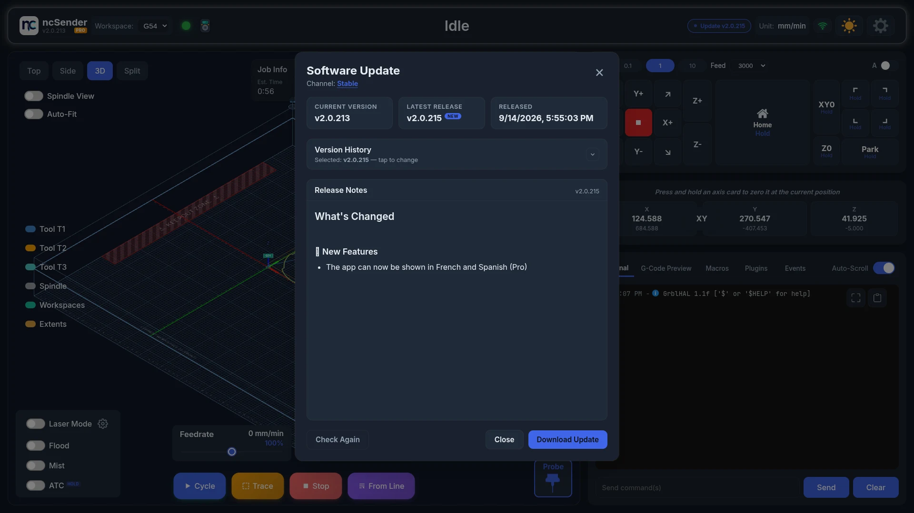
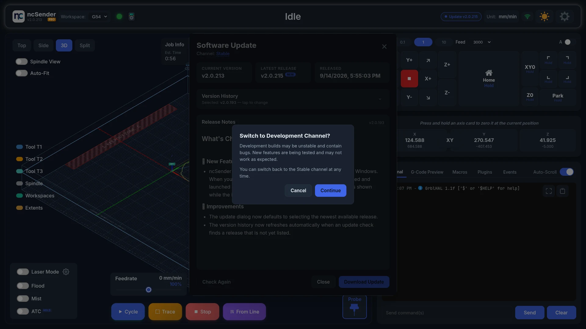

# Software Updates

ncSender checks for new releases a few seconds after it starts. When one is
available, the toolbar shows **Update vX.Y.Z**. Click it, or click the version
number in the toolbar, to open **Software Update**. There you can see what's
new, read the release notes and install.

## Checking for Updates

The dialog shows:

- **Current Version**: the version you're running.
- **Latest Release**: the newest release on your channel. A **NEW** badge means it differs from what you have installed.
- **Released**: when it was published.
- **Release Notes** for the selected version.

**Check Again** asks GitHub for the latest release straight away.

## Going Back to an Older Version

**Version History** lists every release on your channel. The newest is
selected by default, but you can pick any version. The main button installs
whichever one is selected.

1. Open **Version History** and pick a version.
2. Press the main button.
3. ncSender asks **Install vX?** or, for an older version, **Roll back to vX?**
4. Press **Install** or **Roll back** to go ahead, or **Cancel**.

Rolling back to an older version can leave newer settings unsupported.
Existing settings are not migrated automatically.

## Channels

| Channel | What you get |
|---|---|
| **Stable** | Tested releases. The default. |
| **Development** | Beta builds, published ahead of stable for early feedback. Expect rough edges. |

The dialog shows **Channel: Stable**. Click the channel name to switch.
Switching to Development asks **Switch to Development Channel?** Press
**Continue** to switch or **Cancel** to stay. You can switch back to Stable at
any time.

## Installing In-App

!!! info "Pro Feature"
    **ncSender Pro** installs updates from inside the app on Windows, macOS
    and Debian-based Linux. The Community edition installs in-app on
    Debian-based Linux only. On Windows and macOS it still checks for updates
    and shows the release notes, but you download and install the new version
    yourself.

Click **Download Update**. ncSender downloads the release for your platform,
then installs it and restarts itself. What you see during the restart depends
on the platform:

=== "Windows"

    The app closes and a small **"Updating ncSender"** window stays on screen
    while the installer replaces the files, typically 15–25 seconds. The app
    reopens by itself when it's done. If you kept the default install folder,
    there are no prompts and no request for administrator rights.

    <!-- CAPTURE NEEDED: assets/images/getting-started/update-windows-updating-window.webp (Updating ncSender window) -->

=== "macOS"

    The app quits, the new version is copied into place, and the app reopens,
    usually within a few seconds.

    You do **not** need to run `xattr -c` after an in-app update. That command
    is only needed on a fresh install because the browser marks downloaded
    apps as quarantined. Updates are downloaded by ncSender itself, so nothing
    marks them, and the new version launches straight away.

=== "Linux"

    The `.deb` package is installed with `dpkg` and the app relaunches.
    On a Debian-based system that isn't running as root, you may be prompted
    for your password.

    On the **Raspberry Pi 5 / ncSender OS image**, the whole system reboots
    after an update rather than just relaunching the app. The boot logo
    covers the gap.

## Where the Files Come From

Releases are published on GitHub. The updater downloads only the file for
your platform and architecture, and the download goes into your temporary
folder, which is cleaned up once the update has installed.

## If an Update Fails

An interrupted or failed update leaves your current version untouched: on
Windows and macOS the new files are only swapped in once they're complete,
and on Linux `dpkg` won't replace a working package with a broken one. Just
run the update again.

- **Windows**: if you see *"cannot access the file because it is being used
  by another process"*, another program (usually antivirus) is still scanning
  the downloaded installer. Wait a few seconds and click **Download Update** again.
- **Windows**: if you see *"An Application Control policy has blocked this
  file"*, see [Smart App Control](#windows-smart-app-control) below.
- **macOS**: the update log is at `$TMPDIR/ncsender-update.log` if you need
  to see what happened.
- **Upgrading from 0.3.x**: the updater does not cross that boundary; see
  the [FAQ](../faq.md#upgrading-from-03x-to-20x).

## Windows: Smart App Control

Windows 11 ships with **Smart App Control**, which refuses to run programs
that are not code-signed by a publisher it recognises. The ncSender installer
is not signed yet, so on a PC where Smart App Control is **On**, the in-app
update downloads fine and then fails when it tries to start the installer,
with an error like:

> An error occurred trying to start process
> `C:\Users\…\AppData\Local\Temp\ncsender-update-….exe`.
> An Application Control policy has blocked this file.

Your installed version is untouched. You have two ways forward:

=== "Keep Smart App Control on"

    Install updates by hand. Download the Windows installer for the release
    from the [ncSender releases page](https://github.com/siganberg/ncSender/releases)
    (Pro users: from the [Pro releases page](https://github.com/siganberg/ncsenderpro.releases/releases)),
    then run it. If Windows still refuses to open it, right-click the file,
    choose **Properties**, tick **Unblock**, and run it again. The in-app
    update will keep failing on this PC until the installer is signed.

=== "Turn Smart App Control off"

    Open **Windows Security → App & browser control → Smart App Control
    settings** and set it to **Off**. In-app updates then work as described
    above.

    Windows only lets you turn Smart App Control **off**. Once off, it cannot
    be turned back on without reinstalling Windows, so make that choice
    deliberately.

On a company-managed PC the same error can come from an **AppLocker** or
**Windows Defender Application Control** policy set by IT. Only IT can allow
the installer there; manual installation may be blocked too.
