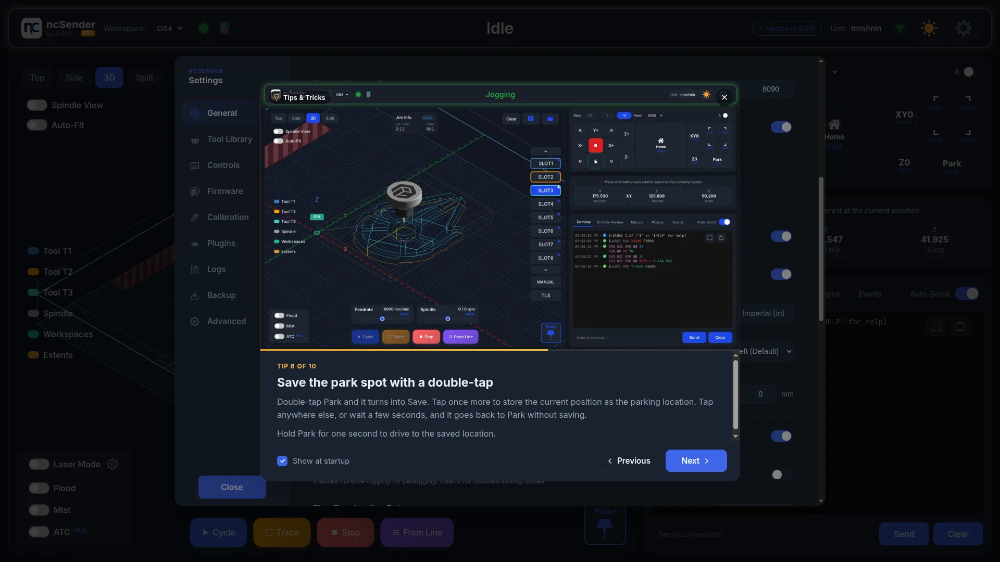
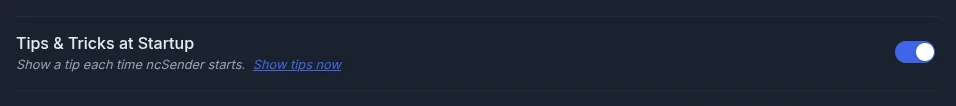

# Tips & Tricks

ncSender shows a short tip each time it starts: a gesture you might not have
found yet, a feature worth knowing about, or a shortcut. Most tips come with
a short looping video of the feature in action.

## At startup

The dialog appears a moment after the interface loads. On the very first
launch it stays out of the way so the
[Machine Setup Wizard](setup-wizard.md) can run instead.

- **Previous** and **Next** move through the set, wrapping around at either
  end. The left and right arrow keys do the same.
- The caption reads **Tip N of M**, and the progress bar shows how far
  through the set you are.
- Each launch opens on the tip after the one you last saw, so you see every
  tip once before the set starts over.

## Turning it off

Untick **Show at startup** in the dialog footer, or open **Settings →
General → Application Settings** and turn off **Tips & Tricks at Startup**.
The same row has a **Show tips now** link to open the dialog on demand.

## Where the tips come from

A handful of tips ship inside the app so the dialog works on a machine that
has never been online. New tips are published in the public
[ncSender.tips](https://github.com/siganberg/ncSender.tips) repository and
downloaded in the background, so they appear without an app update. Videos
and images are cached on disk after the first view and keep playing offline.

Tips marked **Pro** describe a feature of ncSender Pro. On the community
edition they are still shown, with a note that the feature is part of Pro.
