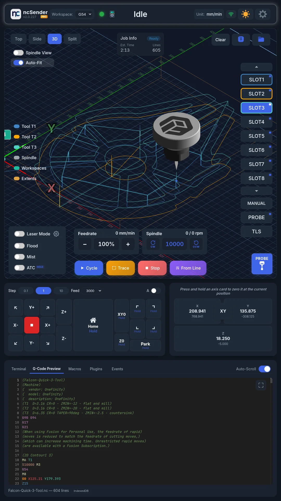

# ncSender Documentation

Welcome to the official documentation for **ncSender**, a CNC controller application for grblHAL.

## What is ncSender?

ncSender controls your CNC machine. It gives you a 3D visualizer, jog controls, probing, tool management, plugins and more. It runs on Windows, macOS and Linux, and you can also open it from a phone, tablet or laptop browser on the same network.

  
   
  <em style="color: var(--md-default-fg-color--light); font-size: 0.85rem;">Also runs full-screen on touchscreens and kiosks.</em>

## Editions

**Community** is free and open source. **Pro** is a commercial edition with extra features and needs a licence.

| Feature | Community | Pro |
|---------|:---------:|:---:|
| 3D Visualizer | :material-check: | :material-check: |
| Jog Controls | :material-check: | :material-check: |
| Probing | :material-check: | :material-check: |
| Console & Terminal | :material-check: | :material-check: |
| Plugin System | :material-check: | :material-check: |
| Macros | :material-check: | :material-check: |
| Tool Management | :material-check: | :material-check: |
| Machine Setup Wizard | :material-check: | :material-check: |
| Tips & Tricks | :material-check: | :material-check: |
| Keepout Zone | :material-check: | :material-check: |
| Backup & Restore | :material-check: | :material-check: |
| Accessories (Pendant, Wireless USB, …) | :material-check: | :material-check: |
| Touch Screen / Kiosk | :material-check: | :material-check: |
| In-App Updates | Debian Linux only | Windows, macOS, Debian Linux |
| Multi-Workspace (G54-G59) | | :material-check: |
| 4th Axis (A-axis) | | :material-check: |
| Laser Mode | | :material-check: |
| Trace | | :material-check: |
| Virtual Keyboard | | :material-check: |
| Safety Door Intelligence | | :material-check: |
| Calibration | | :material-check: |
| UI Language (Deutsch, Français, Español) | | :material-check: |

## Supported Controllers

- **grblHAL**: firmware settings, alarms, real-time overrides and the Machine Setup Wizard.

## Quick Links

- [Installation Guide](getting-started/installation.md): get up and running
- [License Activation](getting-started/license-activation.md): unlock ncSender Pro
- [Machine Setup Wizard](getting-started/setup-wizard.md): set up a new controller
- [First Connection](getting-started/first-connection.md): connect to your CNC controller
- [Interface Overview](getting-started/interface-overview.md): find your way around
- [Plugins](plugins/overview.md): extend ncSender with plugins
- [Troubleshooting](troubleshooting.md): common issues and solutions

## Community

- [GitHub](https://github.com/siganberg/ncSender): Community edition source code and issue tracker
- [Discord](https://discord.gg/3U5Jx2q2wZ): chat and support for both editions
