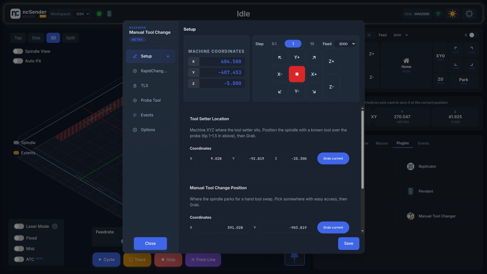
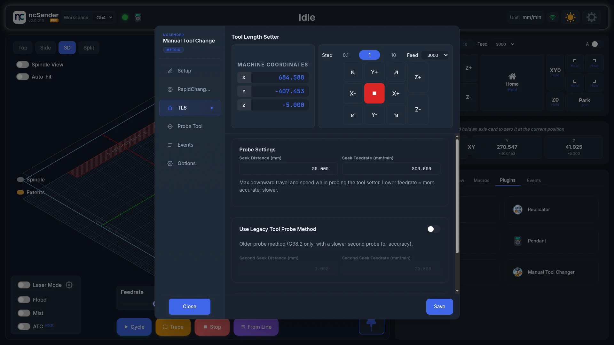
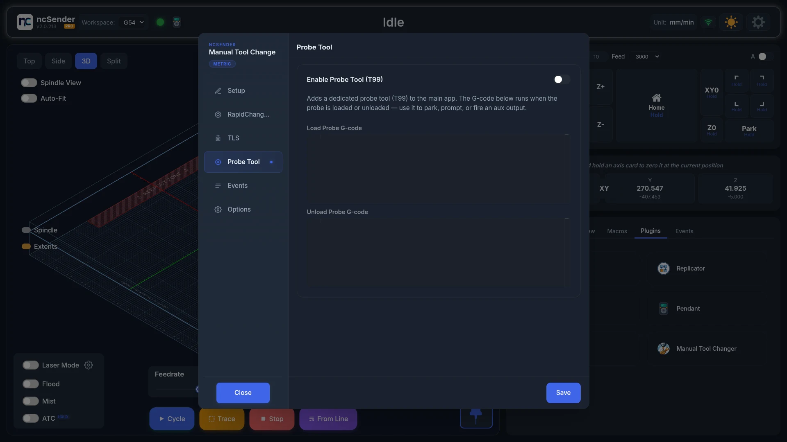
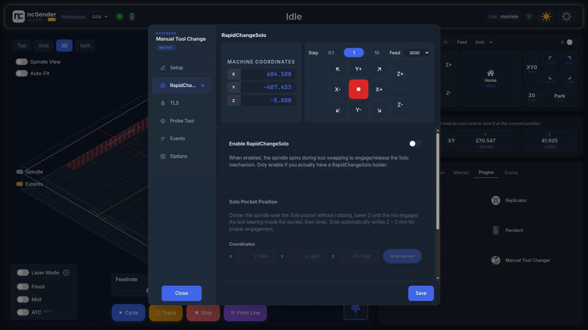
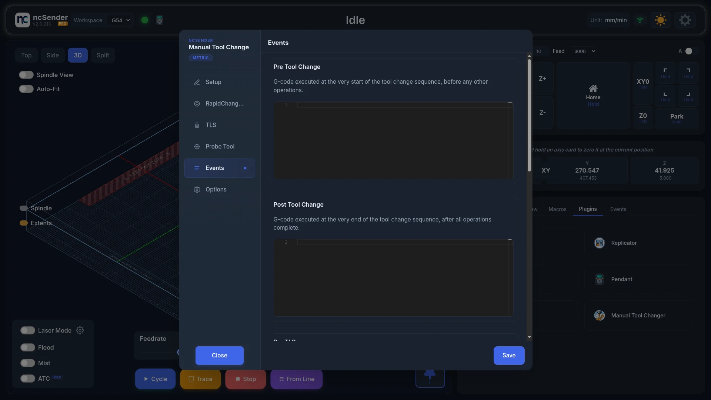

# Manual Tool Changer

Manual Tool Changer walks you through changing bits by hand. The machine parks
the spindle where you can reach it, tells you what to do, then measures the new
bit on your tool length setter so your Z zero stays correct.

Only one tool changer plugin can be enabled at a time. See
[Tool changer plugins](overview.md#tool-changer-plugins).

## Before you start

- You need a tool length setter. Measuring each new bit is part of every
  change.
- Home the machine.
- Open the **Plugins** tab in the console area and press
  **Manual Tool Changer**.

Press **Save** on each tab after you change something. If you close with
unsaved changes, you can **Cancel**, **Discard** or **Save & close**.

## Setup

1. **Tool Setter Location**: put a known bit over the tool setter, with the tip
   about 25 to 40 mm (1 to 1.5 in) above it, and press **Grab current**.
2. **Manual Tool Change Position**: jog to a spot where you can easily reach the
   spindle and press **Grab current**.
3. **Number of Tools**: how many tool buttons show on the main screen.
4. Press **Save**.

## TLS

- **Seek Distance (mm)**: how far down the machine searches for the tool
  setter before giving up.
- **Seek Feedrate (mm/min)**: how fast it searches. Slower is more accurate.
- **Use Legacy Tool Probe Method**: an older method that touches twice, the
  second time slowly. When on, set **Second Seek Distance (mm)** and
  **Second Seek Feedrate (mm/min)**.
- **Perform TLS after first $H**: measures the bit automatically after the
  first homing. The machine moves on its own, so keep clear.

## Probe Tool

Turn on **Enable Probe Tool (T99)** to add a probe tool button (T99) to the
main screen.

**Load Probe G-code** and **Unload Probe G-code** run when the probe is put in
or taken out. Use them to park the machine, show a prompt, or switch an output.

## RapidChangeSolo

Only use this tab if you have a RapidChangeSolo holder. With it on, the spindle
turns by itself during tool changes to screw the collet nut on and off.

!!! warning "The spindle spins during tool changes"
    Keep hands and clothing clear whenever a tool change may start.

1. Turn on **Enable RapidChangeSolo**.
2. **Solo Pocket Position**: centre the spindle over the Solo pocket without
   rubbing, lower Z until the nut touches the bearing inside, then press
   **Grab current**. The plugin stores a Z 5 mm lower so the nut engages
   properly.
3. **Tool Change Motion**:
    - **Load RPM** and **Unload RPM**: spindle speed while screwing the nut on
      and off.
    - **Retract (mm)**: how far the spindle lifts between moves.
    - **Pause before Unload**: stops at the Manual Tool Change Position and asks
      you to confirm before the spindle goes to the Solo pocket to unload.
    - **Wait for Spindle**: controls whether the machine waits for the spindle
      to report that it is up to speed. Your controller and spindle drive must
      support it.

If a red warning says your controller's minimum spindle speed is higher than
these speeds, lower that minimum first. Otherwise the spindle turns too fast
and can damage the Solo. See
[the FAQ](../faq.md#the-spindle-plunges-before-it-is-up-to-speed).

## Events

Add your own G-code to run at each step:

- **Pre Tool Change**: at the start of every tool change.
- **Post Tool Change**: at the end of every tool change.
- **Pre TLS**: just before measuring, for example `M64 P1` to switch on a wired
  tool setter.
- **Post TLS**: just after measuring, for example `M65 P1` to switch it off.
- **Abort Event**: when you press **Abort** during a tool change.

## Options

**Show G-Code Commands on Terminal** shows the command the plugin sends, so you
can copy it into your own program or post-processor.

## Change a tool

<!-- CAPTURE NEEDED: assets/images/plugins/mtc-tool-change.webp (Tool change) -->

1. Press a tool button on the main screen, or run `M6 T2` (for tool 2).
   A job that reaches a tool change does the same.
2. The spindle moves to the Manual Tool Change Position.
3. Follow the prompt:
    - **Unloading**: remove the bit.
    - **Loading**: put in the new bit.
    - **Tool Change**: swap the bit for the new one.
4. Press **Continue**, or **Abort** to stop.
5. The machine measures the new bit on the tool setter.

A highlighted tool button is the bit that is loaded now. Long-press it to
unload.

You can also type these in the console:

- `$TLS`: measure the bit that is in the spindle.
- `$POCKET1`: move to the Solo pocket (RapidChangeSolo only).

!!! note "Tools outside the slots keep their offsets"
    A tool doesn't need a slot to use its TLS offsets and stored TLO. The tool
    number is looked up as a slot first, then as a Tool ID. See
    [How a tool number finds its tool](../features/tool-management.md#how-a-tool-number-finds-its-tool).

## Troubleshooting

- **The first press only unloads.** The controller thinks a tool is already
  loaded. See
  [the FAQ](../faq.md#the-first-press-of-manual-only-unloads-the-tool).
- **The spindle starts before it's up to speed, or runs too fast.** See
  [the FAQ](../faq.md#the-spindle-plunges-before-it-is-up-to-speed).
- **The plugin won't enable.** Another tool changer is enabled. Disable it
  first.
- **No Save button.** See
  [the FAQ](../faq.md#a-plugins-settings-dialog-has-no-visible-save-or-close-button).
