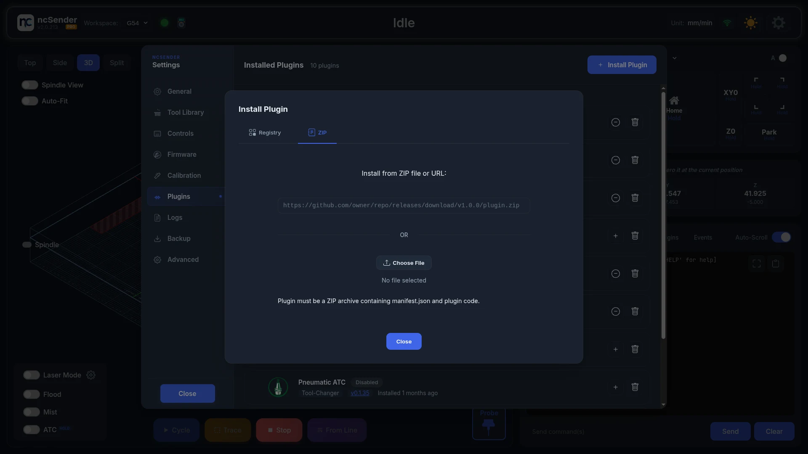
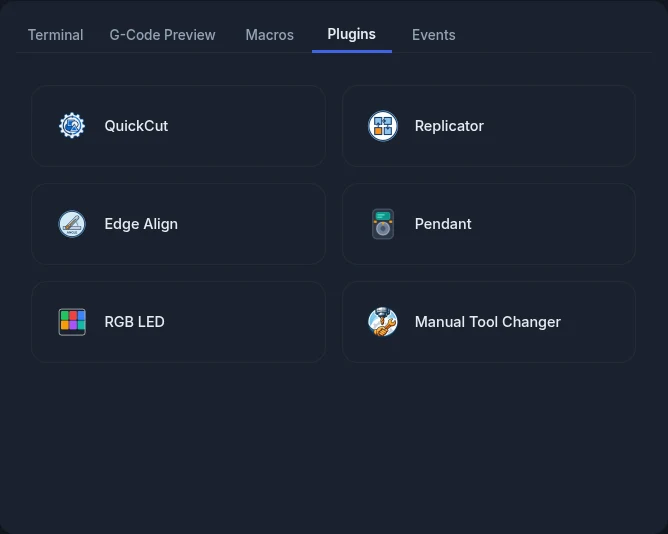
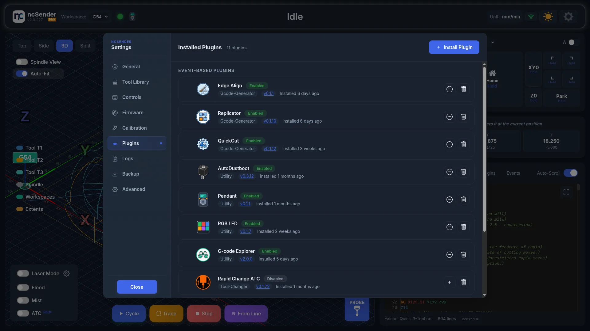
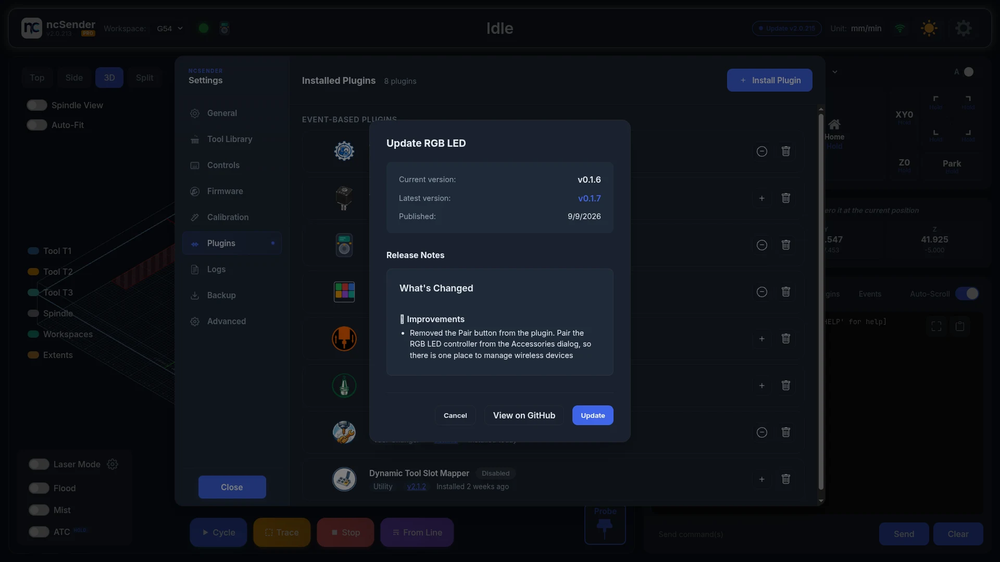

# Plugins

Plugins add tools to ncSender: tool changers, quick G-code generators, probing
helpers and support for ncSender accessories. They work in both ncSender
Community and ncSender Pro, unless a plugin page says otherwise.

## Install a plugin

1. Open **Settings** > **Plugins**.
2. Press **Install Plugin**.
3. On the **Registry** tab, type in **Search plugins...** to find a plugin.
4. Press **Install** on the plugin you want.

Plugins already on your machine show **Installed** instead of **Install**.

### Install from a ZIP file or link

Use this when someone gives you a plugin file or a download link.

1. Open **Settings** > **Plugins** > **Install Plugin** > **ZIP**.
2. Either press **Choose File**, pick the `.zip`, then press **Install from File**,
   or paste the link and press **Install from URL**.

## Use a plugin

1. Open the **Plugins** tab in the console area.
2. Press the plugin's button.

Only enabled plugins have a button. The buttons are locked while a job is
running.

## Manage installed plugins

Open **Settings** > **Plugins**. Each installed plugin has these buttons:

- **Enable** / **Disable**: turn the plugin on or off without removing it.
- **Configure**: open the plugin's settings.
- **Reload**: restart the plugin, for example after it stops responding.
- **Uninstall**: remove the plugin. ncSender asks you to confirm, because this
  also deletes the plugin's saved settings and cannot be undone.

### Update a plugin

When a newer version exists, the plugin shows **Update available**.

1. Press **Update available**.
2. Check the **Current version**, **Latest version** and **Release Notes**.
   Press **View on GitHub** for the full notes.
3. Press **Update**.

## Available plugins

| Plugin | Type | What it does |
|--------|------|--------------|
| [QuickCut](quickcut.md) | G-code generator | Rectangles, circles, polygons, surfacing, edge jointing and cut-to-size |
| [Manual Tool Changer](manual-tool-changer.md) | Tool changer | Guided hand tool changes with automatic tool measuring |
| [Rapid Change ATC](rapid-change-atc.md) | Tool changer | Automatic tool changes with a RapidChange magazine |
| [Pneumatic ATC](pneumatic-atc.md) | Tool changer | Automatic tool changes with an air-powered drawbar and a tool rack |
| [Edge Align](edge-align.md) | Probing | Measures how crooked your stock sits and rotates the program to match (Pro) |
| [3DMesh](3dmesh.md) | Probing | Probes an uneven surface so a flat program follows it (Pro) |
| [Replicator](replicator.md) | G-code generator | Repeats the loaded program in a grid |
| [BoxJoints](boxjoints.md) | G-code generator | Finger joints for boxes and drawers |
| [AutoDustBoot](../accessories/autodustboot.md) | Accessory | Raises the AutoDustBoot for tool changes, homing and rapid moves |
| [Pendant](../accessories/pendant.md) | Accessory | Activates the ncSender pendant and updates its firmware |
| [RGB LED](../accessories/smart-rgb-led.md) | Accessory | Sets the colours of the Smart RGB LED strip |

The Registry also lists plugins written by other people. Their authors look
after them.

Some plugins show a **Beta** label in their title. They work, but they are
still changing, so write down or back up your settings before you update.

## Tool changer plugins

Only one tool changer plugin can be enabled at a time.

- If you install a second tool changer, it installs but stays disabled.
- To switch, **Enable** the other tool changer. The one that was on is turned
  off automatically.

While a tool changer is enabled, it controls the tool buttons on the main
screen. See [Tool Management](../features/tool-management.md).

## Troubleshooting

### A plugin's settings have no Save or Close button

The buttons are below the edge of the screen. See
[the FAQ](../faq.md#a-plugins-settings-dialog-has-no-visible-save-or-close-button).
