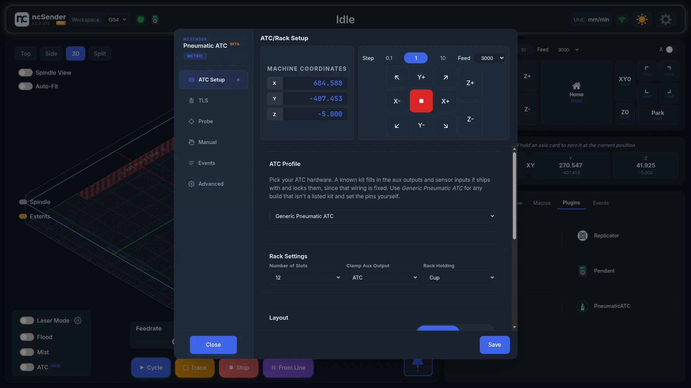
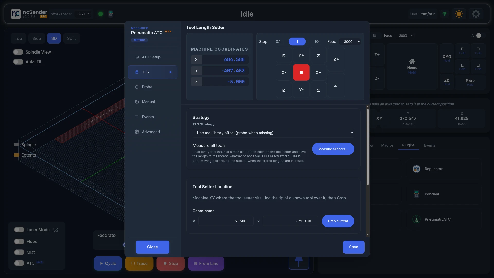
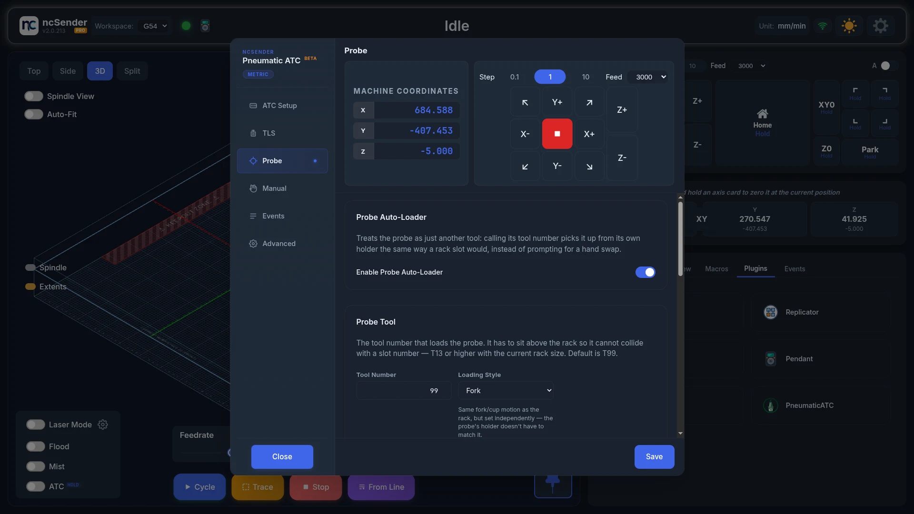
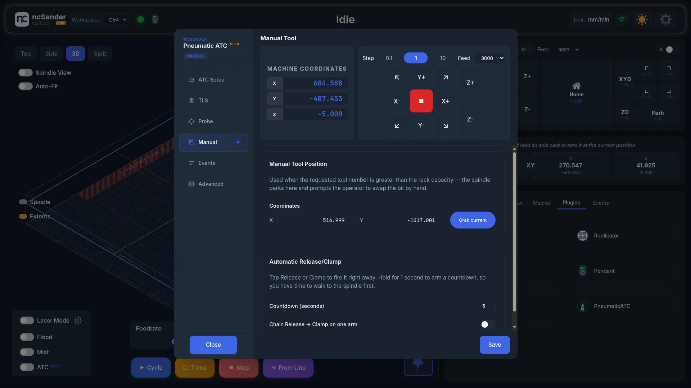
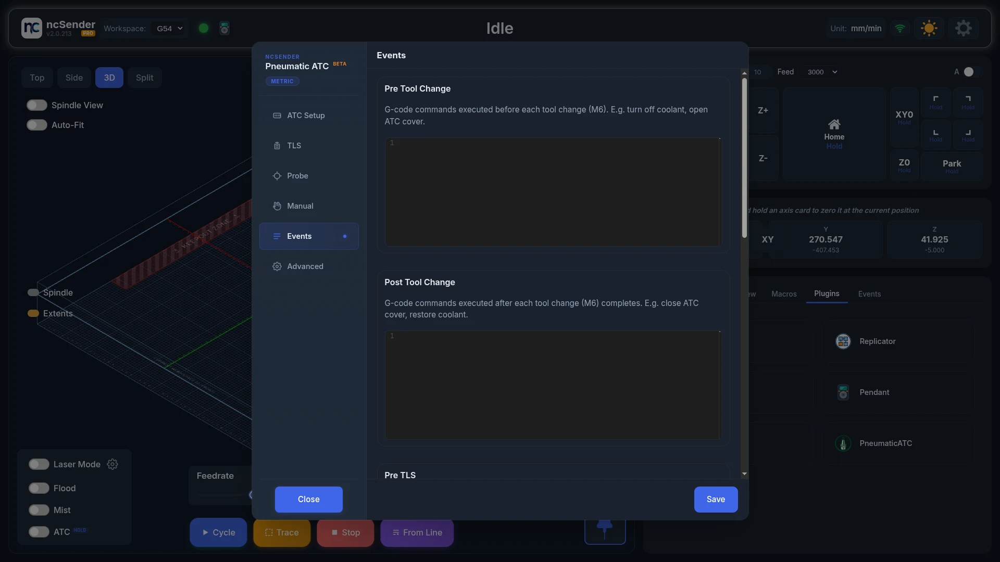
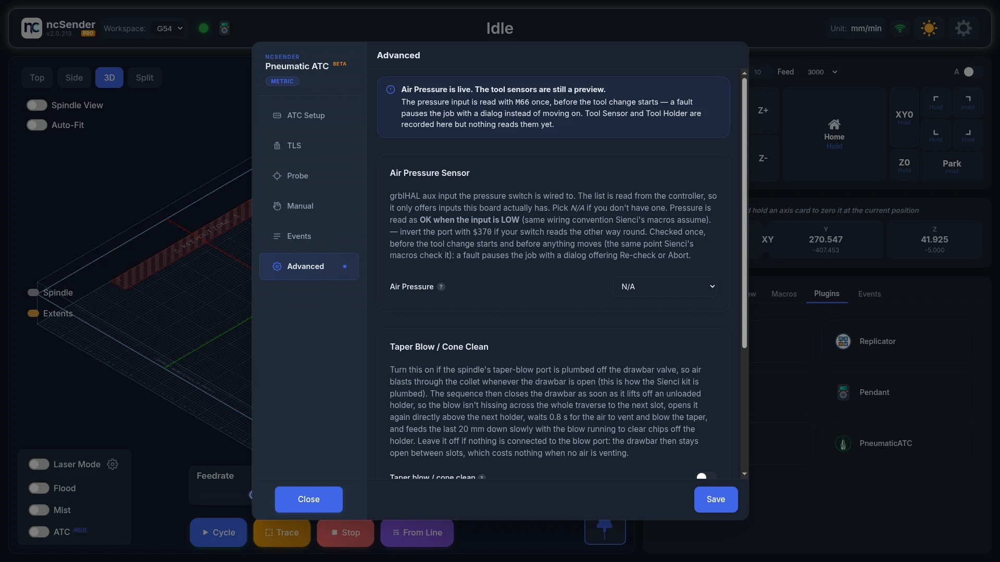

# Pneumatic ATC

Pneumatic ATC changes tools automatically on a spindle with an air-powered
drawbar. One controller output opens and closes the collet. The spindle drops
the current tool into its rack slot, picks up the next one and measures it.

The dialog title shows **Beta**. Write down or back up your settings before you
update the plugin.

Only one tool changer plugin can be enabled at a time. See
[Tool changer plugins](overview.md#tool-changer-plugins).

## Before you start

- Air supply with a regulator, set to the pressure your spindle needs.
- The drawbar valve wired to a controller output.
- A tool rack with fork or cup holders.
- A tool length setter.
- Home the machine.

## Turn it on

1. Open **Settings** > **Plugins**.
2. **Disable** any other tool changer.
3. **Enable** Pneumatic ATC.
4. Open the **Plugins** tab in the console area and press **PneumaticATC**.

The plugin now controls the tool buttons on the main screen.

Press **Save** on each tab after you change something. If you close with
unsaved changes, you can **Cancel**, **Discard** or **Save & close**.

## ATC Setup

### ATC Profile

- **Generic Pneumatic ATC**: for any build that isn't a listed kit. You pick
  the outputs and inputs yourself.
- **Sienci ATC**: for the Sienci kit. Its outputs and inputs are filled in and
  locked, because the kit's wiring is fixed.

When you pick **Sienci ATC**, the plugin asks
**Import positions from the controller?** Press **Import** to copy the
positions you saved with Sienci's setup, or **Skip** to type them in. Nothing
moves.

### Rack Settings

- **Number of Slots**: 1 to 32.
- **Clamp Aux Output**: the controller output wired to the drawbar valve.
- **Rack Holding**: **Fork** (the tool slides in from the side) or **Cup** (the
  tool drops straight in).
- **Slide Direction**, **Slide Distance (mm)** and **Slide Speed (mm/min)**:
  which way, how far and how fast the spindle slides out of a fork.
- **Safety Margin (mm)**: extra room the machine keeps around the rack when
  moving past it.

### Layout

Pick how your slots are placed.

**Linear array**: slots in a straight line, evenly spaced.

1. Set **Orientation** (**X** or **Y**) and **Direction** (**−** or **+**).
2. Set **Slot Distance (mm)**, the distance between slot centres.
3. Jog the spindle into slot 1 and press **Grab current** under
   **Slot 1 Position**.

**Custom**: set X and Y for each slot in the table. Use it when slots aren't
evenly spaced.

<!-- CAPTURE NEEDED: assets/images/plugins/patc-setup-custom.webp (Custom layout) -->

When you switch from Linear array to Custom, the plugin asks
**Auto-populate custom slots?** Press **Yes, auto-populate** to start from the
linear positions, or **No, keep existing** to keep the table as it is.

**Engagement Z** is the same for every slot. It is how far down the spindle
goes to grab a tool.

### Options

**Show G-Code Commands on Terminal** shows the command the plugin sends, so you
can copy it into your own program or post-processor.

## A tool change

<video autoplay loop muted playsinline preload="metadata" aria-label="An automatic tool change: the spindle stops, swaps at the rack and resumes" poster="../../assets/images/plugins/patc-tool-change-poster.jpg">
  <source src="../../assets/images/plugins/patc-tool-change.mp4" type="video/mp4">
</video>

A change from a running program: the spindle stops, the head routes to the
rack, swaps the tool and returns to where it left off. The header reads
**Tool Changing** throughout, and the job picks up on the next line.

## TLS

### TLS Strategy

- **Probe after every tool change**: measures every tool each time it is
  loaded.
- **Use tool library offset (probe when missing)**: uses the length saved in
  the Tool Library, and only measures a tool that has no saved length.

### Measure all tools

Press **Measure all tools…** to load every tool that has a rack slot, measure
each one and save the lengths to the Tool Library. Do this after moving bits
around the rack, or when you don't trust the saved lengths.

<!-- CAPTURE NEEDED: assets/images/plugins/patc-measure-all.webp (Measure all tools) -->

1. Make sure the rack, tool setter and clamp output are set, and that at least
   one normal tool change has worked.
2. Press **Measure all tools…**, then **Start**.
3. Stay at the machine. Don't close the window, refresh or disconnect.
4. Wait for **Tool lengths updated**, then press **Close**.

Press **Cancel** to stop early. The machine stops right away.

### Tool setter and measuring

- **Tool Setter Location**: jog the tip of a known bit over the tool setter
  and press **Grab current**.
- **Seek Start Z (mm)**: the machine height where measuring starts. Keep it
  above your longest tool.
- **Seek Distance (mm)** and **Seek Feedrate (mm/min)**: how far and how fast
  it searches for the tool setter.
- **Perform TLS after first $H**: measures automatically after the first
  homing. The machine moves on its own, so keep clear.

## Probe

Turn on **Enable Probe Auto-Loader** if your touch probe has its own holder.
The machine then picks up and puts away the probe like any other tool.

1. **Tool Number**: the tool number for the probe (99 by default). It must be
   higher than your number of slots.
2. **Loading Style**: **Fork** or **Cup**. It can differ from the rack.
3. For a fork, set **Slide Axis**, **Slide Direction**, **Slide Distance (mm)**
   and **Slide Speed (mm/min)**.
4. **Probe Position**: jog into the probe holder and press **Grab current**.

### Verify probe after pickup

Turn this on to check the probe works right after it is picked up. It catches
a broken or bent probe tip before it can crash into the tool setter.

- **Simple**: set **Verify Z (mm)** to the height where the probe tip is level
  with the holder's edge, or jog there and press **Grab current Z**. The probe
  then touches the holder's edge. If it doesn't trigger, the tool change stops.
- **Advanced**: write your own check. **Regenerate from Simple** fills the
  editor with the Simple check as a starting point.

## Manual

**Manual Tool Position** is where the spindle parks when you ask for a tool
number higher than your number of slots. You then change that tool by hand.
Jog there and press **Grab current**.

!!! note "Tools outside the slots keep their offsets"
    A tool doesn't need a slot to use its TLS offsets and stored TLO. The tool
    number is looked up as a slot first, then as a Tool ID. See
    [How a tool number finds its tool](../features/tool-management.md#how-a-tool-number-finds-its-tool).

### Automatic Release/Clamp

In the manual tool change prompts, **Release** opens the drawbar and **Clamp**
closes it.

- Tap a button to open or close the drawbar right away.
- Hold a button for 1 second to start a countdown, so you have time to walk to
  the spindle. Set the time with **Countdown (seconds)**.
- **Chain Release → Clamp on one arm**: one hold releases, waits, then clamps.

## Events

Add your own G-code to run at each step:

- **Pre Tool Change** and **Post Tool Change**: before and after every tool
  change, for example to open and close a rack cover.
- **Pre TLS**: just before measuring, for example `M64 P1` to switch on a wired
  tool setter.
- **Post TLS**: just after measuring, for example `M65 P1` to switch it off.
- **Abort Event**: when a tool change is aborted. The plugin always clamps the
  drawbar first, then runs this. Leave it empty if you need nothing extra.

## Advanced

- **Air Pressure Sensor**: the controller input your air pressure switch is
  wired to, or **N/A** if you don't have one. The list shows only inputs your
  controller has. Pressure is checked once, before the tool change moves.
- **Taper blow / cone clean**: turn this on only if your spindle's taper-blow
  port is fed from the drawbar valve, as on the Sienci kit. The air then blows
  chips out of the spindle just before each pickup, and the drawbar closes
  while travelling so air isn't wasted. Leave it off if nothing is connected
  to the blow port.
- **Tool Sensors** (**Coming soon**): **Tool Sensor** and **Tool Holder** can be
  set now, but nothing checks them yet.

## Change a tool

<!-- CAPTURE NEEDED: assets/images/plugins/patc-tool-change.webp (Tool change) -->

Press a tool button on the main screen, or run `M6 T2` (for tool 2). A job that
reaches a tool change does the same. The machine puts the current tool back in
its slot, picks up the new one and measures it.

You can also type these in the console:

- `$TLS`: measure the tool that is in the spindle.
- `$SLOT3`: move to slot 3. Use it to check your slot positions.

### Prompts you may see

**Air Pressure Low**: the air pressure switch says there isn't enough air. Check
the compressor, regulator and air lines, then press **Re-check**. Press
**Abort** to stop.

**Air Pressure Still Low**: pressure is still low after two checks. Press
**Abort** unless you are sure the sensor is wrong and the air is fine.
**Continue anyway** runs the tool change without good air, and a tool can be
left loose or dropped.

**Unload Failed** / **Load Failed**: remove or fit the bit by hand, then press
**Continue**, or press **Abort** to stop.

**Manual Unload**, **Manual Load** and **Manual Swap**: shown for tool numbers
above your slot count.

<!-- CAPTURE NEEDED: assets/images/plugins/patc-manual-swap-prompt.webp (Manual Swap prompt) -->

1. Press **Release** to open the drawbar.
2. Take out the old bit and/or put in the new one.
3. Press **Clamp** to close the drawbar.
4. Press **Continue**.

## Troubleshooting

- **Air Pressure Low keeps coming back.** Check the compressor is running and
  up to pressure, and that no air line is kinked or loose. If your switch reads
  the opposite way, the input needs to be inverted in the controller settings.
- **A tool is loose after a change.** Check that **Clamp Aux Output** is the
  output wired to the drawbar valve, and that the air pressure is high enough.
- **Probe check fails after pickup.** Check the probe tip for damage, and that
  **Verify Z (mm)** is level with the holder's edge.
- **The plugin won't enable.** Another tool changer is enabled. Disable it
  first.
- **No Save button.** See
  [the FAQ](../faq.md#a-plugins-settings-dialog-has-no-visible-save-or-close-button).
