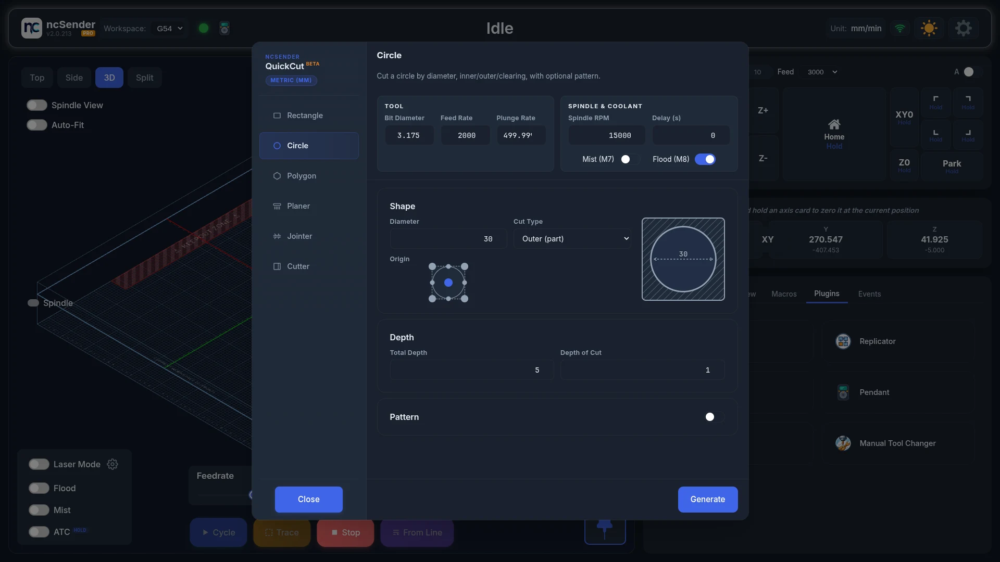
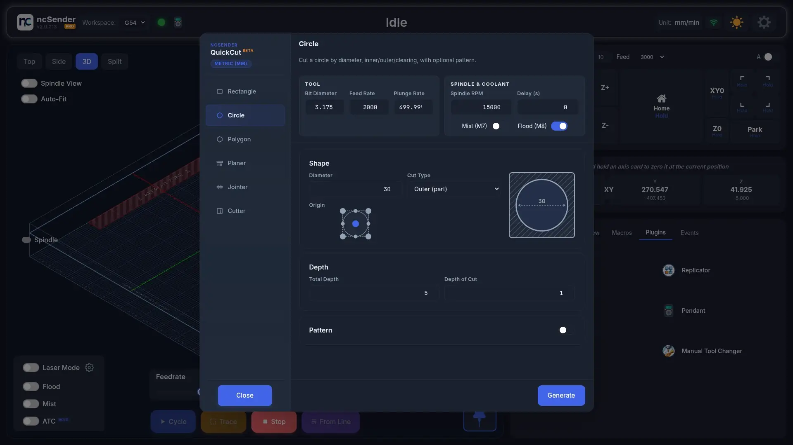
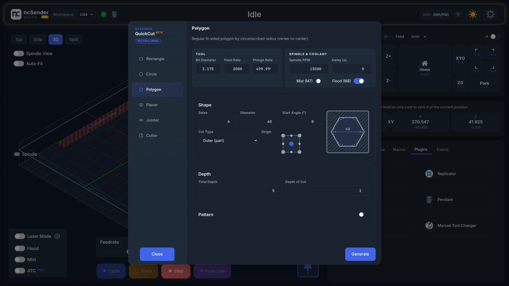
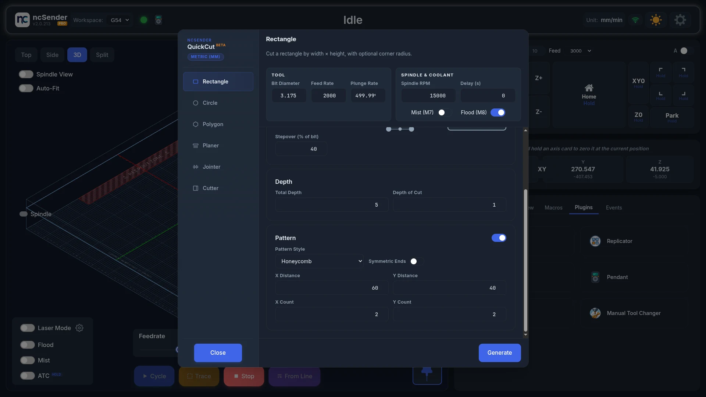
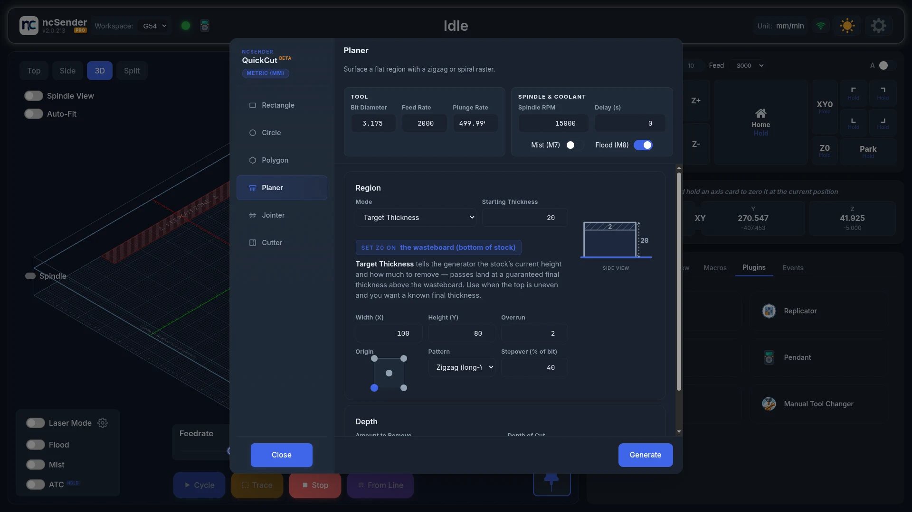
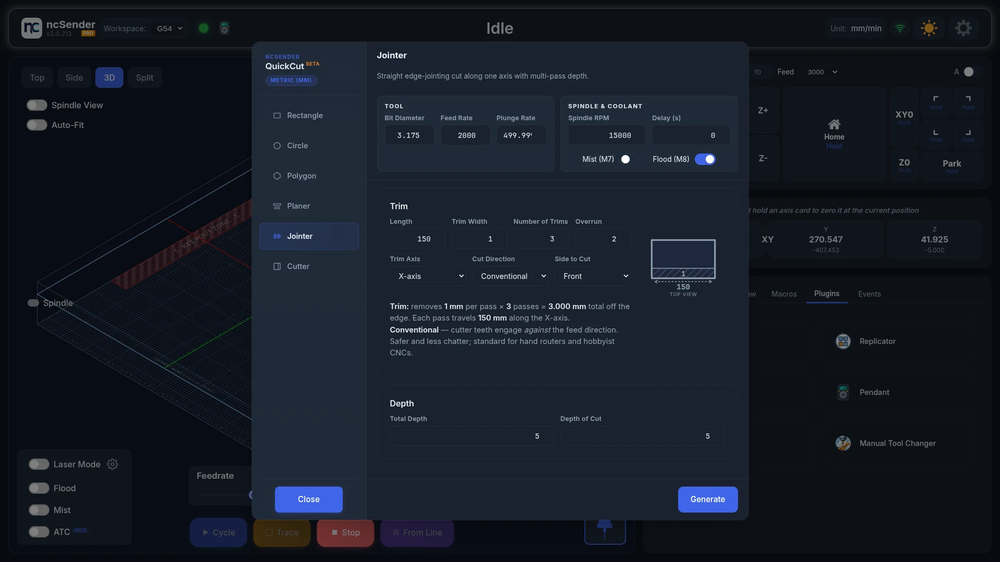
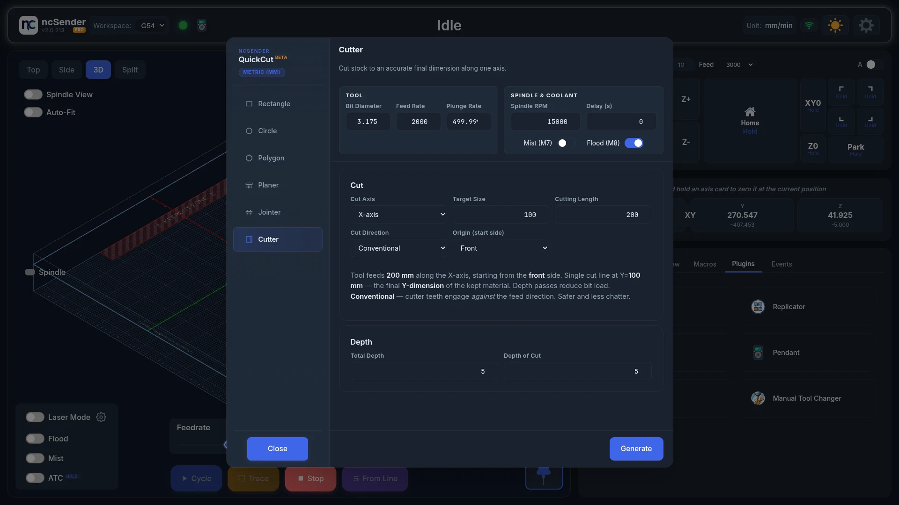

# QuickCut

QuickCut makes G-code for everyday jobs straight from a dialog: cut a
rectangle, circle or polygon, flatten a board or spoilboard, true up an edge or
cut stock to size. Use it when opening a CAM program for one simple cut isn't
worth it.

The dialog title shows **Beta**.

!!! info "QuickCut replaces ToolBench"
    Surfacing, jointing and boring moved here from the retired ToolBench plugin.
    See [Coming from ToolBench](#coming-from-toolbench).

## Make a cut

1. Open the **Plugins** tab in the console area and press **QuickCut**.
2. Pick a tab: **Rectangle**, **Circle**, **Polygon**, **Planer**, **Jointer**
   or **Cutter**.
3. Fill in the fields.
4. Press **Generate**.

The dialog closes and the program loads, ready to check in the visualizer and
run.

Each tab remembers its values for next time.

## Settings on every tab

**Tool**

- **Bit Diameter**, **Feed Rate**, **Plunge Rate**.

**Spindle & Coolant**

- **Spindle RPM**.
- **Delay (s)**: how long to wait for the spindle to get up to speed.
- **Mist (M7)** and **Flood (M8)**: turn coolant on for the job.

**Depth**

- **Total Depth**: how deep to cut in total.
- **Depth of Cut**: how deep each pass goes.

QuickCut uses your ncSender units (mm or inches) and your Safe Z height.

## Shapes: Rectangle, Circle, Polygon

| Shape | Fields |
|---|---|
| **Rectangle** | **Width**, **Height**, **Corner Radius** (0 for sharp corners) |
| **Circle** | **Diameter**. Circles are cut with a spiral entry and a final clean-up pass. |
| **Polygon** | **Sides** (3 to 12), **Diameter** (corner to corner), **Start Angle (°)** to turn the shape |

### Cut Type

This decides what is left in the middle.

| Cut Type | What it does |
|---|---|
| **Inner (perimeter)** | Cuts just inside the line. On a through cut the middle falls out as one piece. |
| **Inner (clearing)** | Clears the whole inside, so a pocket comes out flat-bottomed. |
| **Outer (part)** | Cuts just outside the line, freeing the shape from the stock. |

If a hole comes out with a post in the middle, you picked **Inner (perimeter)**
where you wanted **Inner (clearing)**.

**Stepover (% of bit)** sets how far the bit moves over on each lap when
clearing.

### Origin

Pick where work zero sits on the shape. The origin applies to the whole
program, including every copy in a pattern, not just the first shape.

### Pattern

Turn on **Pattern** to cut several copies in one program, then pick a
**Pattern Style**.

| Pattern Style | Layout | Fields |
|---|---|---|
| **Linear** | Rows and columns | **X Count**, **Y Count**, **X Distance**, **Y Distance**. Use a negative distance to go the other way. |
| **Honeycomb** | Rows shifted by half a step, like a honeycomb | Same as Linear, plus **Symmetric Ends** |
| **Circular (Identical)** | Around a circle, every copy facing the same way | **Count**, **Radius**, **Start Angle (°)** |
| **Circular (Path Direction)** | Around a circle, each copy turned to follow the circle | **Count**, **Radius**, **Start Angle (°)** |

**Symmetric Ends** drops one copy from each shifted row so both ends of the
honeycomb line up.

On the **Circle** tab there is a single **Circular** style, because a turned
circle looks the same.

## Planer

Flatten an area of stock, or your whole spoilboard.

Pick a **Mode**:

| Mode | Set Z zero on | Use it to |
|---|---|---|
| **Target Depth** | Top of the stock | Take a set amount off the top |
| **Target Thickness** | Spoilboard (bottom of the stock) | Mill the stock down to a finished thickness. Enter the **Starting Thickness**. |
| **Wasteboard Surfacing** | Top of the spoilboard | Flatten the whole machine bed |

**Wasteboard Surfacing** reads your machine's travel from the controller and
covers the whole work area, so there is no size to enter.

For the other modes, set:

- **Width (X)** and **Height (Y)**: the area to flatten.
- **Overrun**: how far past the edges to go, for a clean edge.
- **Origin**: where work zero is on that area.
- **Pattern**: **Zigzag (long-Y)**, **Zigzag (long-X)** or
  **Spiral (outside-in)**.
- **Stepover (% of bit)**.

The side-view picture shows where Z zero is. Check it before you press
**Generate**: Target Depth and Target Thickness measure from opposite faces of
the stock.

## Jointer

Cut a straight, clean edge on rough stock.

- **Side to Cut**: **Front**, **Back**, **Left** or **Right**.
- **Trim Axis**: **X-axis** or **Y-axis**, the direction the edge runs.
- **Length**: how long the edge is.
- **Trim Width**: how much each trim takes off the edge.
- **Number of Trims**: how many trims to take.
- **Overrun**: how far past each end to go.
- **Cut Direction**: **Conventional** or **Climb**. Every pass cuts the same
  way.

The top-view picture shows the cuts before you generate.

## Cutter

Cut stock to an exact size along one axis. QuickCut allows for the bit width
so the piece you keep is the size you asked for.

- **Cut Axis**: **X-axis** or **Y-axis**.
- **Target Size**: the finished size of the piece.
- **Cutting Length**: how long the cut is.
- **Cut Direction**: **Conventional** or **Climb**.
- **Origin (start side)**: **Front**, **Back**, **Left** or **Right**.

The cut is taken in several passes, set by **Total Depth** and
**Depth of Cut**.

## Coming from ToolBench

QuickCut's Planer, Jointer and Cutter replace the ToolBench operations. Two
things work differently:

- **Boring is now Circle.** A bored hole is a Circle with
  **Inner (perimeter)**. A flat-bottomed pocket, which ToolBench could not make,
  is **Inner (clearing)**.
- **Origin covers the whole program.** In ToolBench, a centre origin placed a
  bore pattern evenly around work zero. In QuickCut the origin applies to
  everything generated, pattern included.
