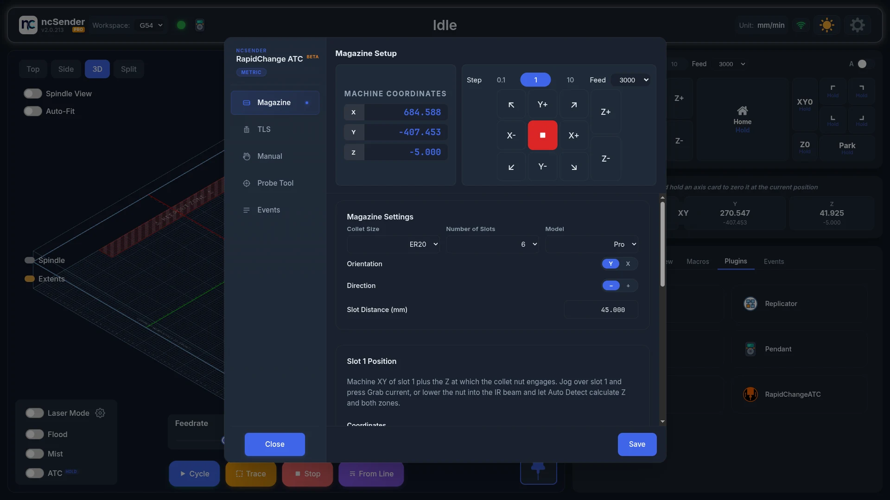
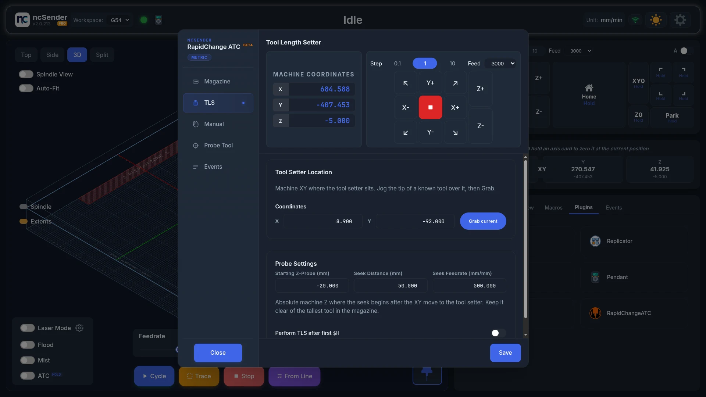
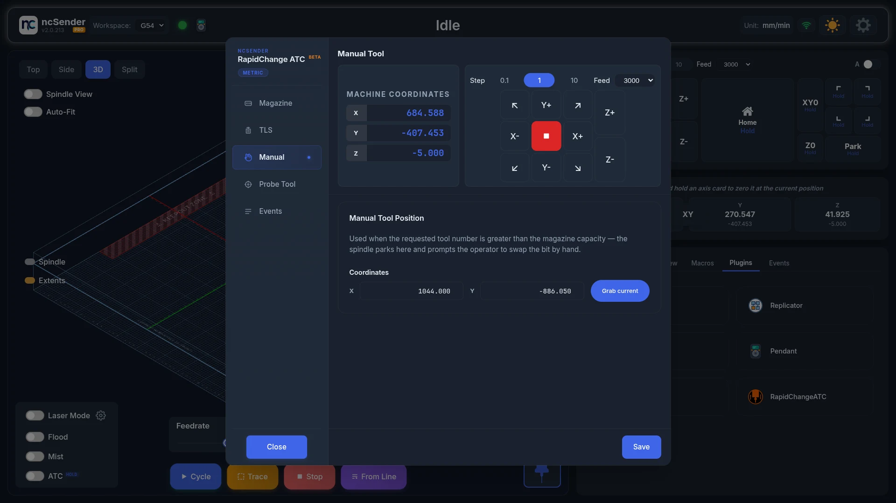
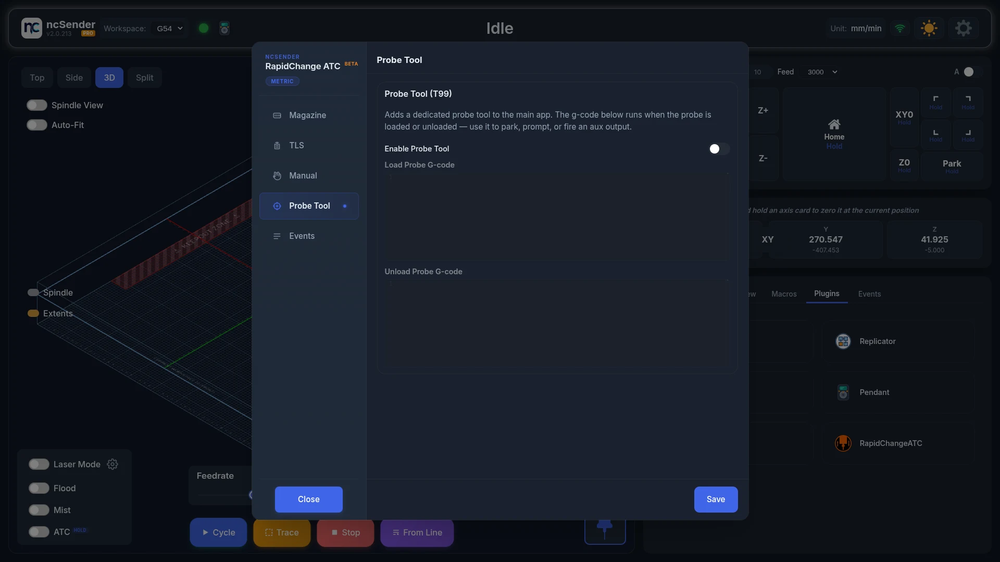
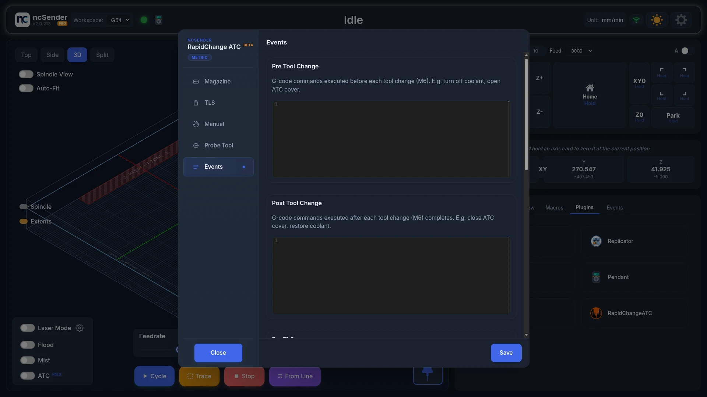

# Rapid Change ATC

Rapid Change ATC changes tools automatically with a RapidChange magazine. The
spindle turns slowly to screw the collet nut off into an empty slot, then
screws the next tool on and measures it.

Only one tool changer plugin can be enabled at a time. See
[Tool changer plugins](overview.md#tool-changer-plugins).

!!! warning "The spindle spins during tool changes"
    Keep hands and clothing clear whenever a tool change may start.

## Turn it on

1. Open **Settings** > **Plugins**.
2. **Disable** any other tool changer.
3. **Enable** Rapid Change ATC.
4. Home the machine.
5. Open the **Plugins** tab in the console area and press **RapidChangeATC**.

The plugin now controls the tool buttons on the main screen.

Press **Save** on each tab after you change something.

## Magazine

### Magazine Settings

- **Collet Size**: **ER11**, **ER16**, **ER20**, **ER25** or **ER32**.
- **Number of Slots**: how many slots your magazine has.
- **Model**: **Basic**, **Pro** or **Premium**.
- **Orientation**: whether the slots run along **X** or **Y**.
- **Direction**: whether slot 2 is on the **−** or **+** side of slot 1.
- **Slot Distance (mm)**: the distance between slot centres.

### Slot 1 Position

1. Jog the spindle over slot 1.
2. Press **Grab current** to store X and Y.
3. Set **Z**, the height where the collet nut engages. The easiest way is
   **Auto Detect** below.

### Sensor Zones and Auto Detect

**Zone 1** and **Zone 2** are the heights where the magazine's IR sensor checks
that a tool is really there.

<!-- CAPTURE NEEDED: assets/images/plugins/rcatc-auto-detect.webp (Auto Detect) -->

To fill in Z, Zone 1 and Zone 2 automatically:

1. Set **Tool Sensor / IR Port** to the input your IR sensor is wired to.
2. Put a collet, nut and bit in the spindle.
3. Jog over slot 1 and lower the spindle until the nut blocks the IR beam. Keep
   the nut centred in the slot. The IR light next to **Auto Detect** turns red.
4. Press **Auto Detect**.

If the IR light doesn't work with your input, open
**Setting these by hand (no Auto Detect)** and follow its steps. Always creep
**up** to the point where the beam clears, in small steps.

### Tool Change Motion

- **Z-Retreat (mm)**: how far the spindle lifts between moves.
- **Load Plunges** and **Unload Plunges**: how many times the spindle pushes
  down to screw the nut on or off.
- **Load RPM** and **Unload RPM**: spindle speed while doing it.
- **Delay before ATC start (s)**: a pause before the tool change begins.
- **Spindle At-Speed**: waits for the spindle to report that it is up to speed.
  Your controller and spindle drive must support it.

If a red warning says your controller's minimum spindle speed is higher than
your load and unload speeds, lower that minimum first. Otherwise the spindle
turns too fast and can damage the collet or the magazine.

### Options

**Show G-Code Commands on Terminal** shows the command the plugin sends, so you
can copy it into your own program or post-processor.

## TLS

- **Tool Setter Location**: jog the tip of a known bit over the tool setter
  and press **Grab current**.
- **Starting Z-Probe (mm)**: the machine height where measuring starts. Keep it
  above your longest tool.
- **Seek Distance (mm)** and **Seek Feedrate (mm/min)**: how far and how fast
  it searches for the tool setter.
- **Perform TLS after first $H**: measures automatically after the first
  homing. The machine moves on its own, so keep clear.

## Manual

**Manual Tool Position** is where the spindle parks when you ask for a tool
number higher than your number of slots, for example a large surfacing bit.
You then change that tool by hand. Jog there and press **Grab current**.

## Probe Tool

Turn on **Enable Probe Tool** to add a probe tool button (T99) to the main
screen. **Load Probe G-code** and **Unload Probe G-code** run when the probe is
put in or taken out.

## Events

Add your own G-code to run at each step:

- **Pre Tool Change** and **Post Tool Change**: before and after every tool
  change, for example to turn coolant off and back on.
- **Pre TLS**: just before measuring, for example `M64 P1` to switch on a wired
  tool setter.
- **Post TLS**: just after measuring, for example `M65 P1` to switch it off.
- **Abort Event**: when a tool change is aborted.

## Change a tool

<!-- CAPTURE NEEDED: assets/images/plugins/rcatc-tool-change.webp (Tool change) -->

Press a tool button on the main screen, or run `M6 T2` (for tool 2). A job that
reaches a tool change does the same. The machine puts the current tool away,
picks up the new one and measures it.

If a tool doesn't come off or go on, you see **Unload Failed** or
**Load Failed**. Remove or fit the bit by hand, then press **Continue**, or
press **Abort** to stop.

For a tool number above your slot count, the spindle goes to the Manual Tool
Position and asks you to swap the bit (**Manual Unload** / **Manual Load**).

You can also type these in the console:

- `$TLS`: measure the tool that is in the spindle.
- `$SLOT3`: move over slot 3. Use it to check your slot positions.

## Troubleshooting

- **The spindle runs too fast during tool changes.** Check your controller's
  minimum spindle speed and your spindle drive's own minimum. See
  [the FAQ](../faq.md#the-spindle-wont-run-slow-enough-for-tool-changes).
- **Tool changes fail right away with Spindle At-Speed on.** Your firmware or
  spindle drive doesn't support it. Update the firmware or turn it off. See
  [the FAQ](../faq.md#the-spindle-plunges-before-it-is-up-to-speed).
- **Auto Detect fails.** Check **Tool Sensor / IR Port**, and that the IR light
  turns red when the nut blocks the beam. If it doesn't, set the values by hand.
- **The plugin won't enable.** Another tool changer is enabled. Disable it
  first.
- **No Save button.** See
  [the FAQ](../faq.md#a-plugins-settings-dialog-has-no-visible-save-or-close-button).
